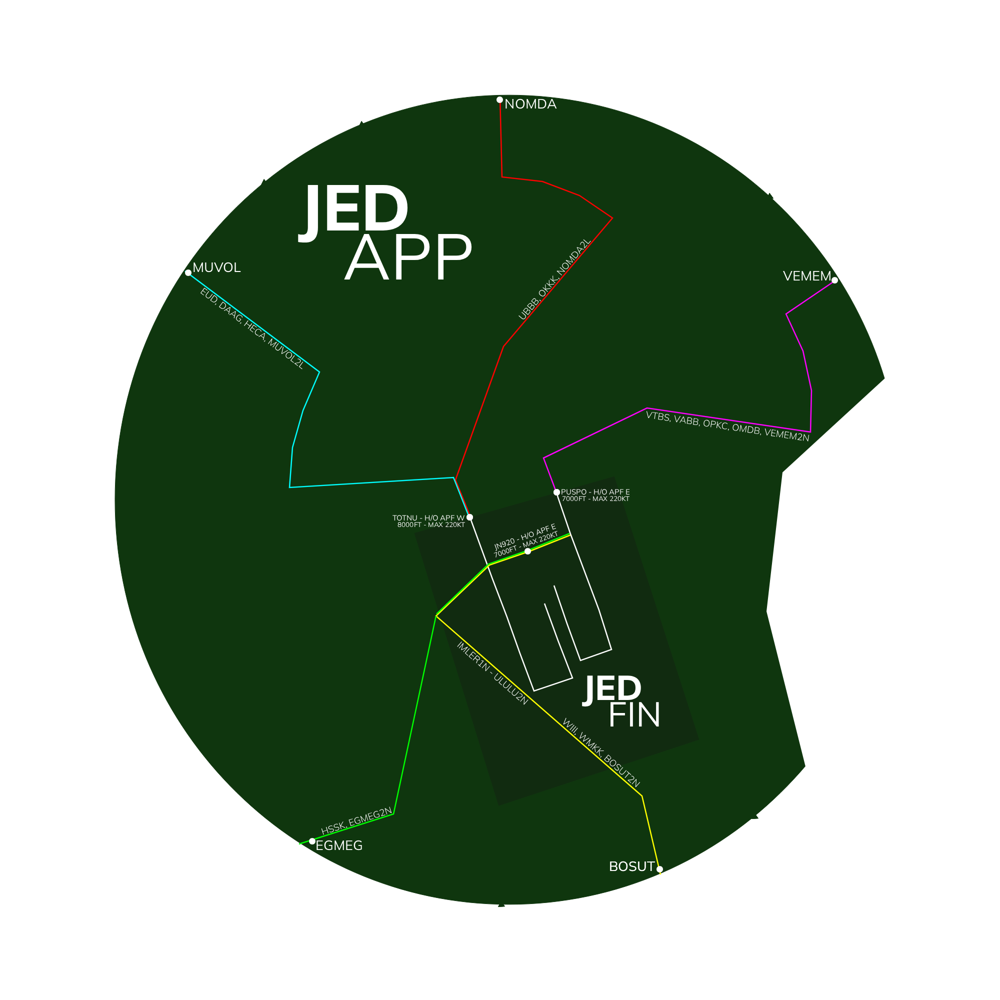

# OEJN_FW_APP [APP FW] Briefing Material | Hajj OPS: 2026

!!! success "Covering"
    This section details all the necessary briefing materials for **OEJN_FW_APP [APP FW]** during Hajj OPS: 2026

## Designated Area of Responsibility 
"*Jeddah Director West*" (OEJN_FW_APP) is in charge of all downwind Arrivals in the Jeddah West.

---

## Notes
### Arrival
- 1500-6500ft = **Class C airspace**
- **RWY34L** for arrivals.
- Arrivals for **RWY34L** will be handed off the **Final West** at **TOTNU** passing **8000 ft**.
- Aircraft must be given **4500** at the sequencing leg.
- Generally **EVEN** profiles are preferred (8000,6000,3000)
- Suggested Vectors: **070** (Base), **010** (Intercepting Vector)
- Handoff to OEJN_W_TWR for **RWY34L**
- REFER TO JEDDAH APP SOP FOR FURTHER
!!! danger "DO NOTE"
    **RWY34L** is generally considered the **LOW** side, hence aircraft must be **3000ft or below** whilst on base

---

## Visual Representation

