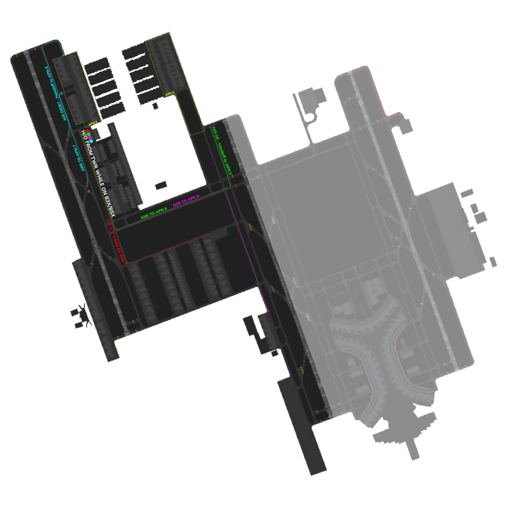

# OEJN_W_GND [SMC W] Briefing Material | Hajj OPS: 2026

!!! success "Covering"
    This section details all the necessary briefing materials for **OEJN_W_GND [SMC W]** during Hajj OPS: 2026

!!! Caution "Bandbox"
    During the event, only SMC W and SMC E are going to be online, spliting the DOAR on 34C.

## Designated Area of Responsibility 
**"Jeddah Ground" (OEJN_W_GND)** is in charge of all GMC operations west of RWY 34C. Ground west includes the Old terminal, Hajj aprons, GA aprons, Royal aprons, and Cargo aprons **(Aprons 1, 2, 3, 4, 5, 13, 8, 9, G, 6, 7, and 11)**.

---

## General Notes
- **Arrivals** landing on 34R are to be taxied to Apron 6, while Arrivals landing on 34L shall be assigned Apron 7. 
- If Apron 7 and 6 are full, then this will be coordinated by APN E to SMC E/SMC W to start assigning arrivals to stands in the international terminal (Aprons 1, 2, 3, 4 and 5) or terminal 1. This procedure shall be executed ONLY in the case of reaching capacity of the HAJJ Terminals.
- It is important that SMC E and W are in constant coordination as stand assignment will not be fully automatic and will involve handing off to APN E in the case of Arrivals to Terminal 1.

## 34's Configuartion
### Arrival 

- **Arrival** traffic going to **Apron A**, will contact you while taxing via the **B5X arrival taxi route**, and shall be taxied by "Jeddah Ground West" via **C, S to hold short Runway 34C passing E** shall contact "AIR West/SMC West" based on coordiantion.

- **Arrival** traffic going to **Apron B**, will contact you while taxing via the **B5X arrival taxi route**, and shall be taxied by "Jeddah Ground West" via **C, S to hold short Runway 34C passing E** shall contact "AIR West/SMC West" based on coordiantion.

- **Arrival** traffic going to **Apron C**, will contact you while taxing via the **B5X arrival taxi route**, and shall be taxied by "Jeddah Ground West" via **C, S to hold short Runway 34C passing E** shall contact "AIR West/SMC West" based on coordiantion.

- **Arrival** traffic going to **Apron 7**, will NOT CONTACT you at all while **taxing on B** after the **B50 arrival taxi route**, and shall be handed from "AIR west" to "APN E" immediately.

- **No arrivals from the west shall be taxied to Apron 6**.

### Departure
- Departure traffic from **Apron 6** will be cleared by "*Jeddah Apron*" via **E to hold short R**. Expect traffic to call "*Jeddah Ground West*" taxing on **E** from "*Jeddah Apron*." Once clear of conflict, traffic shall be taxied by "*Jeddah Ground West*" via **E, S, G to hold short G1 or G2** for **Runway 34C**, if clear of conflict, **traffic passing U** shall contact "AIR west".

- Departure traffic from **Apron 7** will be cleared by "APN E" via **D**. Expect traffic to call you holding short of **C on D5** from "APN E" Traffic shall be taxied by "SMC west" via **C,S, and G to hold short G1 or G2** for **Runway 34C**, if clear of conflict, **traffic passing U** shall contact "AIR west".
- Departure traffic from **Apron 1, 2, 3, 4, 5**, shall contact "SMC W" around **+-5 minutes from TSAT** requesting pushback. All traffic shall be pushed **South** as soon as possible. When traffic request taxi, they shall be taxied via **U hold short G,** and once clear of conflict, further taxi via **G, G1 or G2 for RWY34C**, if clear of conflict, traffic **passing U** shall contact "AIR west"

## 16's Configuartion
### Arrival 

- **Arrival** traffic going to **Apron A**, will contact you while taxing via the **B2O arrival taxi route**, and shall be taxied by "Jeddah Ground West" via **C, S to hold short Runway 16C passing E** shall contact "AIR West/SMC West" based on coordiantion.

- **Arrival** traffic going to **Apron B**, will contact you while taxing via the **B2O arrival taxi route**, and shall be taxied by "Jeddah Ground West" via **C, S to hold short Runway 16C passing E** shall contact "AIR West/SMC West" based on coordiantion.

- **Arrival** traffic going to **Apron C**, will contact you while taxing via the **B2O arrival taxi route**, and shall be taxied by "Jeddah Ground West" via **C, S to hold short Runway 16C passing E** shall contact "AIR West/SMC West" based on coordiantion.

- **Arrival** traffic going to **Apron 7**, WILL CONTACT you while **taxing on C** after the **B20 arrival taxi route**, and shall be handed from "AIR west" to "APN E" immediately.

- **No arrivals from the west shall be taxied to Apron 6**.

### Departure
- Departure traffic from **Apron 6** will be cleared by "*Jeddah Apron*" via **E to hold short R**. Expect traffic to call "*Jeddah Ground West*" taxing on **E** from "*Jeddah Apron*." Once clear of conflict, traffic shall be taxied by "*Jeddah Ground West*" via **E, S, G to hold short G6** for **Runway 16C**, if clear of conflict, **traffic passing E** shall contact "AIR west".

- Departure traffic from **Apron 7** will be cleared by "APN E" via **D**. Expect traffic to call you holding short of **C on D5** from "APN E" Traffic shall be taxied by "SMC west" via **C,S, and G to hold short G6** for **Runway 16C**, if clear of conflict, **traffic passing E** shall contact "AIR west".
- Departure traffic from **Apron 1, 2, 3, 4, 5**, shall contact "SMC W" around **+-5 minutes from TSAT** requesting pushback. All traffic shall be pushed **North** as soon as possible. When traffic request taxi, they shall be taxied via **T hold short G** if clear of conflict, traffic **passing E** shall contact "AIR west"

---

## Visual Representation

