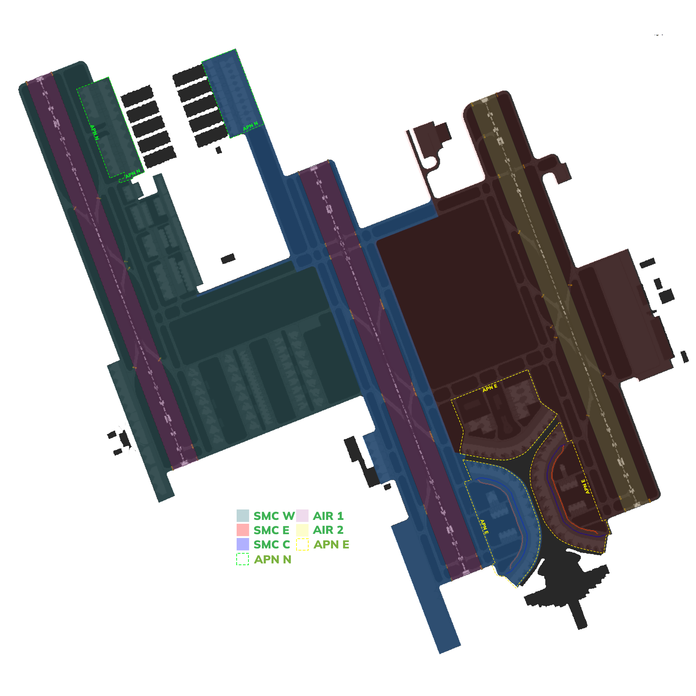

# OEJN_C_TWR [AIR C] Briefing Material | Hajj OPS: 2026

!!! success "Covering"
    This section details all the necessary briefing materials for **OEJN_C_TWR [AIR C]** during Hajj OPS: 2026

## Designated Area of Responsibility 
"*Jeddah Tower*" (OEJN_C_TWR) is in charge of **runway 34C** departure operations.

---

## Notes

### Departure
- Departures shall be **immediately** handed off to "*Jeddah Approach*" (OEJN_APP) after **departure**.
- Departures from **Apron B** will contact you at holding point H1.
- Departures from **Aprons 1, 2, 3, 4, 5, 6, 7** will contact you **while taxing on G**, or at holding point **G1 or G2**. 