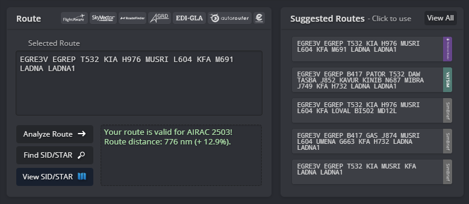

!!! success "covering" 
    This is the pilot briefing of **King Abdulaziz International Airport**. All pilots flying out of Jeddah must familiarize themselves with this document prior to the flight.

## 1. Airport Information
### 1.1 Jeddah King Abdulaziz International Airport (OEJN)
#### 1.1.1 Airport Overview
**King Abdulaziz International Airport (OEJN)** is a significant airport serving the cities **Jeddah and Mecca** in Saudi Arabia. It's situated 19 kilometers north of Jeddah and covers an extensive area of 105 square kilometers. Opened in 1981, it replaced the former Kandara Airport and is named after the founder of Saudi Arabia, King Abdulaziz.

The airport is the busiest in the kingdom and the third-largest by land area and features a royal terminal and three operational passenger terminals, including a dedicated Hajj Terminal for the Islamic Hajj pilgrimage season.

#### 1.1.2 Runway Physical Characteristics

| **Runway** | **Dimensions (m)** | **True Bearing** | **Elevation** | **Slope** |
|:----------:|:------------------:|:----------------:|:-------------:|:---------:|
|     34L    |     3800 x 60      |      340.00      |       14      |    0.0%   |
|     16R    |     3800 x 60      |      160.00      |       14      |    0.0%   |
|     34C    |     3800 x 60      |      340.00      |       28      |   -0.06%  |
|     16C    |     3800 x 60      |      160.00      |       28      |   +0.33%  |
|     34R    |     3800 x 60      |      340.00      |       49      |   -0.14%  |
|     16L    |     3800 x 60      |      160.00      |       30      |   +0.14%  |

#### 1.1.3 Air Traffic Services
##### 1.1.3.1 ATS Airspace

|         Airspace Type         |     Airspace      | Class | Vertical Limits |  Controller  |
| :---------------------------: | :---------------: | :---: | :-------------: | :----------: |
|       **Control Zone**        |    Jeddah CTR     |   D   |  SFC - 2500ft   | AIR W, AIR E |
| **Terminal Maneuvering Area** | Jeddah TMA Part 1 |   C   | 1500ft - FL195  |  APP 1, FIN  |
| **Terminal Maneuvering Area** | Jeddah TMA Part 2 |   C   | 2500ft - FL195  |    APP 1     |
|       **Control Area**        |  Jeddah CTA East  |   A   |  FL150 - FL600  |    CTR 1     |
|       **Control Area**        |  Jeddah CTA West  |   A   |  FL150 - FL600  |    CTR 2     |

##### 1.1.3.2 ATS Positions

|     **Radio Callsign**      | **Logon Callsign** | **Abbreviation** | **Frequency (MHz)** |
| :-------------------------: | :----------------: | :--------------: | :-----------------: |
|       **Jeddah ATIS**       |     OEJN_ATIS      |       ATIS       |       126.200       |
|     **Jeddah Delivery**     |      OEJN_DEL      |       GMP        |       121.800       |
|      **Jeddah Apron**       |     OEJN_E_RMP     |      APN E       |       121.750       |
|      **Jeddah Apron**       |     OEJN_N_RMP     |      APN N       |       121.975       |
|      **Jeddah Ground**      |     OEJN_W_GND     |      SMC W       |       121.600       |
|      **Jeddah Ground**      |     OEJN_E_GND     |      SMC E       |       121.900       |
|      **Jeddah Ground**      |     OEJN_C_GND     |      SMC C       |       121.700       |
|      **Jeddah Tower**       |     OEJN_W_TWR     |      AIR W       |       118.200       |
|      **Jeddah Tower**       |     OEJN_E_TWR     |      AIR E       |       118.500       |
|      **Jeddah Tower**       |     OEJN_C_TWR     |      AIR C       |       118.300       |
|     **Jeddah Approach**     |      OEJN_APP      |      APP 1       |       124.000       |
|  **Jeddah Final Approach**  |    OEJN_FE_APP     |      FIN E       |       123.800       |
|  **Jeddah Final Approach**  |    OEJN_FW_APP     |      FIN W       |       124.675       |
| **Jeddah Terminal Control** |     OEJN_W_CTR     |      CTR W       |       125.450       |
| **Jeddah Terminal Control** |     OEJN_E_CTR     |      CTR E       |       119.100       |
| **Jeddah Terminal Control** |     OEJN_WU_CTR    |      CTR WU      |       124.825       |

## 2. Stands Allocations
### 2.1 Stands
To ensure immersive experience, pilots are recommended to spawn on the following aprons depending on their real-world airlines gate allocations.

|       **Aprons**       |                         **Airlines**                        |
|:----------------------:|:-----------------------------------------------------------:|
|         Apron A        |                        Saudi Airlines                       |
|         Apron B        |           Legacy Gulf Airlines (SVA, UAE, ETD etc)          |
|         Apron C        | Low cost and major international airlines (KNE,FAD,KAC,THY) |
|    Aprons 1,2,3,4,5    |                        International                        |
|       Aprons 6, 7      |                            Hajj                             |
|         Apron 9        |                            Cargo                            |
|        Apron 11        |                   Hanger (Cargo Overfill)                   |
|        Apron 12        |                          Military                           |
|         Apron 8        |                            Royal                            |
|         Apron G        |                       General Aviation                      |

## 3. Preflight
### 3.1 Flight Planning
Depending on the nature of the flight, pilots must fly the correct routes whether normal flight or event flight.

#### 3.1.1 Normal Route(s)
For the majority of departures from **Jeddah**, SimBrief can automatically generate ATC-compliant flight plans by selecting the **"Preferred Route"** option. These routes are maintained and revised by our Operations Department with every AIRAC release to reflect the latest Air Traffic Flow Management (ATFM) requirements across the Middle East, while also ensuring successful validation through Eurocontrol's IFPS.

Figure 3.1.1 - Simbrief Preferred Route

#### 3.1.2 Event Route(s)
During the initial phase of the flight, it is **mandatory** for pilots to prefile with the correct event route either provided by **"Suggested Event Routes"** in myVATSIM or amended by the Delivery controller. Otherwise, pilots should expect further delays.

Figure 3.1.2 - Suggested Event Routes

### 3.2 CDM Procedures
#### 3.2.1 CDM Introduction
During large events, Collaborative Decision Making (CDM) will be put in place to regulate the flow of traffic on the ground. When this system is in use, you will be able to view your TSAT at (`https://vacdm.vatsimsa.com`).

By default, the TSAT is taken from the TOBT that you submitted on the website or the EOBT you filed in the flight plan. Pilots are expected to report ready for pushback/start-up within TSAT+-2. Should you report ready earlier, you may be given an earlier slot depending on the current traffic situation.

For events with individual CTOTs, your TSAT will be generated after you receive your IFR clearance.

|               **Time**              |                                                                                                                                                                                                                                                                                                                                                                                                                                         |
|:------------------------------------|:----------------------------------------------------------------------------------------------------------------------------------------------------------------------------------------------------------------------------------------------------------------------------------------------------------------------------------------------------------------------------------------------------------------------------------------|
| EOBT (Estimated Off-Block Time)     | This is the time when you estimate to be ready for pushback during the creation of your flight plan.                                                                                                                                                                                                                                                                                                                                    |
| TOBT (Target Off-Block Time)        | This is the time that you target to offblock. Keeping your TOBT up to date will help ATC to reduce delays and ensure a smooth operation. When you set a TOBT, ATC will treat it as a confirmed time and calculate your TSAT based on it.                                                                                                                                                                                                |
| TSAT (Target Startup Approval Time) | This is the time when ATC is planning to approve your startup. Keep in mind that it is ultimately your responsibility as the pilot to request startup within the TSAT window. In an optimal situation, your TOBT and TSAT will be at the same time. However, if there are more aircraft wanting to depart than the airport can currently accommodate, startups will be delayed and your TSAT will be at a later time than your TOBT. |
| CTOT (Calculated Take-Off Time)     | This is the actual slot for you to take off from the departure airport.                                                                                                                                                                                                                                                                                                                                                                 |

#### 3.2.2 CDM Procedure and Checklist

1. Submit your flight plan on VATSIM and connect on the network at least 30 minutes prior your
off-block time (or 45 minutes before your CTOT)
2. Submit your TOBT on (`https://vacdm.vatsimsa.com`)
3. Check your TSAT on (`https://vacdm.vatsimsa.com`)
4. Request clearance 25 minutes before your EOBT/TOBT
5. Be ready and request for pushback/startup at TSAT +-2 minutes

If you failed to pushback/start up within +5 minutes after TSAT

1. Inform ATC
2. Submit your new TOBT on (`https://vacdm.vatsimsa.com`)
3. Check your new TSAT on (`https://vacdm.vatsimsa.com`)
4. Be ready and request for pushback/startup at new TSAT +-2 minutes

!!! note
    Keep on refreshing the vACDM website to check for SID/RWY/TOBT changes. TSAT updates automatically and does not require you to refresh.

### 3.3 Getting your clearance

#### 3.3.1 Voice Clearance
**Voice communication** is the preferred method for obtaining departure clearance. Pilots should contact **Dubai Delivery** approximately **10 minutes before start-up** and prepare to provide the following information:

- Aircraft Callsign
- Aircraft Type
- Parking Stand
- Requested Flight Level (RFL)
- Destination Airport
- Standard Instrument Departure (and departure speed if unable to comply with SID minimum speed restrictions)
- Departure Runway
- Current Departure ATIS Information

Departure clearances are issued in an abbreviated format and typically include only the assigned **SID**, departure **runway**, **initial climb altitude**, and **transponder (squawk) code**. Before requesting or accepting your clearance, ensure you have obtained the latest **Departure ATIS** information.

!!! Example
    > **Pilot:** _SVA1024, Stand A10L, A320, requesting IFR clearance to Dammam_

    > **Controller:** _SVA1024, Cleared Dammam as filed, EGREP3V Departure, Runway 34R, Initial Climb 6000ft, SQWK XXXX_

    

    ----------------------------- Pilot Readbacks --------------------------------
    

    > **Controller:** _SVA1024, Readback Correct, Information A, Report ready for push and start_

#### 3.3.2 Pre-Departure Clearance (PDC)
Pilots wishing to obtain their clearance via **Hoppie datalink** should send a clearance request to `OEJN`. A CPDLC logon is **not** required prior to sending the request, and no readback is required once the clearance has been received.

!!! Warning
    **Clearance Delivery** does not issue pushback or engine start approval. After receiving your departure clearance, remain on the **Clearance Delivery** frequency and do **not** transfer to **Ground** unless instructed. Once your aircraft is fully prepared for pushback—including the jetway disconnected, tug attached, and wheel chocks removed—report **fully ready** on the Clearance Delivery frequency. When appropriate, and depending on the current airport departure flow, you will be instructed to contact the relevant **Ground** frequency for pushback and start.

## 4. Pushback Procedures
Pushback and engine start approval may only be requested after **Clearance Delivery** instructs you to contact the designated **Ground** frequency. Depending on traffic conditions and apron operations, the ground controller may assign a specific pushback procedure or direction. Pilots must confirm they are able to comply with the instruction and promptly notify the controller if they are unable to do so.

### 4.1  Apron Flow Direction

|       **Apron(s)**       |     _34 Operations_     | _16s Operations_ |
|:------------------------:|:-----------------------:|:----------------:|
|        **Apron A**       |        Southbound       |    Northbound    |
|        **Apron B**       |        Southbound       |    Southbound    |
|        **Apron C**       |        Westbound        |    Westbound     |
| **Aprons 1, 2, 3, 4, 5** |        Southbound       |    Northbound    |
|        **Apron 7**       |        Southbound       |    Northbound    |

!!! Example
    > **Pilot:** ETD901, Stand C3, request pushback.

    > **Controller:** ETD901, Push & Start Approved, Face West on WA.

### 4.2 Colored Taxilines
`Code C` aircraft operating within **Aprons A and B** shall use the designated **colour-coded taxilines** to facilitate efficient and quick ground movement taxi/pushback operations in large aprons.

Pilots unable to push on colored lines shall immediately inform apron/ground controller if cleared for push onto them

| **Colors** | **Taxiways** |             **Maximum Aircraft Code**            |
|:----------:|:------------:|:------------------------------------------------:|
|  **Blue**  |    KB, LB    | Code C (Aircrafts with a wingspan less then 36m) |
| **Orange** |    KC, LC    | Code C (Aircrafts with a wingspan less then 36m) |

!!! Example
    > **Controller**: SVA1024, Push & Start approved, face south on the blue line.

!!! note "CDM Procedure"
    During **flow management** operations, pushback shall be planned **plus or minus 5 minutes** from the assigned TSAT. Traffic will only be handed off to apron/ground after this is met.
