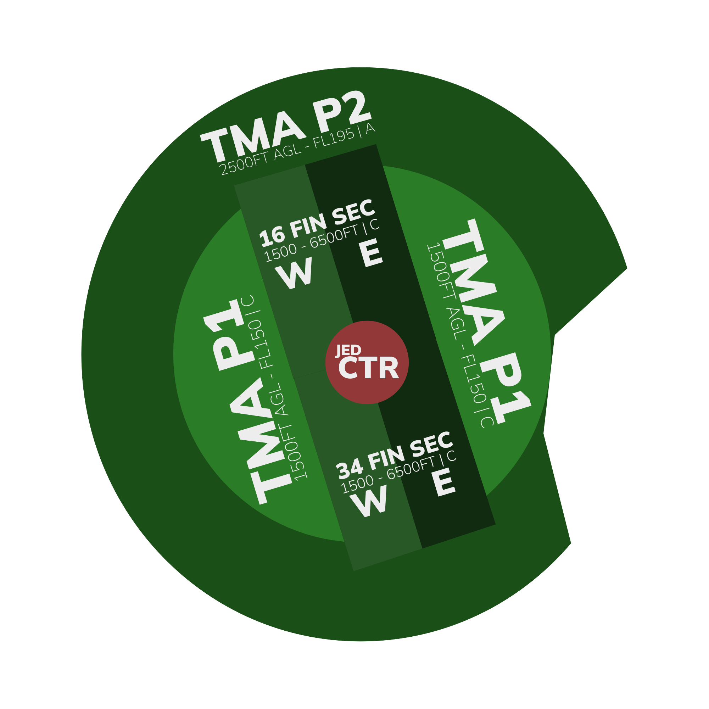

# OEJN_APP [APP 1] Briefing Material | Hajj OPS: 2026

!!! success "Covering"
This section details all the necessary briefing materials for **OEJN_APP [APP 1]** during Hajj OPS: 2026

## Designated Area of Responsibility

"_Jeddah Approach_" (OEJN_APP) is responsible for handling all **arrivals and departures** in the Jeddah TMA up to FL195.

---

## Notes

- The separation minima within the Jeddah TMA is **5 nautical miles**. If this cannot be achieved, a minimum vertical separation of **1,000 feet** must be maintained.
- Wake Turbulence Separation must be enforced under 6,000 feet.
- **All** STARs will be assigned by Jeddah Terminal Control (CTA W).
  - On initial contact, _Jeddah Approach_ **must state** the runway and type of approach to expect.
  - Arrivals on **34L** will be assigned the **ILS 34L**, and arrivals on **34R** will be assigned the **ILS Z 34R**. The ILS Y 34R will **not** be used in any circumstance.
    - "SVA123, Jeddah Approach, expect ILS Z approach runway 34R, information A."
    - Controllers should limit the amount of information/instructions in each transmission to 3 items to avoid overloading pilots.

- All arrivals into the Jeddah TMA will be following a 2L or 2N STAR, utilising the Point Merge System (PMS).
- All arrivals into the Jeddah TMA will be released by Jeddah Terminal Control (CTA W) at the following levels and fixes:
  - Approaching EGMEG, BOSUT and descending to 13,000 feet.
  - All other TMA entry points descending to FL190.
  - Handoffs to Jeddah Approach (APP 1) should be initated prior to the TMA entry point, or passing FL160/FL190 (dependant on the entry fix) whichever is earlier.
- All arrivals into the Jeddah TMA shall be released with a **minimum of 12-15 NM** longitudinal spacing by Jeddah Terminal Control (CTA W).

## Handoff to Jeddah Final (APF)

- The tables below dictate the altitudes and fixes at which arrival traffic will be handed off to Jeddah Final (APF). These are to be **strictly adhered to.**
- Longitudinal spacing of **7 NM** should be targetted when handing off to APF. This figure is the minimum, and the longitudinal spacing **should not go under this figure**.
- The target speed for handoff to APF is **210 knots**. This figure can be increased to **220 knots**, however should not go beyond this figure.

### Runway 16

| Fix | Altitude (ft) | Next Controller |
| :-: |:-------------:|:---------------:|
| NABGI |  6,000 | APF E |
| IMDAP |  6,000 | APF E |
| PUSPO |  7,000 | APF E |
| JN917 |  6,000 | APF W |
| JN997 |  6,000 | APF W |

### Runway 34

| Fix | Altitude (ft) | Next Controller |
| :---: |:-------------:|:---------------:|
| PUSPO |     7,000     |      APF E      |
| JN920 |     7,000     |      APF E      |
| TOTNU |     8,000     |      APF W      |

## Delay Phases

Incase of TMA overload, the following delay phases can be initiated by Jeddah Approach (APP 1) or Jeddah Terminal Control (CTA W).
All delay phases should be coordinated with the designated **"HAJJ OPS HELP"** staff member or **Ismail Hassan**. After initiation, and subsequent coordination with a staff member, of a delay phase, it should be announced globally in the ATC chat on EuroScope. 

| Phase |  Initiated By   |                                                                                                                    Description                                                                                                                    |
| :---: |:---------------:|:-------------------------------------------------------------------------------------------------------------------------------------------------------------------------------------------------------------------------------------------------:|
| P1 |      APP 1      |                                                             Arrivals into OEJN will be slowed down to delay the hourly rate into the TMA. Relevant flow measures to be put in place.                                                              |
| P2 | APP 1 and CTA W | APP and CTA to agree on this phase prior to coordination with staff members. All handoffs into the Jeddah TMA will be stopped. Holding will be initiated at the TMA entry points (e.g. VEMEM, NOMDA, MUVOL). Holding stacks to be managed by CTA. |
| P3 |      CTA W      |                                       All handoffs into the Jeddah CTA will be stopped. Holding will be initiated at the CTA entry points (e.g. BOPEV, ASLAD, GODSA). Holding stacks to be managed by ACC.                                        |
