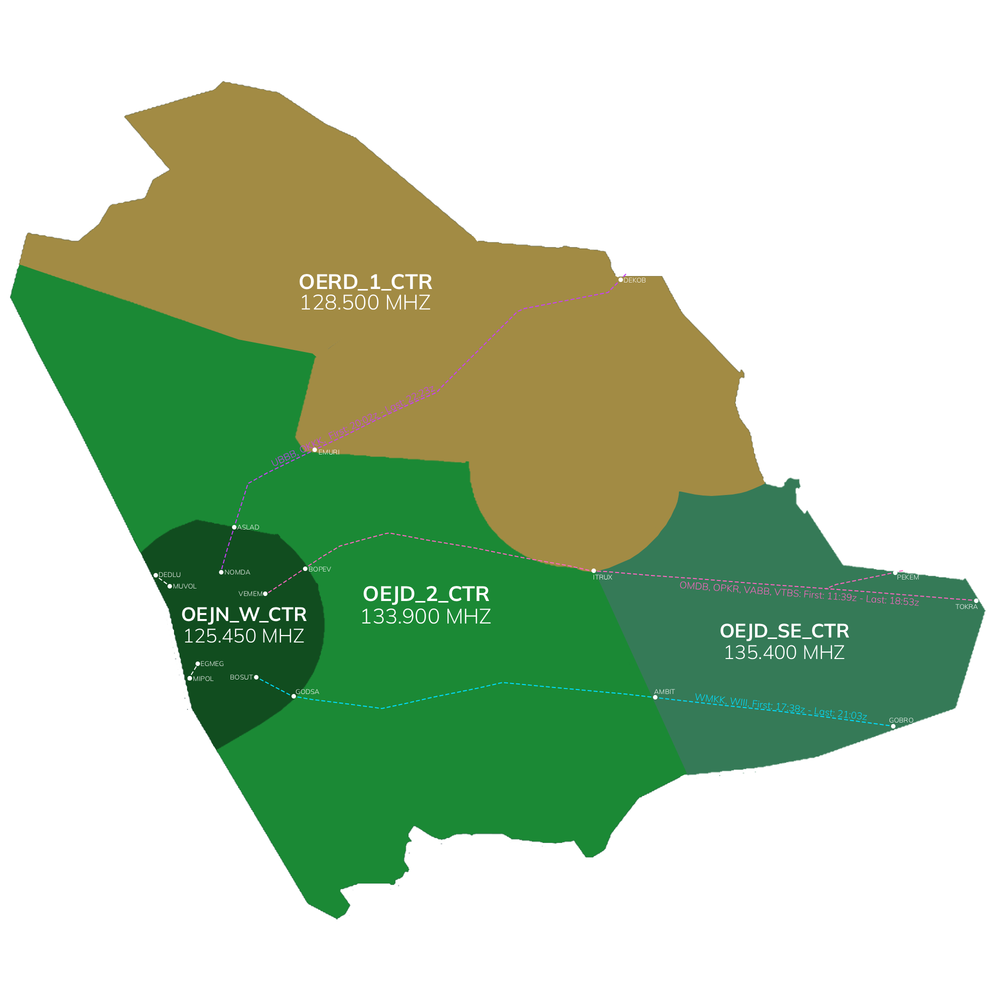

# OERD_1_CTR [OERD 1] Briefing Material | Hajj OPS: 2026

!!! success "Covering"
    This section details all the necessary breifing materials for **OERD_1_CTR [OERD 1]** during Hajj OPS: 2026

## Designated Area of Responsibility 

"*Riyadh Control*" (OERD_1_CTR) is in charge of the North, Eastern, and North Eastern Sector from FL325+.

---

## Notes

* A single traffic flow will enter Riyadh UIR airspace from the northeast at varying times.
* Controllers are required to use the VATCAN plugin to distinguish event traffic from non-event traffic.
* RVSM procedures and the semi-circular cruising level rule are applicable throughout the OERD UIR.
   * Standard separation minima within the airspace are:
      * 1,000 ft vertical separation up to FL410 or 10 NM lateral separation.
      * 2,000 ft vertical separation above FL410 or 10 NM lateral separation.
* Any non-event aircraft entering the Riyadh UIR with destination Jeddah must obtain a release from the appropriate Jeddah Control sector before entry.   Adjacent ACC sectors are responsible for coordinating the release prior to transfer.
* Issuing arrival clearances for traffic inbound to Jeddah is not the responsibility of Riyadh Control; this duty belongs to Jeddah Terminal Control.
* A minimum of 10-15 NM longitudinal spacing must be maintained between arrival aircraft before transfer to Jeddah Control (ACC 2). This means initial sequencing and spacing start in this sector
* Controllers should regularly review ECFMP updates to remain informed of the latest traffic flow restrictions and measures.