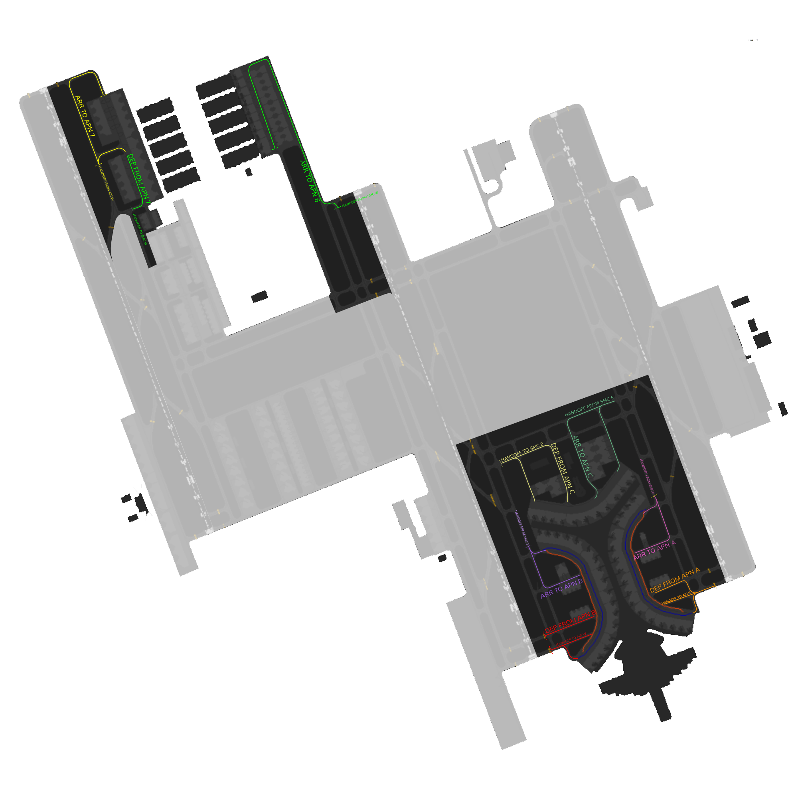
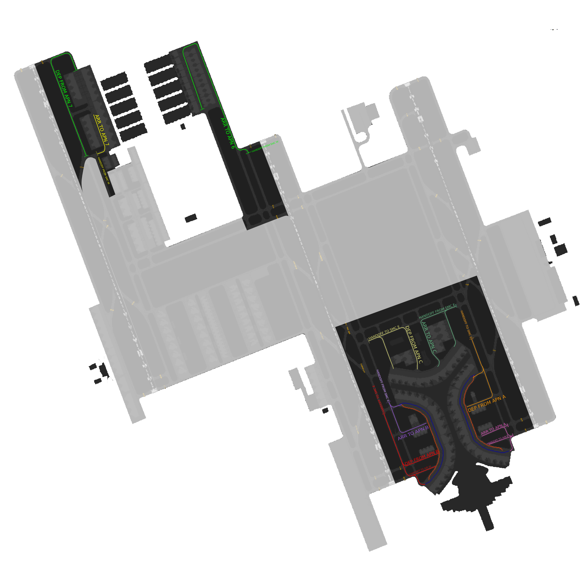

# OEJN_E_RMP [APN E] Briefing Material | Hajj OPS: 2026

!!! success "Covering"
This section details all the necessary briefing materials for **OEJN_E_RMP [APN E]** during Hajj OPS: 2026

!!! Caution "Bandbox"
During the event, only Apron East will be on which is the bandbox of both APN E and APN N.

## Designated Area of Responsibility

**"Jeddah Apron" (OEJN_E_RMP)** is in charge of all apron operations. (**Aprons 6, 7, A, B, C**).

---

## General Notes

- All traffic arriving on runway 34R/16L shall be directed to the **Eastern HAJJ Terminal** (Apron 6).
- All Traffic arriving on runway 34L/16R shall be directed to the **Western HAJJ Terminal** (Apron 7).
- At and in the event of having the a HAJJ or both HAJJ Terminals full, with the complete discretion of the Apron [APN E] controller, shall inform  SMC controllers to have aircrafts to be taxied as follows:
  - Apron 6 reaching capacity, all traffic shall be taxied to Terminal 1 by **SMC E** to be handed to **APN E**.
  - APron 7 reaching capacity, all traffic shall be taxied DIRECTLY to the stands of Aprons 1, 2, 3, 4 and 5 by **SMC W**.
- All departures are to be following the taxi routes that align with SDRO Runway Configurations.

## Runway 34 Configuration

### Arrival

- Expect arrivals to **HAJJ Terminal East (Apron 6)** to contact [APN E] while **holding short G6 on F** and for Taxiway F to be the only entry to the HAJJ Terminal East (Apron 6).
- Expect arrivals to **HAJJ Terminal West (Apron 7)** to contact [APN E] while **holding short B7 on B** and for Taxiway B7 and D6 to be the only entry to the HAJJ Terminal West (Apron 7).
  - Note: Arrivals via the B5O Arrival taxi route shall be **handed directly from AIR West to APN E**. Any traffic entering HAJJ Terminal West (Apron 7) via **D6** shall only turn right (south-bound).
- **Arrival traffic** will contact [APN E] on **V holding short of V3 or V4** and shall enter via **W3 or W4**, once **clear of traffic** pushing at remote stands.
- **Arrival traffic** will contact [APN E] on **V holding short of K5 on K** and shall enter via **K4 or K5**, once **clear of traffic** pushing at remote stands on K4.

### Departure

- Traffic at **Apron A** shall be pushed **Southbound** to exit via **L3, L2, or L1**.
- **Apron C** flow direction is **Westbound** to exit via **W1, W2**.
- **Apron B** flow direction is **Southbound** to exit via **L1, L2, L3**.
- Except for **Apron C**, **Medium** departure traffic shall be pushed on the **blue** line. **Heavy** departure traffic shall be pushed on the **main** taxiway.
- **Remote stands** can be pushed facing **North** if traffic permits.
- **Apron 7** flow direction is **Southbound** to exit via **D5**.
- **Apron 6** traffic must be pushed **facing south**.
- Taxiway **E** is **southbound** only.

---

### Visual Representation

## Runway 16 Configuration

### Arrival

- Expect arrivals to **HAJJ Terminal East (Apron 6)** to contact [APN E] while **holding short G6 on F** and for Taxiway F to be the only entry to the HAJJ Terminal East (Apron 6).
- Expect arrivals to **HAJJ Terminal West (Apron 7)** to contact [APN E] while **holding short D5 on C**.
- **Arrival traffic** will contact [APN E] on **V holding short of V3 or V4** and shall enter via **W3 or W4**, once **clear of traffic** pushing at remote stands.
- **Arrival traffic** will contact [APN E] on **K holding short of K5** and shall enter via **K4 or K5**, once **clear of traffic** pushing at remote stands on K4.

### Departure

- Traffic at **Apron A** shall be pushed **Northbound** to exit via **L4 or L5** to be handed to SMC E holding short of L on L4 pr L5.
- **Apron C** flow direction is **Westbound** to exit via **W1 or W2**, once **clear of traffic** pushing at remote stands.
- **Apron B** flow direction is **Northbound** to exit via **K4 or K5**, once **clear of traffic** pushing at remote stands.
- Except for **Apron C**, **Medium** departure traffic shall be pushed on the **blue** line. **Heavy** departure traffic shall be pushed on the **main** taxiway.
- **Remote stands** can be pushed facing **North** if traffic permits.
- **Apron 7** flow direction is **Northbound** to exit via **B7**.
- **Apron 6** traffic must be pushed **facing south**.
- Taxiway **E** is **southbound** only.

### Visual Representation

