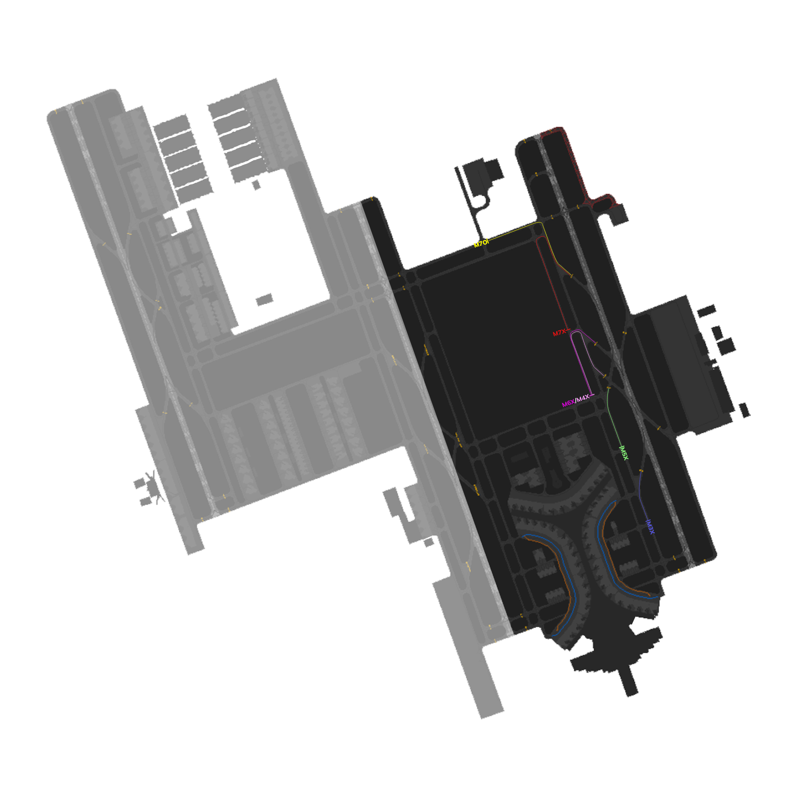

# OEJN_E_TWR [AIR E] Briefing Material | Hajj OPS: 2026

!!! success "Covering"
    This section details all the necessary briefing materials for **OEJN_E_TWR [AIR E]** during Hajj OPS: 2026

## Designated Area of Responsibility 
"*Jeddah Tower*" (OEJN_E_TWR) is in charge of **runway 34R/16L** operations. During this event, SDRO will be in use, which means that **OEJN_E_TWR [AIR E]** will be irrelevant to departures.

---

## Notes

### General Notes
- All departures are to be following the taxi routes that align with SDRO Runway Configurations.
- **OEJN_E_TWR [AIR E]** is responsible for handling the ATIS.

### Arrival (34 SDRO)
- **Arrival traffic** shall be told the **expected runway exit point**, depending on their **parking apron**. For apron A or apron C, you must give them the **M4X or M6X** arrival taxi route, depending if they vacate **M4 or M6**. After the **arriving traffic vacates the runway**, hand the traffic off to "*Jeddah Ground*" (OEJN_E_GND).
- **Arriving traffic** parking at **Apron B** must be given the **M7O arrival taxi route**, meaning they must vacate the **runway at M7**. After the arriving traffic vacates the runway, hand the traffic off to "*Jeddah Ground*" (OEJN_E_GND).
- **Hajj traffic** are to be assigned Apron 6 and must be assigned the M7O arrival taxi route, meaning they must vacate the runway at M7. Once the aircraft has vacated the runway, hand the traffic off to "*Jeddah Ground*" (OEJN_E_GND). Runway crossing will be coordinated with *Jeddah Ground*" (OEJN_E_GND).

### Arrival (16 SDRO)
- **Arrival traffic** shall be told the **expected runway exit point**, depending on their **parking apron**.
- **Arrival traffic** parking at **Apron C or Apron B** must be given the M5X arrival taxi route, meaning they must vacate the **runway at M7**. After the arriving traffic vacates the runway, hand the traffic off to "*Jeddah Ground*" (OEJN_E_GND)
- **Arriving traffic** parking at **Apron A** must be given the **M5X arrival taxi route**, meaning they must vacate the **runway at M5**. After the arriving traffic vacates the runway, hand the traffic off to "*Jeddah Ground*" (OEJN_E_GND).
- **Hajj traffic** are to be assigned Apron 6 and must be assigned the M5O arrival taxi route, meaning they must vacate the runway at M5. Once the aircraft has vacated the runway, hand the traffic off to "*Jeddah Ground*" (OEJN_E_GND). Runway crossing will be coordinated with *Jeddah Ground*" (OEJN_E_GND).

---

## Visual Representation

