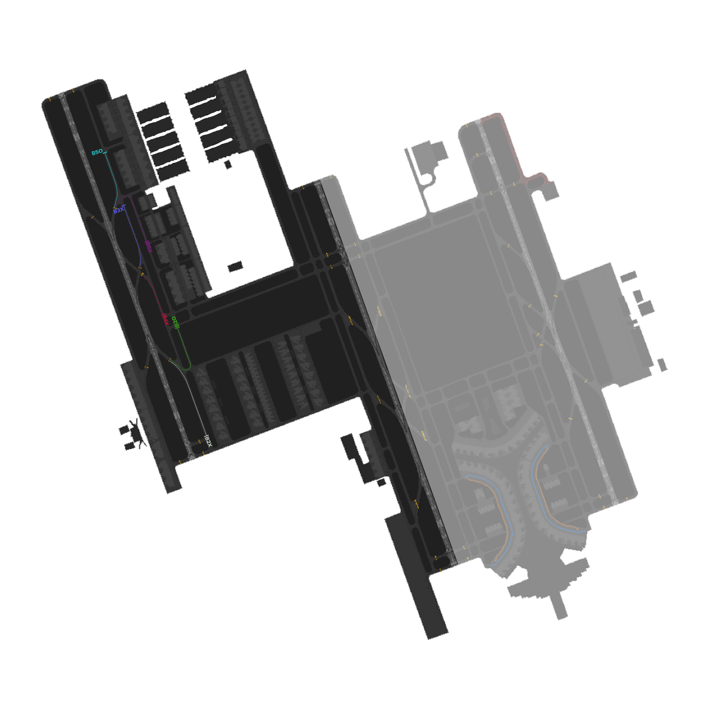

# OEJN_W_TWR [AIR W] Briefing Material | Hajj OPS: 2026

!!! success "Covering"
    This section details all the necessary briefing materials for **OEJN_W_TWR [AIR W]** during Hajj OPS: 2026

## Designated Area of Responsibility 
"*Jeddah Tower*" (OEJN_W_TWR) is in charge of **runway 34L and runway 34C** operations, whether that be departures or arrivals.

---

## Notes

### General Notes
- All departures are to be following the taxi routes that align with SDRO Runway Configurations.

### Arrival (34 SDRO)
- Arrival traffic on runway 34L shall expect parking at APN 7. In the event APN 7 being overflowed, aircraft may be assigned stands at APN 1, 2, 3, 4, or 5.
- **All** arrival traffic shall vacate via **B5**.
- Arrivals to **Apron 7** must be given the **B5O** arrival taxi route. After the **arriving traffic vacates the runway**, hand the traffic off to "*Jeddah Apron*" (OEJN_N_RMP).
- Arrivals to any apron, **other than Apron 7** must be given the **B5X** arrival taxi route. After the **arriving traffic vacates the runway**, hand the traffic off to "*Jeddah Ground*" (OEJN_W_GND).

### Arrival (16 SDRO)
- **Arrival traffic** on runway 16R shall expect parking at APN 7. In the event APN 7 being overflowed, aircraft may be assigned stands at APN 1, 2, 3, 4, or 5.
- **Arrival traffic** shall be told the **expected runway exit point**, depending on their **parking apron**. For Apron 7, you must give them the **B4X** arrival taxi route, depending if they vacate **B4**. After the **arriving traffic vacates the runway**, hand the traffic off to "*Jeddah Ground*" (OEJN_W_GND).
- **Arriving traffic** parking at **Apron 9** must be given the **B4X** arrival taxi route, meaning they must vacate the **runway at B4**. After the arriving traffic vacates the runway, hand the traffic off to "*Jeddah Ground*" (OEJN_W_GND).
- **Arriving traffic** parking at **Apron 1, 2, 3, 4, 5** must be given the **B4X** arrival taxi route, meaning they must vacate the **runway at B4**. After the arriving traffic vacates the runway, hand the traffic off to "*Jeddah Ground*" (OEJN_W_GND).

### Departure (34 SDRO)
- Departures shall be **immediately** handed off to "*Jeddah Approach*" (OEJN_APP) after **departure**.
- Departures from **Apron A** and **Apron C** will contact you while **taxiing on H** to holding point **H1** or holding point **H2**.
- Departures from **Apron B** to contact you **while exiting the apron** to holding point **H1** or holding point **H2**.

### Departure (16 SDRO)
- Departures shall be **immediately** handed off to "*Jeddah Approach*" (OEJN_APP) after **departure**.
- Departures from **Apron A** and **Apron C** will contact you while **taxiing on H** to holding point **H7**
- Departures from **Apron B** will contact you while **taxiing on H** to holding point **H7**

---

## Visual Representation

