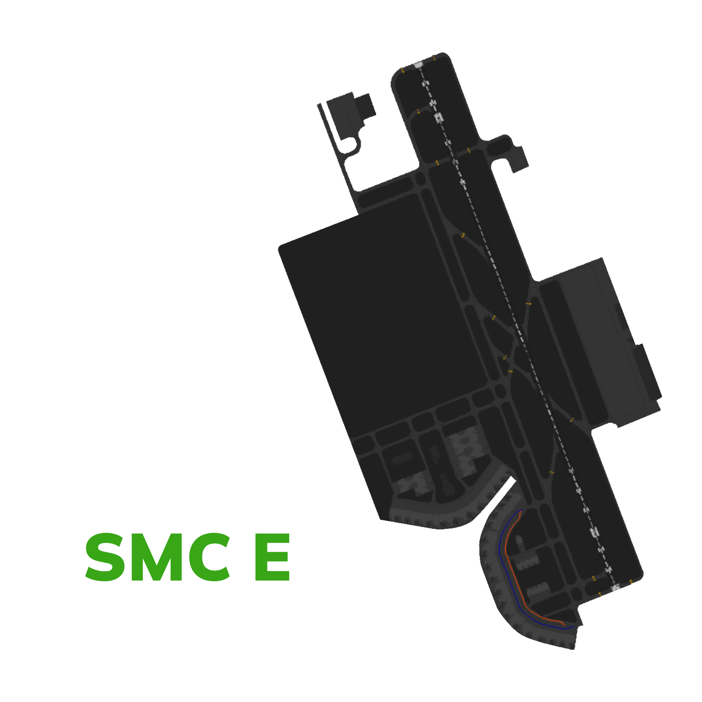

# Jeddah Ground [OEJN_X_GND]

!!! success "Covering"
    This section details all the necessary Standard Operating Procedures for **Ground** Operations in **King Abdulaziz International Airport (OEJN)**

---

## 1. General Provisions

The Jeddah Ground manages aircraft movements on aerodrome areas, excluding runways and their associated taxiways. Departing aircraft receive pushback and taxi instructions to the runway holding point, while arriving aircraft are assigned a stand and given taxi instructions.

---
## 2. Designated Areas of Responsiblity 
**King Abdulaziz International Airport (OEJN)** features three primary Ground Movement Control (SMC) positions, namely **SMC W**, **SMC E** and **SMC C**. The responsibilities and areas of control for each position are outlined as follows:

### 2.1 SMC W [Jeddah Ground West]
Jeddah Ground West covers western side of the aerodrome which includes the following aprons and its assoicasted taxiways:

- Apron 8 [Royal Apron]
- Apron 7 [Hajj Apron]
- Apron G [General Aviation Apron]
- Apron 5, 4, 3, 2, 1 [Old Terminal, International]
- Apron 13

!!! info "Bandbox Position"
    **Jeddah Ground West [OEJN_1_GND]** is the Bandbox Position for ground operations at King Abdulaziz International Airport. This means that when other Ground Movement Control (SMC) positions are offline, OEJN_1_GND is responsible for controlling all aprons and taxiways.

Figure 2.1.1 - Jeddah Ground West AOR

### 2.2 SMC E [Jeddah Ground East]

**Jeddah Ground East [OEJN_E_GND]** covers eastern side of the aerodrome which includes the following aprons and its assoicasted taxiways:

- Apron A,C [Terminal 1]
- Apron 12 [Military Apron]

Figure 2.1.2 - Jeddah Ground East AOR

### 2.3 SMC C [Jeddah Ground Center]

**Jeddah Ground Center [OEJN_C_GND]** covers central part of the aerodrome which includes the following aprons and its assoicasted taxiways:

- Apron B [Terminal 1]
- Apron 9 [Cargo Apron]
- Apron 6 [Hajj Apron]
- Apron 14 [Royal Hanger]
- Apron 11 [Hanger]

Figure 2.1.3 - Jeddah Ground Center AOR

### 2.4 Standard Connection Hierarchy 
Controllers must log in the following order to maintain realizm and follow SOPs: 

- SMC W [OEJN_W_GND]
- GMP [OEJN_DEL]
- SMC E [OEJN_E_GND]
- RMP E [OEJN_E_RMP]
- SMC C [OEJN_C_GND]
- RMP N [OEJN_N_RMP]

 This hierarchy of connection must always be followed unless ATS staff explictly permit you to do otherwise.

### 2.5 Splitting Positions

If SMC W and SMC E are online without SMC C, SMC W must cover the west side of the aerodrome while SMC E must cover the east side of the aerodrome (Split at Runway 34C).

Other then that, refer to the figures above to find the designated areas of responsiblity when all controllers are online. 

---

## 3.  Procedures
The below procedures are considered as standard and no coordination is required to employ them, except where explicitly required.

!!! caution 
    Should a situation arise that does not match any of the below cases, coordinate an arrangement with the affected agencies

### 3.1 Push-back Procedures

Aircraft transferred from the Ground Movement Planner (GMP) should be fully prepared for pushback and have reached their Target Off-Block Time (TOBT). If there are no obstructions, they will be instructed to push back immediately. 

However, if an aircraft requesting pushback is not using the correct transponder code, they must be instructed to squawk the correct code before moving.

Aircraft are issued pushback clearances by the SMC controlling the respective apron that the aircraft is parking at.

The pushback direction is based primarily on aircraft location, runway configuration and the apron's flow direction.

#### 3.1.1  Apron Flow Direction

The apron's flow direction can be determined by examining the taxiway diagrams outlined in *Section 3.2.6* of this aerodrome's GND SOP.

By looking at the entry and exit taxiways of the apron, it is very obvious what the direction that all traffic should face.

|       **Apron(s)**       |     _34s DDRO/SDRO_     | _16s DDRO/SDRO_ |
|:------------------------:|:-----------------------:|:---------------:|
|        **Apron A**       |        Southbound       |    Northbound   |
|        **Apron B**       |        Southbound       |    Southbound   |
|        **Apron C**       |        Westbound        |    Westbound    |
| **Aprons 1, 2, 3, 4, 5** |        Southbound       |    Northbound   |
|        **Apron 7**       |        Southbound       |    Northbound   |

Table 3.1.1 - Jeddah Aprons Flow Direction

####  3.1.2 Colored Taxilines
The King Abdulaziz International Airport (OEJN) utilizes colored taxilines in **Terminal 1 (Apron B and A)** to facilitate efficient and quick ground movement taxi/pushback operations in large aprons.

| **Colors** | **Taxiways** |             **Maximum Aircraft Code**            |
|:----------:|:------------:|:------------------------------------------------:|
|  **Blue**  |    KB, LB    | Code C (Aircrafts with a wingspan less then 36m) |
| **Orange** |    KC, LC    | Code C (Aircrafts with a wingspan less then 36m) |

Table 3.2.2 - Colored Taxilines (Aprons B and C)

!!! tip 
    To remember the colors, remember that taxiways K**B** and L**B** are blue since they end with a B. While LA and KA ending with **A** are the main taxiways that are yellow.

Figure 3.2.4 - Colored Taxilines (Aprons B and C)

##### 3.1.2.1 Pushback on the Colored Lines

Pushback on the colored lines should be given in the following phrasesolgy:

> SMC: SVA123, Push & Start approved, face south on the blue line.

!!! info "Do note"
    For LA and KA, the taxiway names must be said. Also, if need be the taxiway names of the colored lines can be used aswell for instructions.

!!! danger "Be careful!!"
    Controllers must be careful and vigilant regarding pushbacks on the colored lines and also pay attention to the aircraft sizes.

#### 3.1.3  Push-Back Types
##### 3.1.3.1 Standard Push-back
This is the default type of push-back which will normally have the aircraft stop abeam the adjacent stand.

***Phrasesolgy:*** 

> **Pilot:** SVA123, Stand C3, request pushback.

> **SMC:** SVA123, Push & Start Approved, Face West on WA.

??? tip "Be helpful!"
    If you wish to be helpful towards the pilots, you may give them the local QNH. This is not mandatory as the pilot acknowledged the latest ATIS which contains the QNH!

##### 3.1.3.2 Short Push-back
A short pushback instruction shall require the aircraft to complete the pushback abeam the current stand such that the adjacent stand will not be blocked.

***Phrasesolgy:*** 

> **Pilot:** SVA123, Stand C3, requesting pushback.

> **SMC:** SVA123, Short Pushback Approved, Face West on WA.

##### 3.1.3.3 Long Push-back
A long pushback instruction shall require aircraft to complete the pushback operation more then two stands away from where the pushback was commenced. This manoeuvre may be used when an aircraft is vacating a stand to be used by another aircraft that is taxing in.

***Phrasesolgy:*** 

> **Pilot:** SVA123, Stand C3, request pushback.

> **SMC:** SVA123, Long Pushback Approved, Face West on WA.

!!! info "Be Specific!"
    If you desire to provide precise instructions regarding the end point of the pushback, you can use the following phraseology to instruct the aircraft to halt at a specific position:

    > **SMC:** SVA123, Long Pushback Approved, Face North on LA, Finish Abeam stand XX.

    *or if you wish the aircraft keeps a taxiway clear*

    > **SMC:** SVA123, Long Pushback Approved, Face North on LA, Stay Clear of Taxiway XX.

##### 3.1.3.4 Conditional Push-back

In certain situations, conditional pushback instructions may be given when there is an aircraft taxiing behind another aircraft that is waiting for pushback. This ensures safe coordination and efficient movement on the taxiway. This type of pushback is always prefered to be used when applicable as it saves radio time and eases the controller's job.

An example of such an instruction is as follows:

> **Pilot:** SVA123, Stand C3, request pushback.

> **SMC:** SVA123, Behind the Qatari B777 passing from your right to left, push & start approved, face east on WA. Behind.

!!! info "Airline"
    When giving the clearance, the "airline" should be mentioned and not "callsign". 

    For example:

    > **SMC:** SVA123, Behind the **Britsh Airways** (~~Speedbird~~) B777 passing from your right to left, push & start approved, face east on WA. Behind.

    ---

    In addition, if both aircraft involved in the conditional pushback instruction belong to the same airline, it is common to specify the relationship by saying "Behind the Company B777".

!!! caution "Do note."
    The traffic is only mandated to say "Behind" **once**. The controller is mandated to say it **twice** to ensure the instruction is clear.

##### 3.1.3.5 Simultaneous pushback operations
Simultaneous pushbacks from neighboring stands may be allowed if aircraft are directed using the pushback types described in section 3.1. The aim is to ensure that once both aircraft have completed their pushback procedures, they will be positioned on the taxiway with one stand between them.

---

### 3.2  Taxi Procedures
####  3.2.1  Departure Taxi Procedures
##### 3.2.1.1 34s DDRO Departure Taxi Procedures

|       **Apron**      | **Departure Runway** | **Holding Point(s)** | **Apron Exit Taxiway(s)** | **Taxi via** | **Handoff to Tower** |
|:--------------------:|:--------------------:|:--------------------:|:-------------------------:|:------------:|:------------------:|
|      **Apron A**     |      Runway 34R      |         M1/M2        |          L1/L2/L3         |     ME/MF    |     _Immediate_    |
|      **Apron B**     |      Ruwway 34C      |         H1/H2        |          K1/K2/K3         |     HE/HF    |     _Immediate_    |
|      **Apron C**     |       Runway 34C     |         H1/H2        |           W1/W2           |     W, H     |   _Passing by HB_  |
| **Aprons 1,2,3,4,5** |       Runway 34C     |         G1/G2        |            N/A            |     U, G     |    _Passing GB_    |
|      **Apron 6**     |       Runway 34C     |         G1/G2        |             E             |    E, S, G   |    _Passing GB_    |
|      **Apron 7**     |       Runway 34C     |         G1/G2        |             D5            |  D5, C, S, G |    _Passing GB_    |

##### 3.2.1.2 34s SDRO Departure Taxi Procedures

|       **Apron**      | **Departure Runway** | **Holding Point(s)** | **Apron Exit Taxiway(s)** | **Taxi via** | **Handoff to Tower** |
|:--------------------:|:--------------------:|:--------------------:|:-------------------------:|:------------:|:------------------:|
|      **Apron A**     |      Runway 34C      |         H1/H2        |          L1/L2/L3         |     ME/MF, M, W, H   |     _Immediate_    |
|      **Apron B**     |      Ruwway 34C      |         H1/H2        |          K1/K2/K3         |     HE/HF    |     _Immediate_    |
|      **Apron C**     |       Runway 34C     |         H1/H2        |           W1/W2           |     W, H     |   _Passing by HB_  |
| **Aprons 1,2,3,4,5** |       Runway 34C     |         G1/G2        |            N/A            |     U, G     |    _Passing GB_    |
|      **Apron 6**     |       Runway 34C     |         G1/G2        |             E             |    E, S, G   |    _Passing GB_    |
|      **Apron 7**     |       Runway 34C     |         G1/G2        |             D5            |  D5, C, S, G |    _Passing GB_    |

##### 3.2.1.3 16s DDRO Departure Taxi Procedures

|       **Apron**      | **Departure Runway** | **Holding Point(s)** | **Apron Exit Taxiway(s)** | **Taxi via** | **Handoff to Tower** |
|:--------------------:|:--------------------:|:--------------------:|:-------------------------:|:------------:|:------------------:|
|      **Apron A**     |      Runway 16L      |         M8/M9        |          L3/L4            |     L, S, M  |     _Turing on M_  |
|      **Apron B**     |      Ruwway 16C      |         H7           |          K1/K2/K3         |  HE/HF, H    |     _Passing R_    |
|      **Apron C**     |       Runway 16C     |         H7           |           W1/W2           |     W, H     |   _Passing by R_  |
| **Aprons 1,2,3,4,5** |       Runway 16C     |         G6           |            N/A            |     T, G     |    _Passing R_    |
|      **Apron 6**     |       Runway 16C     |         G6           |             E             |    E, S, G   |    _Passing R_    |
|      **Apron 7**     |       Runway 16C     |         G6           |             B7/D6         |  B, S, G     |    _Passing R_    |

##### 3.2.1.4 16s SDRO Departure Taxi Procedures

|       **Apron**      | **Departure Runway** | **Holding Point(s)** | **Apron Exit Taxiway(s)** | **Taxi via** | **Handoff to Tower** |
|:--------------------:|:--------------------:|:--------------------:|:-------------------------:|:------------:|:------------------:|
|      **Apron A**     |      Runway 16C      |         H7        |          L3/L4            |     L, R, H  |     _Turing on H_  |
|      **Apron B**     |      Ruwway 16C      |         H7           |          K1/K2/K3         |  HE/HF, H    |     _Passing R_    |
|      **Apron C**     |       Runway 16C     |         H7           |           W1/W2           |     W, H     |   _Passing by R_  |
| **Aprons 1,2,3,4,5** |       Runway 16C     |         G6           |            N/A            |     T, G     |    _Passing R_    |
|      **Apron 6**     |       Runway 16C     |         G6           |             E             |    E, S, G   |    _Passing R_    |
|      **Apron 7**     |       Runway 16C     |         G6           |             B7/D6         |  B, S, G     |    _Passing R_    |

---

#### 3.2.3 Stand Allocation Procedure
Stands are assigned by the SAUControllerPack in the Euroscope, but controllers should preferably have a basic idea of stand assignments.

| **Aprons** |                         **Airlines**                        |
|:----------------------:|:-----------------------------------------------------------:|
|         Apron A        |                        Saudi Airlines                       |
|         Apron B        |           Legacy Gulf Airlines (SVA, UAE, ETD etc)          |
|         Apron C        | Low cost and major international airlines (KNE,FAD,KAC,THY) |
|    Aprons 1,2,3,4,5    |                        International                        |
|       Aprons 6, 7      |                            Hajj                             |
|         Apron 9        |                            Cargo                            |
|        Apron 11        |                   Hanger (Cargo Overfill)                   |
|        Apron 12        |                          Military                           |
|         Apron 8        |                            Royal                            |
|         Apron G        |                       General Aviation                      |

Table 3.2.4 - Stand Allocation Procedure

---

#### 3.2.4 Arrival Taxi Routes [ATRs]
**Arrival Taxi Routes (ATRs)** are short pre-defined initial taxi paths for traffic that are designed to maintain a smooth flow of traffic after aircraft vacate the runway. These routes are established to prevent traffic congestion around the RETs and to optimize the tower's efficiency by avoiding the need to provide initial taxiway instructions. Instead, the tower instructs the aircraft to follow one of the predetermined ATRs based on the assigned parking stand by the Ground (GND) controller.

This allows for a smooth and immediate transfer of traffic to the appropriate ground controller.

!!! caution "Do Note"
    The Tower controller is responsible for assigning the Arrival Taxi Route (ATR) to aircraft. However, it is essential for the Ground controller to be familiar with these routes in order to anticipate when transfers from the Tower will occur and to follow the correct handoff procedure. 

    By being familiar with the ATRs, the Ground controller can anticipate the aircraft's movements and facilitate effective communication and coordination during the handoff process between the Tower and Ground controllers.

    It also the ground controller's responsiblity to beware of these ATRs and be cautious when clearing other aircrafts in the path of the ATRs/

#####  3.2.4.1 34 Arrival Taxi Routes
| **Arrival Taxi Route** | Runway |       Taxi Instructions       |     Handoff    |
|:----------------------:|--------|:-----------------------------:|:--------------:|
|           M4X          | 34R    | M, MA, L **Hold Short of V**  | AIR E to SMC E |
|           M6X          | 34R    | M, MA, L **Hold Short of V**  | AIR E to SMC E |
|           M7X          | 34R    |  M, S, L **Hold Short of MA** | AIR E to SMC E |
|           M7O          | 34R    |    M, R **Hold Short of J**   | AIR E to SMC C |
|           B3X          | 34L    |     B **Hold Short of B5**    | AIR W to SMC W |
|           B5X          | 34L    | D5, D3-W **Hold Short of B5** | AIR W to SMC W |
|           B5O          | 34L    |     B **Hold Short of D6**    | AIR W to SMC W |

Table 3.2.5 - 34 Arrival Taxi Routes

!!! caution
    All Traffic Movements on M must give way to traffic vacating runway 34R/16L.

#####  3.2.4.2 16 Arrival Taxi Routes
| **Arrival Taxi Route** | Runway |       Taxi Instructions       |     Handoff    |
|:----------------------:|--------|:-----------------------------:|:--------------:|
|           M5X         | 16L    | M  **Hold Short of MB**  | AIR E to SMC E |
|           M3X          | 16L    | M **Hold Short of MD**  | AIR E to SMC E |
|           B4X         | 16R    |  B **Hold Short of R** | AIR W to SMC W |
|           B2X          | 16R    |   B **Hold Short of B1**   | AIR W to SMC W |
|           B2O          | 16R    |     B, T, C **Hold Short of S**    | AIR W to SMC W |

Table 3.2.6 - 16 Arrival Taxi Routes

!!! caution
    All Traffic Movements on B must give way to traffic vacating runway 34L/16R.

#####  3.2.4.3 Diagram of Arrival Taxi Routes

Figure 3.2.1 - Arrival Taxi Routes Diagram

---

#### 3.2.5  Arrival Taxi Procedures
##### 3.2.5.1 General Arrival Taxi Procedures
SMC W should promptly assign a stand to an aircraft as soon as it appears on the arrival list using the stand assigner in the sectorfile . This enables the Tower controller to clear the aircraft to the appropriate vacating point, allowing them to follow the Arrival Taxi Procedures outlined below. It also allows the Tower controller to assign the correct Arrival Taxi Route (ATR) to the aircraft once it has vacated the runway.

Upon vacating the runway, the Tower controller will instruct the aircraft to follow the designated ATR and provide the correct ground frequency for communication. Subsequently, the Ground controller is responsible for providing a taxi route that aligns with the prescribed taxiroutes mentioned below.

##### 3.2.5.2 34s DDRO/SDRO Arrival Taxi Procedures

|      **Type**     |    **Taxi to**   | **Vacate via** |            **Taxi via**            |   **Initial Taxi By TWR**  |
|:-----------------:|:----------------:|:--------------:|:----------------------------------:|:--------------------------:|
|     **Saudi**     |      Apron A     |    M6 [34R]    |            MA, L, L5/L4            | MA, L, **Hold Short of V** |
|     **Legacy**    |      Apron C     |    M6 [34R]    |           MA, L, W, W4/W3          | MA, L, **Hold Short of V** |
|     **Cargo**     |      Apron 9     |    B5 [34L]    |               B, U, F              |    B **Hold Short of U**   |
| **International** | Aprons 1,2,3,4,5 |    B5 [34L]    |               D3, C/T              |             N/A            |
|      **Hajj**     |    Aprons 6,7    |    B5 [34L]    | **D3 [Apron 7]**  / D3, C, S, F [Apron 6] |             N/A     |
|     **Royal**     |      Apron 8     |    A5 [34L]    |                  A                 |             N/A            |
|    **Low Cost**   |      Apron B     |     M7 [34R]   |           M, R, K, K5/K4           |    M **Hold Short of R**   |

##### 3.2.5.3 16s DDRO/SDRO Arrival Taxi Procedures

|      **Type**     |    **Taxi to**   | **Vacate via** |                **Taxi via**                | **Initial Taxi By TWR** |
|:-----------------:|:----------------:|:--------------:|:------------------------------------------:|:-----------------------:|
|     **Saudi**     |      Apron A     |    M3 [16L]    |                 M, L3/L2/L1                |  M **Hold Short of L3** |
|     **Legacy**    |      Apron C     |    M5 [16L]    |                  W, W4/W3                  |  W **Hold Short of L**  |
|     **Cargo**     |      Apron 9     |    B2 [16R]    |                  B, U , F                  |  B **Hold Short of U**  |
| **International** | Aprons 1,2,3,4,5 |    B2 [16R]    |                  B, U , F                  |  B **Hold Short of U**  |
|      **Hajj**     |    Aprons 6,7    |    B4 [16R]    | **B, C, D3 [Apron 7]** / B, S, E [Apron 6] |  B **Hold Short of R**  |
|     **Royal**     |      Apron 8     |    A2 [16R]    |                      A                     |           N/A           |
|    **Low Cost**   |      Apron B     |    M5 [16L]    |                 W, K K5/K4                 |  W **Hold Short of L**  |

####  3.2.6 Taxi Diagrams
##### 3.2.6.1 Legend
###### Departures Flow

###### Arrivals Flow

###### Royal Arrivals Flow

###### Hajj Arrivals Flow

###### Cargo Arrivals Flow

##### 3.2.6.2 34's DDRO

##### 3.2.6.3 34's SDRO

##### 3.2.6.4 16's DDRO

##### 3.2.6.5 16's SDRO

