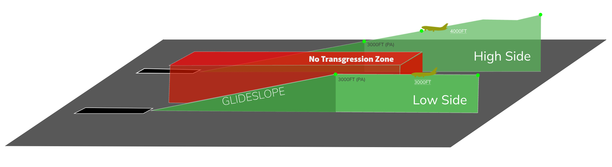

#   Jeddah Approach [OEJN_X_APP] 

!!! success "Covering"
    This section details all the necessary Standard Operating Procedures for **Approach** Operations in **King Abdulaziz International Airport (OEJN)**

---

## 1. General Provisions

**Jeddah Approach Control (APP/FIN)** is tasked with handling the arrival and departure of aircraft at **King Abdulaziz International Airport** within the **Terminal Manevouring Area (TMA)**. Their responsibility includes maintaining adequate spacing and order to ensure safe and efficient operations.

---

## 2. Airspace

The **Jeddah Terminal Manevouring Area (TMA)** is an airspace classified as Class C that reaches up to FL195. This airspace encompasses the entirety of Jeddah city and the adjacent mountainous region within a 60 nautical mile radius.

Figure 1.1 - Jeddah TMA

###  2.1 Aerodromes Covered

The **Jeddah TMA** comprises **King Abdulaziz International Airport (OEJN)** and ***King Faisal Naval Base (OEJF)***.

King Faisal Naval Base (OEJF) is a controlled naval airbase that features an Aerodrome Traffic Zone (ATZ) surrounding the airport's vicinity.

Figure 1.2 - King Faisal ATZ

###  2.2 Airspace Sectorization

####  2.2.1 Lateral View

Figure 1.3 - Jeddah TMA Sectorization - Lateral View

####  2.2.2 Vertical View

Figure 2.3 - Jeddah TMA Sectorization - Vertical View

###  2.3 Surrounding Airspace
#### 2.3.1 Lateral View 

Figure 2.3 - Surrounding Airspaces - Lateral view

#### 2.3.2 Vertical View 

Figure 2.3 - Surrounding Airspaces - Vertical view

###  2.4 Restricted Airspace

Figure 1.4 - Restricted Areas

#### 2.4.1 Prohibited Areas

A prohibited area is a designated area above a country's land or territorial waters where aircraft flight is completely prohibited at all times under any circumstances.

| **Identification & Name** | **Vertical Limits** |     **Remarks**    |
|:-------------------------:|:-------------------:|:------------------:|
|      **OEP01 MAKKAH**     |      SFC - UNL      | Permanent. Makkah. |

Table 1.1 - Prohibited Areas in the Jeddah TMA

#### 2.4.2 Restricted Areas

Restricted airspace is a designated area above a state's land or territorial waters where aircraft flights are regulated based on specific conditions. Civil aircraft can fly in this airspace only if certain requirements are met, such as specified times, meteorological conditions, or special permissions.

| **Identification & Name** | **Vertical Limits** | **Remarks** |
|:-------------------------:|:-------------------:|:-----------:|
|     **OER18B JEDDAH**     |   SFC - 1000FT AGL  |  Permanent. |
|     **OER18A JEDDAH**     |   SFC - 1000FT AGL  |  Permanent. |
|      **OER11 JEDDAH**     |   SFC - 5000FT AMSL  |  Permanent. |
|      **OER12 JEDDAH**     |   SFC - 5000FT AMSL  |  Permanent. |

*Table 1.2 - Restricted Areas in the Jeddah TMA*

#### 2.4.3 Areas of Danger

A danger area is a specified area where activities posing a risk to aircraft flight may occur at certain times. This term is used when the potential danger does not warrant the airspace being classified as restricted or prohibited. By designating a danger area, operators and pilots are cautioned to assess the risks and take responsibility for ensuring the safety of their aircraft.

| **Identification & Name** | **Vertical Limits** |             **Remarks**             |
|:-------------------------:|:-------------------:|:-----------------------------------:|
|      **OED14B OEJN**      |  SFC - 1500FT AMSL  | Military. VFR helicopter operation. |
|      **OED14A OEJN**      |  SFC - 1500FT AMSL  | Military. VFR helicopter operation. |
|      **OED105 OEJN**      |  SFC - 1800FT AMSL  |          Firing. Permanent          |

*Table 1.2 - Areas of Danger in the Jeddah TMA*

###  2.5 Minimum Radar Vectoring Altitude (MRVA)

Figure 1.8 - Minimum Radar Vectoring Altitudes

###  2.6 Transitional Layer

The transitional layer in the Jeddah TMA is between 13000ft and FL150.

---

## 3. ATS Positions

The following are the ATS Positions relevant to this document. They will be subsequently denoted by their stated abbreviations.

|        Radio Callsign        | Logon Callsign | Abbreviation | Frequency |
|:----------------------------:|:--------------:|:------------:|:---------:|
|         Jeddah Tower         |   OEJN_W_TWR   |     AIR W    |  118.200  |
|         Jeddah Tower         |   OEJN_E_TWR   |     AIR E    |  118.500  |
|        Jeddah Approach       |    OEJN_APP    |     APP 1    |  124.000  |
|       Jeddah Final East      |   OEJN_FE_APP  |     FIN E    |  123.800  |
|       Jeddah Final West      |   OEJN_FW_APP  |     FIN W    |  124.675  |
| Jeddah Final Monitor Control |  OEJN_FMC_APP  |     FMC 1    |  125.850  |
|    Jeddah Terminal Control   |   OEJN_1_CTR   |     CTR 1    |  125.450  |
|    Jeddah Terminal Control   |   OEJN_2_CTR   |     CTR 2    |  119.100  |
|        Jeddah Control        |   OEJD_1_CTR   |     ACC 1    |  126.500  |
|        Jeddah Control        |   OEJD_1_CTR   |     ACC 2    |  133.900  |

Table 1.3 - ATS Positions

---

## 4. Designated Areas of Responsiblity (DAOR)
### 4.1 34s DDRO/SDRO Configuration
In any 34 Configuration, APP 1 covers the two parts of the TMA, while APF E handles the 34 FIN SEC East and APF W manages the 34 FIN SEC West.

Figure 1.6 - DOAR 34 Configuration

### 4.2 16s DDRO/SDRO Configuration
In any 16 Configuration, APP 1 covers the two sections of the TMA as usual, APF E is responsible for the 16 FIN SEC East and APF W is responsible for the 16 FIN SEC West.

Figure 1.6 - DOAR 16 Configuration

### 4.3 Standard Connection Hierarchy 
Controllers must log in the following order to maintain realizm and follow SOPs: 

- APP 1 [OEJN_APP]
- APF E [OEJN_FE_APP]
- APF W [OEJN_FW_APP]
- FMC 1 [OEJN_FMC_APP]

 This hierarchy of connection must always be followed unless ATS staff explictly permit you to do otherwise.

---

## 5. General Separation Minimas
### 5.1 Surveillance-Based Separation
Unless specified in 6.1.6.1, aircraft flying within the Jeddah TMA must maintain a horizontal separation of at least **3 nautical miles**. If this distance cannot be achieved, a minimum vertical separation of **1000 feet** should be maintained.

Controllers are required to give suitable speed and altitude directives, along with control over the aircraft's lateral path, to guarantee the necessary separation standards are upheld.

### 5.2 Wake Turbulence Separation
The correct Wake Turbulence Separation (WTS) minimum must always be enforced between aircraft operating below **6000 feet** in the following situations:

* When an aircraft is flying directly behind another at the same altitude or less than 1000 feet below.
* If both aircraft are utilizing the same runway, except as specified in 6.1.6.1.
* When an aircraft is crossing behind another aircraft at the same altitude or less than 1000 feet below.
---

## 6. Procedures
The below procedures are considered as standard and no coordination is required to employ them, except where explicitly required.

!!! caution 
    Should a situation arise that does not match any of the below cases, coordinate an arrangement with the affected agencies

### 6.1 Arrival Procedures

####    6.1.1 STAR Allocation 
STARs are issued by CTR 1/2, or if unavailable, issued by ACC 1/2. The Center always assigns the preferred STARs, typically RNAV STARs with a PTM (Point to Merge) when feasible.

Runways, approaches, and transitions are issued by the approach controller. If the approach controller desires an alternative assignment, they should coordinate this through VCCS with the appropriate enroute controller.

#####    6.1.1.1 Preferred STARs 34s Configuration
|       **Entry Point**       |  VEMEM  |  MISAM  |  NOMDA  |  MOVUL  |  BOSUT  |  EGMEG  |
|:---------------------------:|:-------:|:-------:|:-------:|:-------:|:-------:|:-------:|
| **Preferred Arrival (34R)** | VEMEM2N | MISAM2N | NOMDA2N | MOVUL2N | BOSUT2N | EGMEG2N |
| **Preferred Arrival (34L)** | VEMEM2L | MISAM2L | NOMDA2L | MOVUL2L | BOSUT2L | EGMEG2L |

Table 1.6 - Preferred STARs 34s Configuration

#####    6.1.1.2 Preferred STARs 16s Configuration

|       **Entry Point**       |  VEMEM  |  MISAM  |  NOMDA  |  MOVUL  |  BOSUT  |  EGMEG  |
|:---------------------------:|:-------:|:-------:|:-------:|:-------:|:-------:|:-------:|
| **Preferred Arrival (16R)** | VEMEM2R | MISAM2R | NOMDA2R | MOVUL2R | BOSUT2R | EGMEG2R |
| **Preferred Arrival (16L)** | VEMEM2S | MISAM2S | NOMDA2S | MOVUL2S | BOSUT2S | EGMEG2S |

Table 1.7 - Preferred STARs 16s Configuration

####    6.1.2 Approach and Runway Assignment

Upon initial contact with an aircraft, the aircraft should be assigned the arrival runway and the expected approach type.

> **APP 1:** “SVA449, JEDDAH APPROACH, EXPECT ILS APPROACH RUNWAY 34R, INFORMATION F, [FURTHER INSTRUCTIONS]”

!!! tip 
    If the pilot has correctly noted the ATIS information during their initial contact, the controller is not required to reiterate it.

#####   6.1.2.1 Instrument Approach
In general, the ILS approach is the favored approach type. Nevertheless, aircraft may be instructed to perform a visual approach based on the conditions specified in 6.1.2.2.

RNAV approaches are accessible but should only be utilized if requested by the pilot or due to circumstances like ILS unavailability.

#####   6.1.2.2 Visual Approach

Visual approaches can be initiated by the Approach (APP) controller or requested by the pilot. When a pilot agrees to a visual approach, they are confirming their ability to maintain safe terrain clearance visually and accept responsibility for ensuring a safe landing interval behind the preceding aircraft.

APP can initiate a visual approach under the following conditions:

* The Pilot concurs.
* Pilot reports sighting the preceding aircraft and agrees to maintain their own separation.
* A caution about potential wake turbulence has been issued where necessary.

If the minimum wake turbulence separation cannot be upheld, controllers may propose a visual approach to enable pilots to maintain visual or wake turbulence separation from preceding traffic. 

!!! caution "Be careful!!"
    An aircraft conducting a visual approach cannot participate in simultaneous independent parallel approaches. 
    During BUSY **Independent Parallel Approaches (Mode 1) Operations**, visual approaches are discouraged. 

#####   6.1.2.3 Change of Approach Type/Runway
Controllers should not initiate a change of approach type or runway within **30 nautical miles** of touchdown. However, pilots are allowed to request a change of approach type or runway at any point.

!!! danger "Beware!"
    In Jeddah, **Standard Terminal Arrival Routes (STARs)** are specific to each runway, meaning a single STAR **CANNOT** be utilized for multiple runways. If a runway change is required, the current STAR must be canceled, and radar vectors provided instead. This practice is strongly discouraged to maintain operational efficiency and safety.

####    6.1.3 Point To Merge System

The **Point to Merge System (PTM)** is engineered to operate effectively under heavy traffic conditions without the need for radar vectoring. It is built around a specific P-RNAV route framework that includes a merge point and pre-defined, equidistant sequencing legs from that merge point. 

!!! info "Why is it so important?"
    Jeddah relies entirely on this system to manage traffic sequencing onto the downwind leg, which is relatively short in the area. As a result, the system is heavily utilized to ensure that aircraft are properly sequenced before reaching the downwind.

!!! tip "Substitution"
    If using a STAR with a PTM is not practical/possible, we resort to holding patterns, transitions, or vectors for sequencing.

Figure 1.9 - Point To Merge

#####    6.1.3.1 PTM Rules

The Point Merge System is structured symmetrically, with uniform rules that facilitate the calculation and separation of traffic. The key principles are as follows:

* Each waypoint in the sequencing is equidistant from the merge point;
* The distances between the fixes on the sequencing legs are the same;
* Overlapping PTMs with two arrival flows have altitude restrictions that ensure a vertical separation of at least **1,000 feet** to maintain the minimum separation requirements 

These principles ease the calculation and sequencing for the controller.

####    6.1.4 Descent Profile
When giving descend instructions, the approach controller must mention weather the pilot must descend via the star or descend unrestricted for the first altitude.

If you want to descend via the STAR:

> **Controller:** *SVA123, Descend via the STAR, FL170*

If you want to descend unrestricted:

> **Controller:** *SVA123, Descend unrestricted, FL170*

!!! tip "Change of Profile"
    If you would like to chenge the descend from via the STAR you can use the phrasesolgy below:

    > **Controller:** *SVA123, Continue descend, unrestricted, FL150*

#####   6.1.4.1	Initial Segment of the STAR
######  6.1.4.1.1   34 Configuration - Right Downwind (34R)

| **Arrival** | **Descend Procedure**                                                                                                                                                                                                                                              | **Additional Notes**                                                               |
|:-------------:|--------------------------------------------------------------------------------------------------------------------------------------------------------------------------------------------------------------------------------------------------------------------|:------------------------------------------------------------------------------------:|
| **VEMEM2N** | **CTR 2:** FL190 by VEMEM **APP 1:** FL170 on the sequencing leg **APP 1:** FL150 **APP 1:** Leaving IMDAP, 13000ft **APP 1:** 9000ft by OBTUG **APP 1:** 7000ft by PUSPO, Handoff to APF E  Further with **APF E**. Refer to Section 6.1.4.2. |FL160 can be given as appropriate in the PTM. |
| **MOVUL2N** | **CTR 1:** FL190 by MOVUL **APP 1:** FL170 on the sequencing leg **APP 1:** 13000ft by GINKU **APP 1:** Leaving GINKU, 7000ft by PUSPO, Handoff to APF E  Further with **APF E**. Refer to Section 6.1.4.2.                                     | |
| **MISAM2N** | **CTR 2:** FL170/FL150 by MISAM **APP 1:** FL150 on the sequencing leg **APP 1:** Leaving IMDAP, 13000ft **APP 1:** 9000ft by OBTUG **APP 1:** 7000ft by PUSPO, Handoff to APF E  Further with **APF E**. Refer to Section 6.1.4.2.                     |                        |
| **NOMDA2N** | **CTR 1:** FL190 by NOMDA **APP 1:** FL170 on the sequencing leg **APP 1:** FL150 **APP 1:** Leaving NIVGO, 13000ft **APP 1:** 9000ft by OBTUG **APP 1:** 7000ft by PUSPO, Handoff to APF E  Further with **APF E**. Refer to Section 6.1.4.2. |                                                                                    |
| **EGMEG2N** | **CTR 1:** FL170/FL190 by EGMEG **APP 1:** FL170 **APP 1:** Leaving ULULU, 10000ft **APP 1:** Leaving JN917, 8000ft **APP 1:** 7000ft, Handoff to APF E  Further with **APF E**. Refer to Section 6.1.4.2.                                 |                                                                                    |
| **BOSUT2N** | **CTR 1:** 13000ft by BOSUT **APP 1:** 10000ft  **APP 1:** 6000ft, Handoff to APF E Further with **APF E**. Refer to Section 6.1.4.2.                                                                                                               |                                                                                    |
| **ULULU2NxIMLER1N** | **CTR 1:** 13000ft by BOSUT **APP:** Clearance for ULULU2N via IMLER1N.  **APP 1:** 13000ft by ULULU **APP 1:** Leaving ULULU, 10000ft **APP 1:** 8000ft  **APP 1:** Leaving JN920, 7000ft, Handoff to APF E  Further with **APF E**. Refer to Section 6.1.4.2.                                                        | _IMLER1N Transition_  Holds over ULULU as necessary for sequencing.                                      |                                                                                                                                                                   

Table 2.9 - Descent Profile - Right Downwind (34R)

######  6.1.4.1.2  34 Configuration - Left Downwind (34L)

| **Arrival** | **Descend Procedure**                                                                                                                                                                                                                                                                                                               | **Additional Notes**                                                                                                                              |
|:-------------:|-------------------------------------------------------------------------------------------------------------------------------------------------------------------------------------------------------------------------------------------------------------------------------------------------------------------------------------|:---------------------------------------------------------------------------------------------------------------------------------------------------:|
| **VEMEM2L** | **CTR 2:** FL190 by VEMEM **APP 1:** FL170 **APP 1:** Leaving RABEP, FL150 **APP 1:** Leaving IMDAP, 11000ft **APP 1:** 11000ft by OBTUG **APP 1:** Leaving OBTUG, 7000ft **APP 1:** Past Midfield and clear of the DEPs, 6000ft, Handoff to APF W  Further with **APF W**. Refer to Section 6.1.4.2. | FL160 can be given as appropriate in the PTM.                                                                                                     |
| **MOVUL2L** | **CTR 1:** FL190 by MOVUL **APP 1:** FL170 **APP 1:** FL150 **APP 1:** 10000ft by GINKU  **APP 1:** 8000ft **APP 1:** 6000ft, Handoff to APF W by TOTNU    Further with **APF W**. Refer to Section 6.1.4.2.                                                                                       |                                                                                                                                                   |
| **MISAM2L** | **CTR 2:** FL170/FL150 by MISAM **APP 1:** FL150 on the sequencing leg **APP 1:** 13000ft **APP 1:** 11000ft by OBTUG **APP 1:** Leaving OBTUG, 7000ft **APP 1:** Past Midfield and clear of the DEPs, 6000ft, Handoff to APF W   Further with **APF W**. Refer to Section 6.1.4.2.                   |                                                                                                                                                   |
| **NOMDA2L** | **CTR 1:** FL190 by NOMDA **APP 1:** FL170 **APP 1:** Leaving JN789, FL150 **APP 1:** Leaving NIVGO, 13000ft **APP 1:** 10000ft by GINKU **APP 1:** 8000ft **APP 1:** 6000ft, Handoff to APF W by TOTNU  Further with **APF W**. Refer to Section 6.1.4.2.                                            |                                                                                                                                                   |
| **EGMEG2L** | **CTR 1:** FL150 by EGMEG **APP 1:** 13000ft **APP 1:** 11000ft **APP 1:** 8000ft **APP 1:** 6000ft, Handoff to APF W  Further with **APF W**. Refer to Section 6.1.4.2.                                                                                                                                    |                                                                                                                                                   |
| **ULULU2LxTADMA1L** | **CTR 1:** FL150 by EGMEG **APP 1:** Clearance for ULULU2L via TADMA1L transition. **APP 1:** 13000ft **APP 1:** 11000ft **APP 1:** 6000ft by ULULU **APP 1:** Overhead ULULU, Handoff to APF W  Further with **APF W**. Refer to Section 6.1.4.2.                                                               | _TADMA1L Transition_ Holds over ULULU as necessary for sequencing _If the traffic will be entering the holding, descend to the MHA (10000)_ |
| **BOSUT2L** | **CTR 1:** 13000ft by BOSUT **APP 1:** 8000ft  **APP 1:** 6000ft, Handoff to APF W  Further with **APF W**. Refer to Section 6.1.4.2.                                                                                                                                                                             |                                                                                                                                                   |
| **ULULU2LxTAPSU1L** | **CTR 1:** 13000ft by BOSUT **APP 1:** Clearance for ULULU2L via TAPSU1L transition. **APP 1:** 11000ft **APP 1:** Passing REXED, 6000ft  **APP 1:** Overhead ULULU, Handoff to APF W  Further with **APF W**. Refer to Section 6.1.4.2.                                                                            | _TAPSU1L Transition_ Holds over ULULU as necessary for sequencing _If the traffic will be entering the holding, descend to the MHA (10000)_ |

Table 3.0 - Descent Profile - Left Downwind (34L)

######  6.1.4.1.3  16 Configuration - Left Downwind (16L)

| **Arrival**         | **Descend Procedure**                                                                                                                                                                                                                                                                                       | **Additional Notes**                                                                                                                                                               |
|:---------------------:|-------------------------------------------------------------------------------------------------------------------------------------------------------------------------------------------------------------------------------------------------------------------------------------------------------------|:------------------------------------------------------------------------------------------------------------------------------------------------------------------------------------:|
| **VEMEM2S**         | **CTR 2:** FL150 by VEMEM **APP 1:** 13000ft **APP 1:** 10000ft by IMDAP **APP 1:** Leaving IMDAP, 6000ft, Handoff to APF E  Further with **APF E**. Refer to Section 6.1.4.2.                                                                                                         |                                                                                                                                                                                    |
| **MOVUL2S**         | **CTR 2:** FL150 by MOVUL **APP 1:** 13000ft **APP 1:** 11000ft/7000ft **APP 1:** 5000ft, Handoff to APF E  Further with **APF E**. Refer to Section 6.1.4.2.                                                                                                                          |                                                                                                                                                                                    |
| **MISAM2S**         | **CTR 2:** 13000ft by MISAM **APP 1:** 11000ft on the sequencing leg **APP 1:** 10000ft by IMDAP **APP 1:** Leaving IMDAP, 6000ft, Handoff to APF E  Further with **APF E**. Refer to Section 6.1.4.2.                                                                                 |                                                                                                                                                                                    |
| **NOMDA2S**         | **CTR 1:** FL150 by NOMDA **APP 1:** 13000ft on the sequencing leg **APP 1:** 11000ft **APP 1:** 6000ft, Handoff to APF E by NABGI  Further with **APF E**. Refer to Section 6.1.4.2.                                                                                                  |                                                                                                                                                                                    |
| **EGMEG2S**         | **CTR 1:** FL150 by EGMEG **APP 1:** 13000ft **APP 1:** 12000ft **APP 1:** 9000ft **APP 1:** 7000ft **APP 1:** Past Midfield/Clear of DEPs 6000ft, Handoff to APF E  Further with **APF E**. Refer to Section 6.1.4.2.                                                           |                                                                                                                                                                                    |
| **BOSUT2S**         | **CTR 1:** FL190 **APP 1:** FL160 **APP 1:** FL150 **APP 1:** 11000ft **APP 1:** 8000ft till ITOMA **APP 1:** 6000ft, Handoff to APF W  Further with **APF W**. Refer to Section 6.1.4.2.                                                                                        |                                                                                                                                                                                    |
| **ULULU2SxIMLER1S** | **CTR 1:** FL190 at BOSUT **APP 1:** Clearance for ULULU2S Via IMLER1S Transition **APP 1:** FL160 **APP 1:** 12000ft **APP 1:** 9000ft **APP 1:** 7000ft **APP 1:** Past MIdfield/Clear of DEPS, 6000ft, Handoff to APF E  Further with **APF E**. Refer to Section 6.1.4.2. | _IMLER1L Transition_ Cleared for the BOSUT2S by CTR Holds over ULULU as necessary for sequencing _If the traffic will be entering the holding, descend to the MHA (9000)_ |

Table 3.1 - Descent Profile - Left Downwind (16L)

######  6.1.4.1.4  16 Configuration - Right Downwind (16R)

|     **Arrival**     |                                                                                                                 **Descend Procedure**                                                                                                                |                                                                                        **Additional Notes**                                                                                       |
|:-------------------:|----------------------------------------------------------------------------------------------------------------------------------------------------------------------------------------------------------------------------------------------------|:-------------------------------------------------------------------------------------------------------------------------------------------------------------------------------------------------:|
| **VEMEM2R**         | **CTR 2:** FL150 by VEMEM **APP 1:** 13000ft on the sequencing leg **APP 1:** 10000ft by IMDAP **APP 1:** 8000ft **APP 1:** 6000ft, Handoff to APF W  Further with APF W. Refer to Section 6.1.4.2.                                                    |                                                                                                                                                                                                   |
| **MOVUL2R**         | **CTR 2:** FL150 by MOVUL **APP 1:** 13000ft **APP 1:** 11000ft/6000ft **APP 1:** 4000ft, Handoff to APF W  Further with APF W. Refer to Section 6.1.4.2.                                                                                             |                                                                                                                                                                                                   |
| **MISAM2R**         | **CTR 2:** 13000ft by MISAM **APP 1:** 11000ft on the sequencing leg **APP 1:** 10000ft by IMDAP **APP 1:** 8000ft **APP 1:** 6000ft, Handoff to APF W  Further with APF W. Refer to Section 6.1.4.2.                                                  |                                                                                                                                                                                                   |
| **NOMDA2R**         | **CTR 1:** FL150 by NOMDA **APP 1:** 13000ft on the sequencing leg **APP 1:** 11000ft **APP 1:** 6000ft, Handoff to APF W by NABGI  Further with APF W. Refer to Section 6.1.4.2.                                                                     |                                                                                                                                                                                                   |
| **EGMEG2R**         | **CTR 1:** FL150 by EGMEG **APP 1:** 13000ft **APP 1:** 8000ft **APP 1:** Past Midfield/Clear of DEPs 6000ft, Handoff to APF W  Further with APF W. Refer to Section 6.1.4.2.                                                                         |                                                                                                                                                                                                   |
| **BOSUT2R**         | **CTR 1:** FL190 **APP 1:** FL150 **APP 1:** 11000ft **APP 1:** 8000ft till GEVUS **APP 1:** 6000ft, Handoff to APF W  Further with APF W. Refer to Section 6.1.4.2.                                                                                   |                                                                                                                                                                                                   |
| **ULULU2RxIMLER1R** | **CTR 1:** FL190 at BOSUT **APP 1:** Clearance for ULULU2R Via IMLER1R Transition **APP 1:** FL160 **APP 1:** 12000ft **APP 1:** 8000ft APP 1: Past Midfield/Clear of DEPS, 6000ft, Handoff to APF W  Further with APF W. Refer to Section 6.1.4.2. | IMLER1R Transition Cleared for the BOSUT2R by CTR Holds over ULULU as necessary for sequencing If the traffic will be entering the holding, descend to the MHA (9000) or as appropriate  |

Table 3.1.1 - Descent Profile - Right Downwind (16R)

#####   6.1.4.2	Final Segment of the STAR
The Downwind till final of the star is defined as the final segment. This part of the star is with the appropriate APF Controller.

!!! caution "Do note"
The final segment of the STAR descend profile is really variable depending on the sequence's leg, the amount of traffic, and much more. Use this as the standard profile but adjust as appriorpraite ensuring separation requirmenets are met

######   6.2.4.2.1 34s Configuration - Downwind - Suggested Descents

| **Leg**           | **Descent Profile** | **Mandatory Altitudes**                                           |
|:-------------------------:|:-----------------------------:|:-------------------------------------------------------------------:|
| **Right Downwind (34R)**| Generally **ODD** (7000ft, 5000ft) | For ILS Z 34R (Vectors), maintain a minimum altitude of **5000ft** on the downwind, typically assigned at ITOMA, to avoid the MRVA of 4200 when canceling the STAR for vectors. For ILS Y (IAF ITOMA), descend to **3000ft** at ITOMA. |
| **Left Downwind (34L)** | Generally **EVEN** (8000ft, 6000ft, 4000ft) | N/A                                                               |

*Table 3.2 - 34s Configuration - Suggested Descents*

!!! caution "Do note"
    This may be adjusted to accommodate more traffic during high traffic operations.

######   6.2.4.2.2 16s Configuration - Downwind - Suggested Descents

| **Leg**           | **Descent Profile** | **Mandatory Altitudes**                                                    |
|:-------------------------:|:-----------------------------:|:----------------------------------------------------------------:|
| **Right Downwind (16R)**| Generally **EVEN** (8000ft, 6000ft, 4000ft) | Nil. |
| **Left Downwind (16L)** | Generally **ODD** (7000ft, 5000ft) | Nil.|

Table 3.3 - 16s Configuration - Suggested Descents

!!! caution "Do note"
    This may be adjusted to accommodate more traffic during high traffic operations.

####    6.1.5 Lateral Profile
#####   6.1.5.1 Standard Shortcuts'
When provided by APP 1, direct routings/shortcuts for arrivals in any configuration should only lead to a merge point when employing a point-to-merge system, or to one of the downwind fixes for sequencing in coordination with the respective APF controller.

#####   6.1.5.2 Sequencing/Horizontal Separation
Traffic entering the downwind should be separated horizontally by a minimum of **7nm**.

####    6.1.6 Speed Control

Aircraft should ideally be provided with speeds according to section 5.1 to ensure separation. If necessary for maintaining distance between aircraft, speeds within the appropriate range can be utilized, ensuring that maximum or minimum speeds for each segment are not exceeded.

To ease the workload of controllers, aircraft may be directed to adhere to the specified speeds on the STAR.

> Example: **“SVA499, MAINTAIN STAR SPEEDS”**

|    **Arrival segment**    |                  **Recommend/Published Speed**                  | **Speed Range** |
|:-------------------------:|:---------------------------------------------------------------:|:---------------:|
|       **TMA Entry**       |                               250                               |     280-230     |
| **On the Point to Merge** |                             250/230                             |     250-220     |
|  **Approaching Downwind** | 220;**this must be enforced before handing off traffic to APF** |     230-220     |
|      **On Downwind**      |                               210                               |     230-190     |
|   **Turning Base/Base**   |                               190                               |     200-180     |
|  **10NM from Touchdown**  |                             170-190                             |     160-190     |
|   **4NM from Touchdown**  |                               160                               |       160       |

Table 3.6 - Speed Control

#####    6.1.6.1 Deviation from published and recommended speeds

It is advised to adhere to recommended speeds from the downwind leg onward to avoid affecting turn radius and rate, potentially leading to a localizer overshoot. Consistent speeds also give controllers more time to manage aircraft on the downwind leg effectively.

For aircraft on a straight-in approach from the initial STAR fix, speed control is unnecessary until the aircraft aligns with the final approach course, or if needed for separation purposes. However, it is advisable to instruct traffic to maintain a maximum speed of 190 knots at 10 nautical miles from the landing threshold to ensure approach stabilization criteria are met.

In the TMA, higher speeds may be allowed if the aircraft does not anticipate turns exceeding a 30-degree course change in any arrival segment, and if the traffic volume and controller workload permit such speeds.

####    6.1.7 Final Approach Sequencing

#####   6.1.7.1 Standard Vectors

| **Runway** | **Base Leg** | **Intercepting Vector** |
|:----------:|:------------:|:-----------------------:|
|   **34L**  |      070     |      010 (340-010)      |
|   **34R**  |      250     |     310 (340 - 310)     |
|   **16L**  |      250     |      190 (160-190)      |
|   **16R**  |      070     |      130 (160-130)      |

Table 3.4 - Standard Vectors

#####   6.1.7.2 Platform Altitudes

| **Runway** | **Platform Altitude** |
|:----------:|:---------------------:|
|   **34L**  |          2700         |
|   **34R**  |          2100         |
|   **16L**  |          1700         |
|   **16R**  |          2700         |

Table 3.5 - Platform Altitudes

####    6.1.8 Independent Parallel Approaches (Mode 1)

**Independent Parallel Approaches (Mode 1)** involves the simultaneous use of parallel instrument runways without requiring radar separation between aircraft utilizing adjacent ILS systems. This operational method is highly efficient and facilitates high traffic volume.

In independent parallel approaches, significant attention is placed on the altitude levels at which the glide path or vertical path is intercepted (referred to as "high side" and "low side"), and the necessity to adhere to these levels until the aircraft is established on both the final approach course and glide path.

#####   6.1.8.1 Separation Requirements

A vertical separation of 1000 feet or 5nm horizontally must be maintained between aircraft until:

* The aircraft is aligned with the Localizer/Inbound Course, and
* Enters the Normal Operating Zone (NOZ).

!!! tip 
    Following the High/Low Side procedure and descending aircraft to the corresponding High/Low Side Altitudes as outlined in section 6.1.8.2.1 automatically ensures this separation.

**Once these conditions are met and the aircraft is within 10 nautical miles, diagonal or vertical separation is no longer necessary**
#####   6.1.8.2 High/Low Side 

A set of parallel approaches includes a designated "high side" and "low side" for vectoring purposes, ensuring vertical separation until aircraft are aligned with their respective parallel ILS localizer courses. 

The low side altitude should be chosen so that the aircraft becomes aligned with the ILS localizer course well in advance of intercepting the ILS glide path. The high side altitude should be maintained at least 300 meters (1,000 feet) above the low side altitude until 18 kilometers (10 nautical miles) from the threshold.

To achieve this, aircraft should be descended to the appropriate high or low side altitude specified in section 6.1.8.2.1.

Figure 2.0 - High/Low Side

######   6.1.8.2.1 High/Low Side Altitudes

The altitudes for the **"high side"** and **"low side"** must be assigned to aircraft **before** or **at** the time of the base instruction.

> **APF:** SVA123, Descend 3000ft, Turn Right Heading 070, Base Leg

!!! danger "DO NOTE!! VERY IMPORTANT"
    Aircraft can always maintain or ascend to the high side altitude as this action only enhances vertical separation. **HOWEVER, for the low side altitude, aircraft must already be descending or positioned at the lower altitude before initiating the base turn to guarantee that separation does not decrease below 1000 feet.**

| **Approach** | **Side** | **Altitude** |
|:------------:|:--------:|:------------:|
|  **ILS 34R** |   High   |    4000ft    |
|  **ILS 34L** |    Low   |    3000ft    |
|  **ILS 16R** |   High   |    3000ft    |
|  **ILS 16L** |    Low   |    2000ft    |

Table 3.7 - High/Low Side Altitudes

#####   6.1.8.3 Radar Vectoring

When vectoring aircraft to intercept the ILS localizer course, the final vector must allow the aircraft to approach the localizer course or final approach track at an angle not exceeding 30 degrees, as per standard vectors outlined in section 6.1.5.1. 

Additionally, there should be a minimum of **1.0NM** of straight and level flight before intercepting the ILS localizer course. The vectors should ensure that the aircraft is aligned with the ILS localizer course or MLS final approach track in level flight for at least **2NM** before intercepting the ILS glide path. 

Traffic **MUST** be cleared on the localizer initially, then cleared to descend via the glide after entering the NOZ and on the correct localizer course.

**This indicates that aircraft must be established on the localizers no later than:**

| **Approach** |    **Altitude**    | **Established on the LOC Before** |
|:------------:|:------------------:|:---------------------------------:|
|  **ILS 34R** | 4000ft (High Side) |                14NM               |
|  **ILS 34L** |  3000ft (Low Side) |                11NM               |
|  **ILS 16R** | 3000ft (High Side) |                11NM               |
|  **ILS 16L** |  2000ft (Low Side) |                8NM                |

Table 3.8 - High/Low Side Altitudes

#####   6.1.8.4 Non Transgression Zone (NTZ)
Since radar separation is not provided between traffic on adjacent extended runway centre lines in Mode 1 approaches, there must be an established means of determining when an aircraft deviates too far from the ILS localizer course or the MLS final approach track. This is achieved through the concept of the NTZ.

Figure 4.1 - NTZ/NOZ

######   6.1.8.4.1 Normal Operating Zone (NOZ)

The Normal Operating Zone, illustrated in Figure 4.1, is the designated region near the localizer where an aircraft is considered secure and on its approach path. To enable independent parallel approaches, aircraft must remain within the NOZ.

---

### 6.2 Departures Procedures
####    6.2.1 Climb Profile
#####    6.2.1.1 Climb Procedure - 34 Configuration
| **Departure** |                                                                                        **Climb Procedure**                                                                                       |                                                             **Additional Notes**                                                             |
|:-------------:|:------------------------------------------------------------------------------------------------------------------------------------------------------------------------------------------------:|:--------------------------------------------------------------------------------------------------------------------------------------------:|
|  **BOMOX2W**  |                                                    **APP:** 6000ft till clear of the arrivals/till JN276 **APP:** Even levels up till FL200                                                   |                                                             Handoff Passing FL160                                                            |
|  **MIGDA2W**  |                                                    **APP:** 6000ft till clear of the arrivals/till JN276 **APP:** Even levels up till FL200                                                   |                                                             Handoff Passing FL160                                                            |
|  **DATAP2W**  |                                    **APP:** 6000ft till clear of the arrivals/till JN276 **APP:** 12000ft till JN510/Clear of NOMDA ARRs **APP:** FL160                                    |   Handoff Passing 13000ft **If climb to 12000ft was given prior to JN510 and track miles permit, APP may issue even levels till FL200.**  |
|  **EGREP2W**  |                                    **APP:** 6000ft till clear of the arrivals/till JN276 **APP:** 12000ft till JN520/Clear of NOMDA ARRs **APP:** FL160                                    |   Handoff Passing 13000ft **If climb to 12000ft was given prior to JN520 and track miles permit, APP may issue even levels till FL200.**  |
|  **ISLAM2W**  |                                                            **APP:** 6000ft till clear of the arrivals/till JN276 **APP:** 12000ft                                                             |                                                          Handoff after clear of PTMs                                                         |
|  **KAROX2W**  |                          **APP:** 6000ft till clear of the arrivals/till JN276 **APP:** 12000ft till JN610/Clear of NOMDA ARRs **APP:** Even levels up till FL200                          |                                                             Handoff Passing FL160                                                            |
|  **RIBAM2W**  | **APP:** 6000ft till clear of the arrivals/till JN276 **APP:** 8000ft till JN522/Clear of ULULU ARRs **APP:** 12000ft till JN521/Clear of ULULU ARRs **APP:** Even levels up till FL200 |                                                             Handoff Passing FL160                                                            |
|  **EGPOB3V**  | **APP:** 6000ft till clear of the arrivals/till JN276 **APP:** 8000ft till JN522/Clear of ULULU ARRs **APP:** 12000ft till JN521/Clear of ULULU ARRs **APP:** Even levels up till FL200 |                                                             Handoff Passing FL160                                                            |
|  **BOMOX3V**  |                             **APP:** 6000ft till clear of the arrivals/till RIBIL **APP:** 12000ft till Clear of NOMDA ARRs **APP:** Even levels up till FL200                             |                                                             Handoff Passing FL160                                                            |
|  **MIGDA3V**  |                             **APP:** 6000ft till clear of the arrivals/till RIBIL **APP:** 12000ft till Clear of NOMDA ARRs **APP:** Even levels up till FL200                             |                                                             Handoff Passing FL160                                                            |
|  **DATAP3V**  |                                            **APP:** 6000ft till clear of the arrivals/till RIBIL **APP:** Even levels up till FL200 (Unrestricted)                                            |                                                             Handoff Passing FL160                                                            |
|  **EGREP3V**  |                                            **APP:** 6000ft till clear of the arrivals/till RIBIL **APP:** Even levels up till FL200 (Unrestricted)                                            |                                                             Handoff Passing FL160                                                            |
|  **ISLAM3V**  |                                                            **APP:** 6000ft till clear of the arrivals/till JN236 **APP:** 12000ft                                                             |                                                          Handoff after clear of PTMs                                                         |
|  **KAROX3V**  |                                                                 **APP:** 6000ft till JN236 **APP:** Even levels up till FL200                                                                 | Handoff Passing FL160 and clear of ARRs **Traffic must be given the highest altitude (FL200) immediately after JN236 if traffic permits** |
|  **RIBAM3V**  |                                                                 **APP:** 6000ft till JN236 **APP:** Even levels up till FL200                                                                 | Handoff Passing FL160 and clear of ARRs **Traffic must be given the highest altitude (FL200) immediately after JN236 if traffic permits** |
|  **EGPOB3V**  |                                                                 **APP:** 6000ft till JN236 **APP:** Even levels up till FL200                                                                 | Handoff Passing FL160 and clear of ARRs **Traffic must be given the highest altitude (FL200) immediately after JN236 if traffic permits** |

Table 3.9 - Climb Procedure - 34 Configuration

####    6.2.2 Lateral Profile
#####   6.2.2.1 Standard Shortcuts
Direct routings can used as appropriate when traffic levels are low. 

!!! danger "Do note"
    THEY MUST NOT BE USED IN HIGH TRAFFIC SCENARIOS.

#####   6.2.2.1.1 Standard Shortcuts - 34s Configuration
| **Departure** | **Standard Shortcuts**                                        | **Additional Notes** |
|---------------|---------------------------------------------------------------|----------------------|
| **BOMOX2W**   | No direct routings permitted                                  |                      |
| **MIGDA2W**   | No direct routings permitted                                  |                      |
| **DATAP2W**   | Direct to JN510 if traffic permits                            |                      |
| **EGREP2W**   | Direct to JN520 if traffic permits                            |                      |
| **ISLAM2W**   | No direct routings permitted                                  |                      |
| **KAROX2W**   | From JN276/JN254 to NIVBA if above 5000ft and traffic permits |                      |
| **RIBAM2W**   | From JN276/JN254 to NIVBA if above 5000ft and traffic permits |                      |
| **EGPOB3W**   | From JN276/JN254 to NIVBA if above 5000ft and traffic permits |                      |
| **BOMOX3V**   | No direct routings permitted                                  |                      |
| **MIGDA3V**   | No direct routings permitted                                  |                      |
| **DATAP3V**   | No direct routings permitted                                  |                      |
| **EGREP3V**   | No direct routings permitted                                  |                      |
| **ISLAM3V**   | No direct routings permitted                                  |                      |
| **KAROX3V**   | No direct routings permitted                                  |                      |
| **RIBAM3V**   | No direct routings permitted                                  |                      |
| **EGPOB3V**   | No direct routings permitted                                  |                      |

Table 5.9 - Standard Shortcuts - 34 Configuration

####    6.2.2.2 Sequencing/Horizontal Separation
Approach should strive to transfer traffic with a minimum of **8-10** nautical miles in trail, and increasing.

####    6.2.3 Speed Control
For departing aircraft, speed control can be issued as needed, with a maximum speed of **280 to 300** knots.

!!! tip "Higher Speed"
    In Class C airspace below 10,000 feet, aircraft are required to maintain speeds of 250 knots or lower. If you wish to grant unrestricted climb and encourage a higher speed, you can communicate the following message:

    > **APP 1:** *"SVA123, High Speed Approved"*

!!! caution "Do Note"
    When assigning a speed greater than 250 knots to an aircraft below 10,000 feet in Class C airspace, you do not need to provide a specific "high speed" instruction. Simply state the speed that has been assigned.

---

### 6.3 Handoff Procedures
Handoffs should always be made between **2000 and 5000 feet** before reaching the assigned altitude.

####    6.3.2 Arrivals

| Entry Point: |                  **From:**                 |         **To:**         |         **Notes**        |
|:------------:|:------------------------------------------:|:-----------------------:|:------------------------:|
|   **MISAM**  | **_Jeddah Terminal Control East (CTR 2)_** | Jeddah Approach (APP 1) | CTR 1 when 2 is offline. |
|   **VEMEM**  | **_Jeddah Terminal Control East (CTR 2)_** | Jeddah Approach (APP 1) | CTR 1 when 2 is offline. |
|   **NOMDA**  | **_Jeddah Terminal Control West (CTR 1)_** | Jeddah Approach (APP 1) |                          |
|   **MOVUL**  | **_Jeddah Terminal Control West (CTR 1)_** | Jeddah Approach (APP 1) |                          |
|   **EGMEG**  | **_Jeddah Terminal Control West (CTR 1)_** | Jeddah Approach (APP 1) |                          |
|   **BOSUT**  | **_Jeddah Terminal Control West (CTR 1)_** | Jeddah Approach (APP 1) |                          |

Table 4.2 - Handoff Procedure - Arrivals

####    6.3.3 Departures
| Exit Point: |        **From:**        |                   **To:**                  |         **Notes**        |
|:-----------:|:-----------------------:|:------------------------------------------:|:------------------------:|
|  **EGREP**  | Jeddah Approach (APP 1) | **_Jeddah Terminal Control East (CTR 2)_** | CTR 1 when 2 is offline. |
|  **ISLAM**  | Jeddah Approach (APP 1) | **_Jeddah Terminal Control East (CTR 2)_** | CTR 1 when 2 is offline. |
|  **BOMOX**  | Jeddah Approach (APP 1) | **_Jeddah Terminal Control West (CTR 1)_** |                          |
|  **MIGDA**  | Jeddah Approach (APP 1) | **_Jeddah Terminal Control West (CTR 1)_** |                          |
|  **DATAP**  | Jeddah Approach (APP 1) | **_Jeddah Terminal Control West (CTR 1)_** |                          |
|  **KAROX**  | Jeddah Approach (APP 1) | **_Jeddah Terminal Control West (CTR 1)_** |                          |
|  **RIBAM**  | Jeddah Approach (APP 1) | **_Jeddah Terminal Control West (CTR 1)_** |                          |

Table 4.3 - Handoff Procedure - Departures

---

## 7. Final Approach Monitering (OEJN_FMC_APP)

The **Jeddah Final Monitoring Control (FMC)** is responsible for monitoring traffic when the 1000ft vertical separation is reduced. 

FMC verifies that when the 1,000 ft vertical separation is decreased:

* Aircraft do not enter the depicted No Transgression Zone (NTZ).
* The appropriate minimum longitudinal separation between aircraft on the same ILS localizer course is preserved.
 
 ### 7.1 Termination of Radar Monitering
**Radar monitoring should not be terminated until:**

* Visual separation is implemented, ensuring that both radar controllers are informed whenever visual separation is applied; or
* The aircraft has landed, or in the event of a missed approach, is a minimum of **1.0 NM** beyond the departure end of the runway and maintains sufficient separation from any other traffic.

!!! caution "Do Note"
    There is no requirement to advise the aircraft that radar monitoring is terminated.

### 7.2 Infringement of NTZ
When an aircraft is seen deviating from the ILS localizer course towards the No Transgression Zone (NTZ) and remains in the Normal Operating Zone (NOZ), ATC will instruct the aircraft to promptly return to the correct ILS localizer course using the following phraseology:

> **FMC:** *“OBSERVING YOU ARE LEFT (or RIGHT) OF THE LOCALIZER (or FINAL APPROACH COURSE), TURN RIGHT (or LEFT)
IMMEDIATELY AND REJOIN THE LOCALIZER”*

### 7.2.1 Break-Out Maneuver

When FMC observes an aircraft penetrating or about to penetrate the No Transgression Zone (NTZ), they will first instruct the aircraft on the adjacent ILS localizer course to adjust their course to avoid the deviating aircraft, using the following phraseology:

> **FMC:** *“Break-Out Alert, (callsign), turn (Left or Right), Immediately Heading (3 digits), Climb (or descend) to (altitude)”*

!!! danger "Do Note"
    No heading instruction will be issued when aircraft is below 400 feet.

---

## 8. Holding Procedures

There are five primary published holding stacks located within the Jeddah Terminal Maneuvering Area (TMA). These stacks are used for holding arriving aircraft or as part of the missed approach procedures for certain instrument approaches.

!!! caution "Use with Caution"
    In the Jeddah Terminal Maneuvering Area (TMA), holdings should be considered the final option for sequencing aircraft. Radar vectors, speed adjustments, direct routing, and using PTM are significantly more efficient methods for managing aircraft traffic flow.

### 8.1 Holding Stacks in the Jeddah TMA

| **Holding Fix** |  **Radial/DME** |                            **Use**                            |
|:---------------:|:---------------:|:-------------------------------------------------------------:|
|    **IMDAP**    | JDW R-053/25DME |           RNAV STAR RWYs 34C/34L/34R and 16C/16L/16R          |
|    **IMDAP**    | JDW R-053/25DME | Missed approach holding for RWY34R & RWY34C & RWY16L & RWY16C |
|    **ULULU**    | JDW R-208/20DME |           RNAV STAR RWYs 34C/34L/34R and 16C/16L/16R          |
|    **ULULU**    | JDW R-208/20DME |               Missed approach holding for RWY16R              |
|    **RADKI**    |  JDWR-302/18DME |        Missed approach holding for ILS Z or LOC RWY 34L       |

Table 5.6 - Published Holding Stacks

Figure 5.6 - Published Holding Stacks

