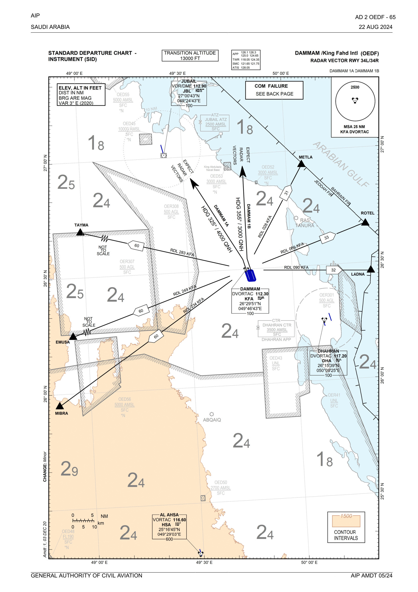

# Dammam Delivery [OEDF_1_GND]

!!! success "Covering"
    This section details all the necessary Standard Operating Procedures for Delivery Operations in **King Fahd International Airport (OEDF)**

!!! caution "Do Note"
    **King Fahd International Airport (OEDF)** does **NOT** have a GMP position. The Ground Movement Planner (GMP) operations are handled by SMC 1.

    During periods of high traffic, the authority to issue clearances may be delegated to SMC 2.

## 1. General Provisions

**Dammam Ground (OEDF_1_GND)** is entrusted with the task of validating routes and providing IFR/VFR clearances to departing aircraft. This involves carefully reviewing the flight plan and cross-verifying the accuracy of the filed route, assigned level, and departure procedure. In situations where any inconsistencies, errors, or invalid information are identified, the controller must rectify the errors and issue a reclearance.

Additionally, the GMP plays a vital role in minimizing potential delays and congestion on the taxiways for outbound flights. During periods characterized by increased departure activities, the GMP implements proactive measures to optimize the flow of traffic. This includes holding aircraft at their stands.

!!! danger "Don't get confused!"
    In this section, GMP (Ground Movement Planner) will be used to refer to Dammam Ground (SMC 1).

---

## 2. Departure Clearance

### 2.1 General

GMP is responsible for issuing IFR/VFR clearances for departing aircraft. Pilots may be expected to report the
following information on first contact:

-   Callsign;
-   Aircraft type;
-   Parking stand;
-   Destination;
-   Any other special requests

### 2.2 IFR Clearances

An IFR clearance shall contain:

-   Destination (Optional);
-   Departure procedure;
-   Departure runway;
-   Initial climb;
-   Assigned SSR code

#### 2.2.1 Phrasesology

In Dammam, the standard GACA phrasesology is used. For IFR Clearances, the following phrasesolgy must strictly be adhered to.

> **Pilot:** _SVA123, Stand 21, A320, requesting IFR clearance to Jeddah_

> **GMP:** _SVA123, Cleared Jeddah as filed, MIBRA2E Departure, Runway 34L, Initial Climb 4000ft, SQWK XXXX_

  --------------------------------------------------------------Pilot Readbacks--------------------------------------------------------------

> **GMP:** _SVA123, Readback Correct, Information A, Report ready for push and start_

!!! tip "Keep in mind"
    GMP shall obtain a full readback of the clearance. If the pilot reports the current information on initial contact, GMP must not repeat it.

#### 2.2.2 Departure Procedures

##### 2.2.2.1 RNAV SIDs

Dammam Airport predominantly utilizes **RNAV standard instrument departures (SIDs)** as the preferred departure method for aircraft flying under instrument flight rules (IFR). The selection of the appropriate RNAV departure for departing aircraft is based on the exit point specified in the flight plan and the active runways at the airport.

GMP must always issue RNAV SIDs unless needed otherwise.

| **Exit Points** | **METLA** | **ROTEL** | **LADNA** | **RYDAN** | **MIBRA** | **TAYMA** | **EMUSA** | **PUSRA** |
| :-------------: | :-------: | :-------: | :-------: | :-------: | :-------: | :-------: | :-------: | :-------: |
|     **34L**     |    1E     |    1E     |    1E     |    2E     |    2E     |    2E     |    2E     |    2E     |
|     **34R**     |    1F     |    1F     |    1F     |    2F     |    2F     |    2F     |    2F     |    2F     |
|     **16L**     |    1H     |    2H     |    1H     |    2H     |    2H     |    2H     |    2H     |    2H     |
|     **16R**     |    1G     |    2G     |    1G     |    2G     |    2G     |    2G     |    2G     |    2G     |

Table 2.2.2.1 - RNAV SIDs of Dammam

!!! info "Initial Climb"
    Regardless of the specific SID chosen, all departures require an initial climb to an altitude of **4000 feet**.

##### 2.2.2.2 Radar Departures

King Fahd International Airport (OEDF) offers two radar departures, namely **DAMMAM1A** and **DAMMAM1B**, specifically designed for aircraft departing from **Runway 34L and 34R**, respectively. These departure procedures involve deviating the aircraft by _15_ degrees from the runway heading until further instructions are provided by APP.

It is important to note that these radar departures should only be utilized when necessary, and their usage requires coordination with APP 1 and/or APP L.

!!! Example "Coordination Example for Radar Departures"
    SVA123 is requesting DAMMAM1A due to outdated AIRAC. GMP must call APP via VCCS to coordinate

    > **GMP:** _Calls APP via VCCS_

    > **APP:** _Accepts call from GMP_

    > **GMP -> APP:** _APP, SVA123 is an A320 requesting approval for DAMMAM1A._

    > **APP -> GMP:** _GMP, DAMMAM1A approved._

!!! tip
    When giving Radar Departures, type **"RDEP"** in the scratch pad so upper controllers don't forget and you too!

Figure 2.2.2.2 - DAMMAM1A & DAMMAM1B

!!! caution "Do note"
    Runways 16L and 16R do not have radar departures. If needed, Omni-Directional Departures maybe used.

##### 2.2.2.3 Omni-Directional Departures

In exceptional circumstances for 16 operations, omnidirectional departures can be issued in coordination with AIR & APP.

An Omnidirectional departure clearance shall contain the following information:

-   Callsign;
-   Destination (Optional);
-   Expect Radar vectors;
-   Departure Runway;
-   Initial climb;
-   Assigned SSR code

> **Pilot:** _SVA123, Stand 14, A320, requesting IFR clearance to Jeddah_

> **GMP:** _SVA123, Cleared Jeddah as filed, Expect Radar Vectors, Runway 34L, Initial Climb 4000ft, SQWK XXXX_

  --------------------------------------------------------------Pilot Readbacks--------------------------------------------------------------

> **GMP:** _SVA123, Readback Correct, Information A, Report ready for push and start_

!!! info "Do note"
    The pilot can receive an initial heading as part of the departure clearance, but it should only be given if instructed by AIR & APP.

**Phraseology:**

> **GMP:** _SVA123, Cleared Jeddah as filed, After departure, Maintain Runway Heading, Runway 34L, Initial Climb 4000ft, SQWK XXXX_

**_OR_**

> **GMP:** _SVA123, Cleared Jeddah as filed, After departure, Turn left heading 310, Runway 34L, Initial Climb 4000ft, SQWK XXXX_

!!! Example "Coordination Example for Omni-Directional Departures"
    FAD5MA is requesting Omni-Directional due to technical malfunctions. GMP must call APP via VCCS to coordinate

    > **GMP:** _Calls APP via VCCS_

    > **APP:** _Accepts call from GMP_

    > **GMP -> APP:** _APP, SVA123 is an A320. Requesting approval for Omni-Directional Departure.._

    > **APP -> GMP:** _GMP, Omni-Directional approved_ | **(Use Expect Radar Vectors in Clearance)**

    **_OR_**

    > **APP -> GMP:** _GMP, Omni-Directional approved, Runway heading/Left Turn heading 310 after departure_ | **(Use Maintain Runway Heading/Assigned heading in Clearance)**

#### 2.2.3 Rerouting Traffic

The responsibility of ensuring that all aircraft have the accurate and realistic route lies with the GMP. The GMP should utilize the VFPC tool for this purpose.

If a traffic files an invalid route, they shall be informed by GMP of such as soon as they have connected to the network by private message or on frequency.

##### 2.2.3.1 Rerouting by voice

GMP may use the following phrasesolgy to reroute traffic.

> **GMP:** SVA123, Cleared Jeddah, MIBRA N687 KIA, Flight plan route, MIBRA2F, Runway 34L, Initial Climb 4000ft, SQWK XXXX

While this is permitted, it occupies valuable airtime that may be required for other traffic. For efficiency, rerouting via Private Message is the preferred method.

##### 2.2.3.2 Rerouting by private message

This is the preferred way of rerouting traffic. Refer to the Alias.

#### 2.2.4 Crusing Flight Level (CFL)

GMP must ensure all traffic are cleared on the appropriate CFL.

##### 2.2.4.1 Semi-Circular Rule

GMP must ensure the semi-circular rule is followed. For more information regarding the Semi-Circular Rule, refer to the Saudi S1 Training vMATS.

#### 2.2.5 Delay Mitigation

Refer to [Supplementary Guides - Flow Management Procedures](/docs/sup/Special%20Procedures/Flow%20Management%20Procedures/flow-management-procedures).

### 2.3 VFR Clearances

GMP is responsible for issuing VFR Clearances as well. Prior to issuing a VFR Clearance to any traffic, GMP **must** coordinate with AIR.

#### 2.3.1 VFR Circuits

|     Details     | Oxford Traffic |               Other Traffic                |
| :-------------: | :------------: | :----------------------------------------: |
|  **Runway(s)**  |    34R/16L     |            34L/16R _OR_ 34R/16L            |
|  **Direction**  |      East      |     West for 34L/16R, East for 34R/16L     |
| **Altitude(s)** |   1000ft AGL   | 1500ft AGL. _(2000ft on request for Jets)_ |

Table 2.3.1 - Dammam VFR Circuits

##### 2.3.1.1 Oxford Training Circuits

Oxford Saudi Flight Academy aircraft operate on visual traffic circuit **east of RWY 16L/34R** as follows:

-   **Left** hand circuit for RWY **16L**
-   **Right** hand circuit for RWY **34R**
-   Circuit area is contained within **2 NM** of RWY 16L/34R.
-   Circuit height: **1000 FT AGL**.

##### 2.3.1.2 Other Traffic

Piston aircraft should be granted clearance to perform circuits on the eastern side of Runway 34R/16L. They may fly at an altitude of either **1000 feet** _or 1500 feet if necessary_. Alternatively, they can be cleared for circuits on Runway 34L/34R at an altitude of 1500 feet.

Jet engine aircraft, on the other hand, must receive clearance to conduct circuits on the western side of Runway 34L/16R, maintaining 1500 feet.

##### 2.3.1.3 Phraseology

> **GMP:** _HAZAZ, Cleared VFR Circuits, Runway 34L, Make a left hand circuit and climb to 1500ft, SQWK XXXX._

  --------------------------------------------------------------Pilot Readbacks--------------------------------------------------------------

> **GMP:** _HAZAZ, Readback Correct, Information A, Report Ready for Startup_ **_(Pushback if on a terminal)_**

---

#### 2.3.2 VFR Crosscountry

Any VFR aircraft leaving the control zone at Dammam is considered to be engaging in cross-country VFR flight. Traffic leaving the control zone will either fly on track to their destination or follow one of the published Urban Visual Routes (UVRs).

Prior to granting clearance for cross-country VFR traffic, coordination with the AIR and APP is required.

!!! info "Do note"
    VFR Crosscountry traffic are considered as departures and shall depart from the active departure runway unless needed otherwise by AIR.

##### 2.3.2.1 VFR departures following Urban Visual Routes (UVRs)
VFR traffic planning to exit Dammam CTR following the published urban VFR routes by GACA shall be given the most appropriate UVR to their destination.

It is advisable for VFR flights between Riyadh, Ahsa, and Dammam to utilize the **Urban Visual Routes (UVRs)** as the preferred method of navigation. Controllers should consistently suggest UVRs to pilots for their flight planning and execution.

###### 2.3.2.1.1 Routes

The provided routes serve as examples for reference, and there are various appropriate routes available for each destination.

Pilots are not required to strictly follow the route below for their destinations; they can opt for alternate routes. GMP must clear them if APP approves.

| **Destination** |      **Preferred Route**     |
|:---------------:|:----------------------------:|
|  **Riyadh CTR** |   WASLA - DAM1 - EAST GATE   |
|   **Ahsa CTR**  | WASLA - JUDAH - AHS1 - MALAF |

Table 2.3.2.1.1 - Dammam UVRs

###### 2.3.2.1.2 Phraseology

> **GMP:** _HAZAZ, Cleared VFR to Riyadh via WASLA - DAM1 - EAST GATE, Runway 34L, Maintain 1500ft, SQWK XXXX._

> **GMP:** _HAZAZ, Cleared VFR to Ahsa via WASLA - JUDAH - AHS1 - MALAF, Runway 34L, Maintain 1500ft, SQWK XXXX._

> **GMP:** _HAZAZ, Cleared VFR to Riyadh via WASLA - DAM1 - SLASL - DAM2 - SAAD - DAM1 - EAST GATE, Runway 34L, Maintain 1500ft, SQWK XXXX._

##### 2.3.2.2 VFR departures without UVR
For VFR Traffic leaving the control zone without utlizing one of the UVR, they shall be cleared on track to their destination after coordination with APP. 

###### 2.3.2.2.1 Phraseology

> **GMP:** _HAZAZ, Cleared VFR to Ras Tanura, Runway 34L, Altitude 3500ft, SQWK XXXX_
