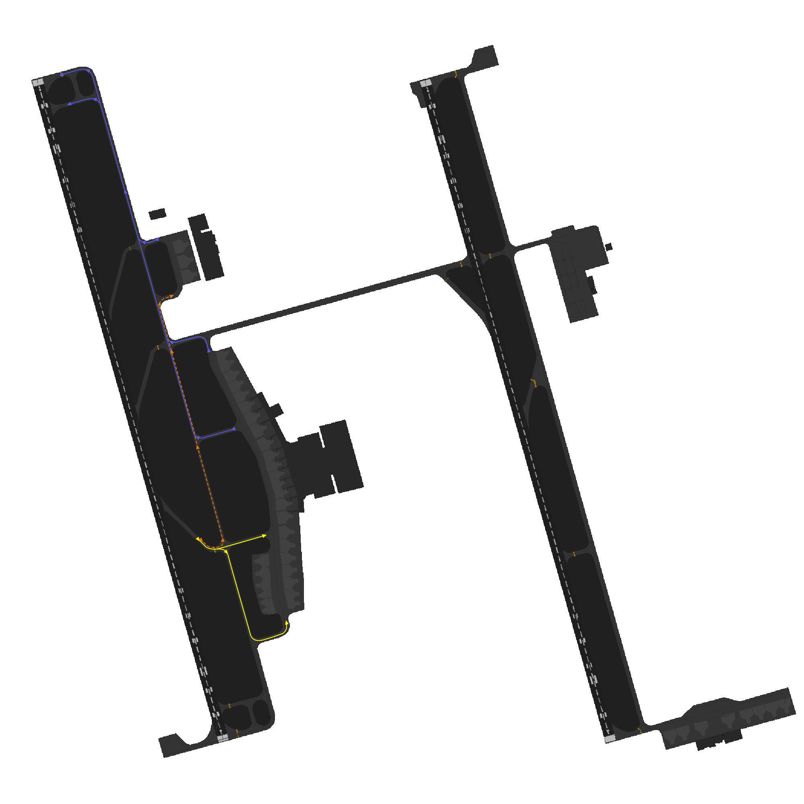

# Dammam Ground [OEDF_X_GND]

This section details all the necessary Standard Operating Procedures for Ground Operations in **King Fahd International Airport (OEDF)**

NOT FULLY DETAILED. USE AS QRH.
---

# 1. General Provisions

**Dammam Ground (OEJN_1_GND)** is responsible for controlling the aerodrome's aprons and taxiways.

**King Fahd International Airport (OEDF)** features two primary Ground Movement Control (SMC) positions, namely **SMC 1** and **SMC 2**. The responsibilities and areas of control for each position are outlined as follows:

# 2. Push-back Procedures

Aircraft are issued pushback clearances by the SMC controlling the respective apron that the aircraft is parking at.

Pushback direction is based primarily on aircraft location, runway configuration and the apron's flow directiom.

::::info Apron Flow Direction

The apron's flow direction can be determined by examining the taxiway diagrams outlined in the **[TWR] Tower** section of this aerodrome's SOP.

By looking at the entry and exit taxiways of the apron, it is very obvious what the direction that all traffic should face.
::::

## 2.1 Push-back Types
### 2.1.1 Standard Push-back
This is the default type of push-back which will normally have the aircraft stop abeam the adjacent stand.

***Phrasesolgy:*** 

> **Pilot:** SVA123, Stand C3, requesting pushback.

> **GMP:** SVA123, Push & Start Approved, Face North on C.

::::tip Be helpful!

If you wish to be helpful towards the pilots, you may give them the local QNH. This is not mandatory as the pilot acknowledged the latest ATIS which contains the QNH!

::::
### 2.1.2 Short Push-back
A short pushback instruction shall require the aircraft to complete the pushback abeam the current stand such that the adjacent stand will not be blocked.

***Phrasesolgy:*** 

> **Pilot:** SVA123, Stand C3, requesting pushback.

> **GMP:** SVA123, Short Push & Start Approved, Face North on C.

### 2.1.3 Long Push-back
A long pushback instruction shall require aircraft to complete the pushback operation more then two stands away from where the pushback was commenced. This manoeuvre may be used when an aircraft is vacating a stand to be used by another aircraft that is taxing in.

***Phrasesolgy:*** 

> **Pilot:** SVA123, Stand C3, requesting pushback.

> **GMP:** SVA123, Long Push & Start Approved, Face North on C.

::::info Be Specific!

If you desire to provide precise instructions regarding the end point of the pushback, you can use the following phraseology to instruct the aircraft to halt at a specific position:

> **GMP:** SVA123, Long Push & Start Approved, Face North on C, Finish Abeam stand XX.

*or if you wish the aircraft keeps a taxiway clear*

> **GMP:** SVA123, Long Push & Start Approved, Face North on C, Stay Clear of Taxiway XX.

# 3. Taxi Diagrams
# 3.1 34s SRO

# 3.2 16s SRO

## Detailed Procedures In the making
