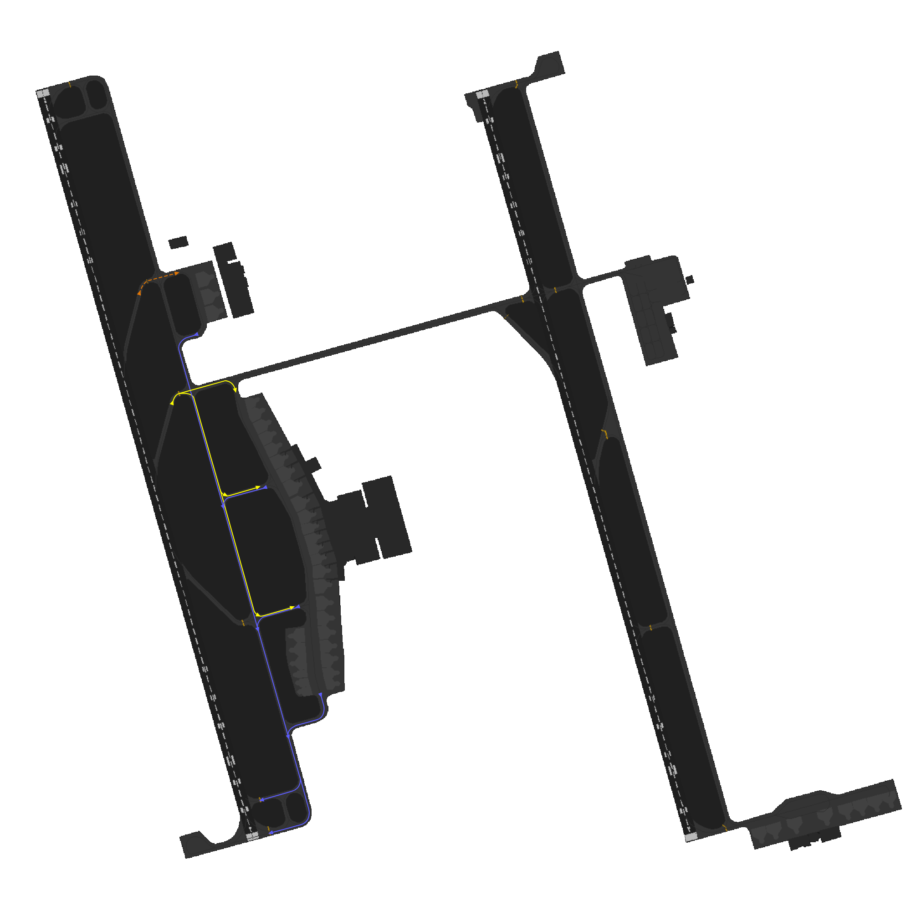

# Dammam Ground [OEDF_X_GND]

!!! success "Covering"
    This section details all the necessary Standard Operating Procedures for Ground Operations in **King Fahd International Airport (OEDF)**

## 1. General Provisions
The **Dammam Ground** manages aircraft movements on aerodrome areas, excluding runways and their associated taxiways. Departing aircraft receive pushback and taxi instructions to the runway holding point, while arriving aircraft are assigned a stand and given taxi instructions.

---

## 2. Designated Areas of Responsiblity
**King Fahd International Airport (OEDF)** features two primary Service Movement Control (SMC) positions, namely **SMC 1** and **SMC 2**. The responsibilities and areas of control for each position are outlined as follows:

Figure 2. - Aerodrome DAOR

### 2.1 SMC 1 [Dammam Ground West]
Dammam Ground (SMC1) covers western side of the aerodrome which includes the following aprons and its assoicasted taxiways:

- Apron 1 [Passenger Terminal]
- Apron 2 [Cargo Terminal]

!!! info "Bandbox Position"
    **Dammam Ground [OEDF_1_GND]** is the Bandbox Position for ground operations at King Fahd International Airport. This means that when other Ground Movement Control (SMC) positions are offline, OEDF_1_GND is responsible for controlling all aprons and taxiways.

Figure 2.1 - Dammam Ground 1 AOR

### 2.2 SMC 2 [Dammam Ground East]
Dammam Ground (SMC2) covers the eastern side of the aerodrome which includes the following aprons and its assoicasted taxiways:

- Apron 5 [Aramco Hanger]
- Apron 8 [Royal Terminal]

Figure 2.2 - Dammam Ground 2 AOR

## 3. Procedures
The below procedures are considered as standard and no coordination is required to employ them, except where explicitly required.

!!! caution 
    Should a situation arise that does not match any of the below cases, coordinate an arrangement with the affected agencies

### 3.1 Push-back Procedures

Aircraft are issued pushback clearances by the SMC controlling the respective apron that the aircraft is parking at.

Pushback direction is based primarily on aircraft location, runway configuration and the apron's flow directiom.

#### 3.1.1 Apron Flow Direction
The apron's flow direction can be determined by examining the taxiway diagrams outlined in *section 3.2.4* of this aerodrome's SOP.

By looking at the entry and exit taxiways of the apron, it is very obvious what the direction that all traffic should face.

|       **Apron(s)**       |           _34L_         |      _16R_      |
|:------------------------:|:-----------------------:|:---------------:|
|        **Apron 1**       |        Southbound       |    Northbound   |
|        **Apron 2**       |        Southbound       |    Northbound   |

Table 3.1.1 - Apron Flow Direction

#### 3.1.2 Push-back Types
##### 3.1.2.1 Standard Push-back
This is the default type of push-back which will normally have the aircraft stop abeam the adjacent stand.

***Phrasesolgy:*** 

> **Pilot:** SVA123, Stand 17, requesting pushback.

> **GMP:** SVA123, Push & Start Approved, Face South on C.

!!! tip "Be helpful!"
    If you wish to be helpful towards the pilots, you may give them the local QNH. This is not mandatory as the pilot acknowledged the latest ATIS which contains the QNH!

##### 3.1.2.2 Short Push-back
A short pushback instruction shall require the aircraft to complete the pushback abeam the current stand such that the adjacent stand will not be blocked.

***Phrasesolgy:*** 

> **Pilot:** SVA123, Stand 10, requesting pushback.

> **SMC:** SVA123, Short Pushback Approved, Face South on C.

##### 3.1.2.3 Long Push-back
A long pushback instruction shall require aircraft to complete the pushback operation more then two stands away from where the pushback was commenced. This manoeuvre may be used when an aircraft is vacating a stand to be used by another aircraft that is taxing in.

***Phrasesolgy:*** 

> **Pilot:** SVA123, Stand 10, request pushback.

> **SMC:** SVA123, Long Pushback Approved, Face South on C.

!!! info "Be Specific!"
    If you desire to provide precise instructions regarding the end point of the pushback, you can use the following phraseology to instruct the aircraft to halt at a specific position:

    > **SMC:** SVA123, Long Pushback Approved, Face South on C, Finish Abeam stand XX.

    *or if you wish the aircraft keeps a taxiway clear*

    > **SMC:** SVA123, Long Pushback Approved, Face South on C, Stay Clear of Taxiway XX.

##### 3.1.2.4 Conditional Push-back

In certain situations, conditional pushback instructions may be given when there is an aircraft taxiing behind another aircraft that is waiting for pushback. This ensures safe coordination and efficient movement on the taxiway. This type of pushback is always prefered to be used when applicable as it saves radio time and eases the controller's job.

An example of such an instruction is as follows:

> **Pilot:** SVA123, Stand 17, request pushback.

> **SMC:** SVA123, Behind the Flynas A320 passing from your left to right, push & start approved, face south on C. Behind.

!!! info "Airline"
    When giving the clearance, the "airline" should be mentioned and not "callsign". 

    For example:

    > **SMC:** SVA123, After the **Etihad Airways** (~~Etihad~~) A321 passing from your left to right, push & start approved, face south on C. Behind.

    ---

    In addition, if both aircraft involved in the conditional pushback instruction belong to the same airline, it is common to specify the relationship by saying "Behind the Company A321".

!!! caution "Do note."
    The traffic is only mandated to say "Behind" **once**. The controller is mandated to say it **twice** to ensure the instruction is clear.

##### 3.1.2.5 Simultaneous pushback operations
Simultaneous pushbacks from neighboring stands may be allowed if aircraft are directed using the pushback types described in section 3.1. The aim is to ensure that once both aircraft have completed their pushback procedures, they will be positioned on the taxiway with one stand between them.

---

### 3.2 Taxi Procedures
#### 3.2.1 Departure Taxi Procedures
##### 3.2.1.1 34L/34R Departure Taxi Procedures
|       **Apron(s)**       |   **Departure Runway**  | **Holding Point(s)** | **Apron Exit Taxiway(s)** | **Taxi via** |         **Handoff to Tower**         |
|:------------------------:|:-----------------------:|:--------------------:|:-------------------------:|:------------:|:------------------------------------:|
|        **Apron 1**       |        Runway 34L       |        B1/B2         |          C1/C2/C3         |       B      | Passing **C2** when clear of traffic |
|        **Apron 2**       |        Runway 34L       |        B1/B2         |             P1            |       B      | Passing **C2** when clear of traffic |
|     **Aramco Apron**     |        Runway 34R       |         J/J3         |             R             |      R, J    |               Immediate              |
|      **Royal Apron**     |        Runway 34R       |         J/J3         |             J             |       J      |               Immediate              |

Table 3.2.1.1 - 34L/34R Departure Taxi Procedures

##### 3.2.1.2 16L/16R Departure Taxi Procedures
|       **Apron(s)**       |   **Departure Runway**  | **Holding Point(s)** | **Apron Exit Taxiway(s)** | **Taxi via** |         **Handoff to Tower**        |
|:------------------------:|:-----------------------:|:--------------------:|:-------------------------:|:------------:|:-----------------------------------:|
|        **Apron 1**       |        Runway 16R       |        B6/B7         |            C3/R           |       B      | Passing **R** when clear of traffic |
|        **Apron 2**       |        Runway 16R       |        B6/B7         |            P1/P2          |       B      | Passing **R** when clear of traffic |
|     **Aramco Apron**     |        Runway 16L       |          J           |             R             |      R, J    |              Immediate              |
|      **Royal Apron**     |        Runway 16L       |          J           |             J             |       J      |              Immediate              |

Table 3.2.1.2 - 16L/16R Departure Taxi Procedures

#### 3.2.2 Stand Allocation Procedure
Stands are assigned by the Ground Radar Plugin in Euroscope, but controllers should preferably have a basic idea of stand assignments.

|       **Aprons**       |                         **Airlines**                        |
|:----------------------:|:-----------------------------------------------------------:|
|         Apron 1        |    Domestic and international airlines (KNE,FAD,SVA,GFA)    |
|         Apron 2        |                            Cargo                            |
|      Aramco Apron      |                       Aloula Aviation                       |
|       Royal Apron      |                            Royal                            |

Table 3.2.2 - Stand Allocation Procedure

!!! warning "Apron 2"
    **Stand 1**:

    - Taxiway P1 will be CLOSED when aircraft parked at stand 1.
    - Aircraft code F can use stand 1 and has to use taxiway P1 for exit and entrance.
    - Stand 2 at same ramp will be used by aircraft code C or D while aircraft code F still occupying stand 1.

    **Stand 3**:

    - Aircraft code F can use stand 3 and has to use taxiway P2 for exit and entrance.
    - Taxiway P2 will be CLOSED when aircraft parked at stand 3
    - Stand 2 at same ramp will be used by aircraft code C or D while aircraft code F still occupying stand 3.

#### 3.2.3  Arrival Taxi Procedures
##### 3.2.3.1 General Arrival Taxi Procedures
SMC should promptly assign a stand to an aircraft as soon as it appears on the arrival list using the stand assigner in the sectorfile. This enables the Tower controller to clear the aircraft to the appropriate vacating point, allowing them to follow the Arrival Taxi Procedures outlined below.

Upon vacating the runway, the Tower controller will instruct the aircraft to follow the assigned initial taxi and provide the correct ground frequency for communication. Subsequently, the Ground controller is responsible for providing a taxi route that aligns with the prescribed taxiroutes mentioned below.

##### 3.2.3.2 34L/34R Arrival Taxi Procedures
|               **Type**             |    **Taxi to**   |         **Vacate via**       |             **Taxi via**            |   **Initial Taxi By TWR**  |
|:----------------------------------:|:----------------:|:----------------------------:|:-----------------------------------:|:--------------------------:|
|     **Domestic & International**   |      Apron 1     |    B4/B5 [34L]   H [34R]  |          B, R, C3   R, C         |          **B, R**          |
|              **Cargo**             |      Apron 2     |              B5 [34L]        |                  P2                 |           **P2**           |
|           **Royal Apron**          |    Royal Apron   |              J2 [34R]        |                 J, R                |           **J**            |
|         **Aloula Aviation**        |   Aramco Apron   |              J2 [34R]        |                   J                 |           **J**            |

Table 3.2.3.2 - 34L/34R Arrival Taxi Procedures

##### 3.2.3.3 16L/16R Arrival Taxi Procedures
|               **Type**             |    **Taxi to**   |         **Vacate via**       |             **Taxi via**            |   **Initial Taxi By TWR**  |
|:----------------------------------:|:----------------:|:----------------------------:|:-----------------------------------:|:--------------------------:|
|     **Domestic & International**   |      Apron 1     |    J/J1 [16L]   B3 [16R]  |          J, R, C   C1/C2         |  **J, R**   **C1, C2**  |
|              **Cargo**             |      Apron 2     |              B3 [16R]        |                 B, P1               |           **B**            |
|           **Royal Apron**          |    Royal Apron   |            J/J1 [16L]        |                   J                 |           **J**            |
|         **Aloula Aviation**        |   Aramco Apron   |            J/J1 [16L]        |                 J, R                |           **J**            |

Table 3.2.3.3 - 16L/16R Arrival Taxi Procedures

#### 3.2.4 Taxi Diagrams
##### 3.2.4.1 Legend
###### Departures Flow

###### Arrivals Flow

###### Cargo Arrivals Flow

##### 3.2.4.2 34s Configuration

##### 3.2.4.3 16s Configuration
