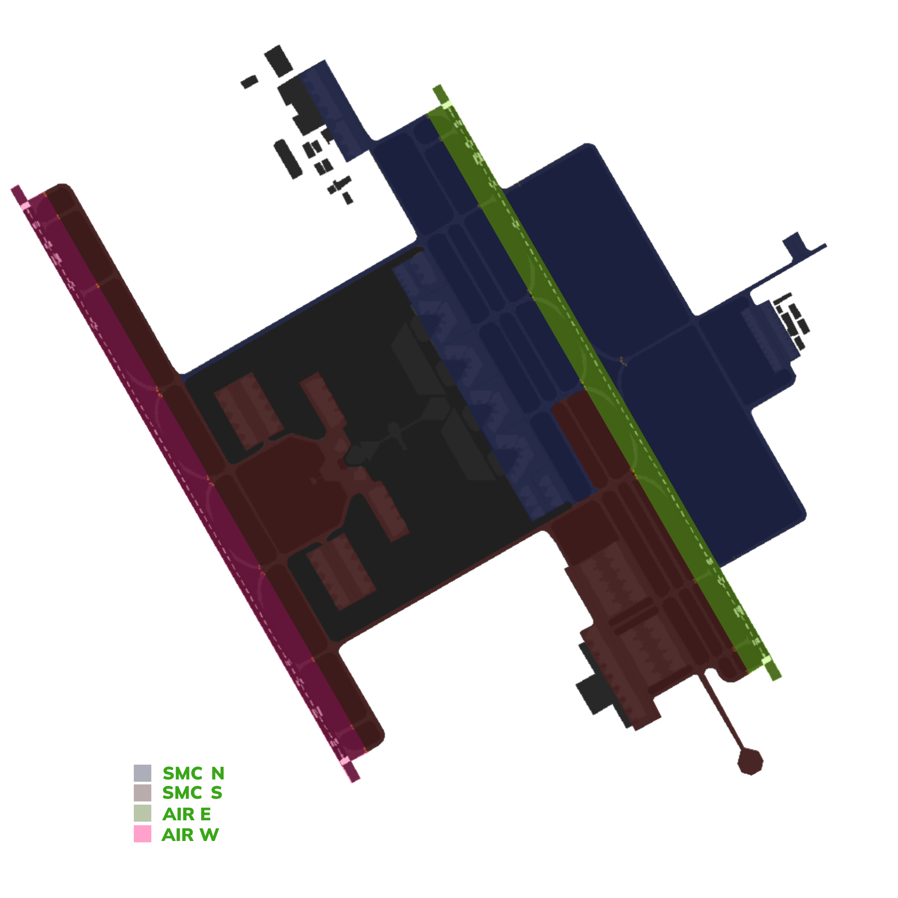

!!! success "Covering"
    This section details all the necessary Standard Operating Procedures for Tower Operations in **King Khalid International Airport (OERK)**

##  1. General Provisions

The **King Khalid Tower (AIR)** is responsible for all aerodrome movements on runways and their associated taxiways. AIR shall also ensure separation between IFR aircraft that are arriving at and departing the aerodrome, as well as provide traffic information to VFR aircraft operating within the aerodrome control zone.

---

##  2. Designated Areas of Responsibility
**King Khalid International Airport (OERK)** features two primary AIR positions, namely **AIR W**, and **AIR E**. The responsibilities and areas of control for each position are outlined as follows:

Figure 2.1 - Aerodrome DAOR

### 2.1. Airspace
**King Khalid International Airport (OERK)** Control Zone (CTR) is Class C airspace and is centered around the aerodrome. Its ceiling is 4500ft MSL and has a radius of 10NM.

Figure 2.3 - King Khalid Control Zone

### 2.2. AIR W [King Khalid Tower West]
**King Khalid Tower West [OERK_W_TWR]** covers runway 33L and it's assoiscated taxiways.

#### 2.2.1 Visual Reporting Points (VRPs)
**King Khalid Tower West [OERK_W_TWR]** covers the following VRPs in the King Khalid Control Zone [CTR]:

- B
- C
- KAFD
- WEST GATE
- D

### 2.3. AIR E [King Khalid Tower East]
**King Khalid Tower East [OERK_E_TWR]** covers runway 33R and it's assoiscated taxiways.

####  2.3.1 Visual Reporting Points (VRPs)
**King Khalid Tower East [OERK_E_TWR]** covers the following VRPs in the King Khalid Control Zone [CTR]:

- E
- G
- K
- F
- J
- RC HELIPAD
- EAST GATE
- Z

### 2.4. Standard Connection Hierarchy 
Controllers must log in the following order to maintain realizm and follow SOPs: 

- AIR E [OERK_E_TWR]
- AIR W [OERK_W_TWR]

 This hierarchy of connection must always be followed unless ATS staff explictly permit you to do otherwise.

 ---

## 3. Runway Configurations

### 3.1 General
The hierarchy of responsibility for determining the runway configuration is outlined as follows:

 - AIR 
 - APP
 - CTR
 - SMC 
 - GMP

!!! tip "Do note"
    It is the **ultimate responsibility** of the tower controllers to set the active runways! In any airport!

    So as long as there is a tower controller, it is his responsibility to set the active runway and ATIS, if not online, follow the hierarchy above

### 3.2 Preferential Runway System [PRS]
In Riyadh, the Preferential Runway System is in use. In conditions of slack winds, 33 operation is preferred up to a tailwind component of 6kts.

This is the more efficent configuration, thus it is used as much as possible.

!!! tip "Crosswind"
    In the event of a direct crosswind (240 degrees) with a speed exceeding 7 knots, the following guidelines should be followed to determine the runway configuration:

    - Check the Terminal Aerodrome Forecast (TAF) for any indications of a potential change in weather conditions that may necessitate a different runway configuration.
    - If the TAF suggests a possible shift in weather conditions that would favor an alternative configuration, select the runway configuration that aligns with the forecasted conditions.
    - However, if the TAF does not indicate any expected changes that would warrant a different configuration, default to using the 33 Configs (presumably a reference to a specific set of runway configurations).

### 3.3 Standard Runway Configuration
At King Khalid International Airport, standard runway configurations for normal operations are established and ranked in order of preference. 

The configurations, listed from most preferred to least preferred, are as follows:

- 33s Mixed Operations
- 33s Semi-mixed Operations
- 15s Mixed Operations
- 15s Semi-mixed Operations

!!! info "Do note."
    Exceptions to runway configurations can be granted per pilot's request after approval from AIR and APP. 

    **Standard Exceptions:**

    - Royal Flights [Always departs/arrives on 33L/15R regardless of the active config]
    - VFR Flights [Always departs/arrives on 33R/15L regardless of the active config]

#### 3.3.1. Mixed Runway Operations [MO]
In the context of runway operations at King Khalid International Airport, **Mixed Runway Operations (MO)** is the primary and most preferred configuration, where both arrivals and departures are conducted on the same runway. This configuration provides optimal flexibility and efficiency in managing traffic flows under normal operating conditions.

Mixed Runway Operations shall be used as the standard configuration unless traffic demand, weather conditions, or operational constraints require an alternative runway configuration.

#### 3.3.2. Semi-Mixed Runway Operations [SMO]
**Semi-Mixed Runway Operations (SMO)** is a runway configuration utilized at King Khalid International Airport in which one runway is primarily dedicated to a single traffic flow, while the secondary runway accommodates a limited mix of arrivals and departures. This configuration is considered the least preferred due to its reduced operational efficiency.

While Semi-Mixed Operations may provide short-term flexibility during specific traffic or infrastructure constraints, they increase controller workload, complicate traffic sequencing, and may result in reduced runway throughput. Additionally, this configuration can lead to increased taxi times and coordination complexity, particularly during periods of elevated traffic demand.

Semi-Mixed Runway Operations is the least preferred configuration and shall not be implemented during high arrival traffic operations.

---

##  4. Procedures
The below procedures are considered as standard and no coordination is required to employ them, except where explicitly required.

!!! caution 
    Should a situation arise that does not match any of the below cases, coordinate an arrangement with the affected agencies

### 4.1 Departure procedures
#### 4.1.1. Departure points

|       **Runway**       |   **Departure point**   |
|:----------------------:|:-----------------------:|
|            33L         |        A, A1, A2        |
|            33R         |      G, G1, G2 / H1     |
|            15L         |      G, G7, G6 / H4     |
|            15R         |        A, A7, A6        |

Table 4.2.1. - Departure points

#### 4.1.2. Line up clearances

Conditional line up instructions shall include the traffic that the aircraft is to follow, as well as the word **“behind”** at the beginning and end of the transmission.

> **AIR:** *“FAD123, Behind the departing Saudia A321, Via G1, line up runway 33R behind”*

If aircraft have not yet reached the holding point where they are expected to line up at, ATC shall reiterate the cleared holding point.

Example: *“SVA123, Via M1, line up runway 33R”*

#### 4.1.3. Take-off clearances

Aircraft shall be cleared for take-off once adequate separation exists

> **AIR:** *“SVA123, Winds 340 degrees 10knots, Runway 33R, cleared for take-off”*

#### 4.1.4. Separation requirements

Aircraft shall be separated on departure in compliance with standard IFR departure separation minima, standard wake turbulence separation or RE-CAT.

Succeeding aircraft on the same SID shall be separated by a minimum of 2 minutes.

VFR aircraft may be instructed to maintain visual separation with preceding aircraft and given a take-off clearance if no wake turbulence separation minima exists.

#### 4.1.5. Low visibility and IMC

During low visibility operations and during IMC, departing aircraft shall not be cleared for take-off when there is an arriving aircraft within 4 NM of the landing runway threshold.

Traffic should report **"airborne"** after take-off. Once airborne they should then be handed off to the appropriate station.

#### 4.1.6. IFR handoff procedure

IFR departures shall be handed off to the appropriate departure controller as instructed.

#### 4.1.7. Stopping a departure

If the departing aircraft has to abort takeoff, the Tower controller shall use the following
phraseology and instruct the aircraft twice. After the instruction, the Tower controller shall
confirm that the aircraft has acknowledged the cancel takeoff instruction.

This is a common occurrence on VATSIM when an aircraft randomly connects to the network while
on an active runway. Once conditions permit, if the aircraft needs to return to the end of
the runway for takeoff, the Tower controller shall instruct the aircraft to hold short of the
closest taxiway parallel to the active runway and hand off the aircraft to Ground.

> *(Takeoff roll commenced)* **AIR:** *"SVA123 stop immediately, I say again stop immediately. Aknowledge"*

> *(Takeoff roll not commenced)* **AIR:***"SVA123 hold position, cancel takeoff clearance. I say again cancel takeoff clearance, due ground crew on runway"*

---

###  4.2 Arrival procedures

#### 4.2.1. Preferred exit points

|       **Runway**       |     **Exit points**     |
|:----------------------:|:-----------------------:|
|           33L          |            A4           |
|           33R          |         G4 / H3         |
|           15L          |         G4 / H3         |
|           15R          |            A4           |

Table 4.1.1 - Preferred exit points

On initial contact with AIR, traffic **must** be advised to expect an exit point along with a landing clearance.

> **AIR:** *"SVA123, Plan to vacate A4, winds 340 degrees 10kts, runway 33L, cleared to land"*

#### 4.2.2. Initial Taxi Routes

**Initial Taxi** is a short pre-coordinated taxi instruction for traffic that is issued by Tower to maintain a smooth flow of traffic after aircraft vacate the runway. These taxi instructions are issued to prevent traffic congestion around the RETs and to optimize the tower's efficiency by avoiding the need to provide initial taxi instructions. Instead, the tower instructs the traffic to taxi initially to an intermidate point and the pilot can contact ground while taxing to get the full clearance. 

This allows for a smooth and immediate transfer of traffic to the appropriate ground controller.

#####  4.2.2.1. 33 Initial Taxi Routes
|     **Apron**    | **Arrival Runway** |          **AIR W Taxi Instructions**         |        **Air E Taxi Instructions**       |     **Handoff to SMC N**    |                **Handoff to SMC S**               |
|:----------------:|:------------------:|:--------------------------------------------:|:----------------------------------------:|:---------------------------:|:-------------------------------------------------:|
| **_Aprons 1,2_** |    _Runway 33R_    |                       -                      |                _Vacate G4_               |        _Immediately_        |                         -                         |
|  **Aprons 1,2**  |     Runway 33L     | Vacate A4 Taxi A, P  *Hold Short of E* |                     -                    | _While taxing on Taxiway P_ |                         -                         |
| **_Aprons 3,4_** |    _Runway 33R_    |                       -                      |                _Vacate G4_               |        _Immediately_        |                         -                         |
|  **Aprons 3,4**  |     Runway 33L     | Vacate A4 Taxi A, P  *Hold Short of E* |                     -                    | _While taxing on Taxiway P_ |                         -                         |
|   **_Apron 5_**  |    _Runway 33R_    |                       -                      |                _Vacate G4_               |        _Immediately_        |                         -                         |
|    **Apron 5**   |     Runway 33L     |  Vacate A4 Taxi A, P *Hold Short of E* |                     -                    | _While taxing on Taxiway P_ |                         -                         |
|    **Apron 6**   |     Runway 33R     |                       -                      | Vacate G4 Taxi G *Hold Short of T* |              -              |                   _Immediately_                   |
|    **Apron 6**   |     Runway 33L     |  Vacate A4 Taxi A, P *Hold Short of E* |                     -                    | _While taxing on Taxiway P_ | _While taxing on Taxiway G and clear of conflict_ |
|  **Cargo Apron** |     Runway 33L     |  Vacate A4 Taxi A, P *Hold Short of E* |                     -                    | _While taxing on Taxiway P_ |                         -                         |
|   **GA Apron**   |     Runway 33R     |                       -                      |               Vacate H3/H4               |         Immediately         |                         -                         |

Table 4.2.1 - 33 Initial Taxi Routes

#####  4.2.2.2. 15 Initial Taxi Routes
|    **Apron**   | **Arrival Runway** |         **AIR W Taxi Instructions**         | **Air E Taxi Instructions** |     **Handoff to SMC S**    |            **Handoff to SMC N**           |
|:--------------:|:------------------:|:-------------------------------------------:|:---------------------------:|:---------------------------:|:-----------------------------------------:|
| **Aprons 1,2** |     Runway 15R     | Vacate A4 Taxi A, T _Hold Short of D_ |              -              | _While taxing on Taxiway T_ |                     -                     |
| **Aprons 1,2** |     Runway 15L     |                      -                      |           Vacate G4         |              -              |               _Immediately_               |
| **Aprons 3,4** |     Runway 15R     | Vacate A4 Taxi A, T _Hold Short of D_ |              -              | _While taxing on Taxiway T_ |                     -                     |
| **Aprons 3,4** |     Runway 15L     |                      -                      |           Vacate G4         |              -              |               _Immediately_               |
|   **Apron 5**  |     Runway 15R     | Vacate A4 Taxi A, T _Hold Short of D_ |              -              | _While taxing on Taxiway T_ |                     -                     |
|   **Apron 5**  |     Runway 15L     |                      -                      |           Vacate G4         |              -              |               _Immediately_               |
|   **Apron 6**  |     Runway 15R     | Vacate A4 Taxi A, T _Hold Short of D_ |              -              |  While taxing on Taxiway T  |                     -                     |
|   **Apron 6**  |     Runway 15L     |                      -                      |           Vacate G4         |              -              |               _Immediately_               |

Table 4.2.2 - 15 Initial Taxi Routes

!!! caution
    All Traffic Movements on B must give way to traffic vacating runway 33L/15R.

---

#### 4.2.3. Separation requirements
##### 4.2.3.1. General
While the radar controllers are responsible for separating arriving aircraft, the AIR controller shall still ensure that minimum separation is maintained until the preceding aircraft crosses the runway threshold.

##### 4.2.3.2. Speed control
AIR may use a tactical reduction in aircraft speed in order to ensure minimum separation between aircrafts.

> **AIR:** *SVA123, reduce to final approach speed.*

##### 4.2.3.3. Wake turbulence separation minima
Standard ICAO Separation is enforce in the Jeddah CTR.

#### 4.2.4. Go around procedure

At any time should a runway become unsuitable for an aircraft landing, or separation minima  is not met, aircraft shall be instructed to go-around.

> **AIR:** *“SVA123, go around, I say again, go around, acknowledge”*

Once aircraft have acknowledged the instruction and are observed to be safely climbing away, they shall be handed off to departure control.

Example: *“SVA123, fly standard missed approach procedure, climb 4000 feet, contact Jeddah Approach 124.0”*

!!! info "Go around vs cancel approach"

    A go-around occurs when an aircraft aborts its landing during the final approach phase after reaching the minimum descent altitude. In contrast, a "cancel approach" instruction is given when the aircraft is still in the early stages of the approach. The key difference is that during a cancel approach, air traffic control provides all the missed approach procedures in a single transmission since there is no immediate urgency. On the other hand, during a go-around, the controller instructs the aircraft to initiate the climb, and further instructions are provided once the aircraft is in the climb phase. 

---
###  4.3 VFR procedures
!!! caution "Do note." 
    VFR is only allowed at daytime. Night VFR is not permitted in the Jeddah Control Zone.

#### 4.3.1. Visual Reporting Points (VRPs)
**Visual Report Points (VRPs)** are specific geographical locations used in aviation to assist pilots in navigation and communication with air traffic control. These points help pilots maintain situational awareness and provide reference points for reporting their position during flight.

VRPs are typically marked by prominent landmarks, such as buildings, intersections, or natural features, making them easily identifiable from the air. They are particularly useful in busy airspace, allowing pilots to report their locations accurately, which helps air traffic controllers manage traffic effectively and ensure safety.

|    **Ident**    |                  **Location Geographic**                |  **Radial and distance** | **Coordinates**  |
|:---------------:|:-------------------------------------------------------:|:------------------------:|:----------------:|
|      **A**      |                    Kuzam Residential                    | RDL 298 from KIA 6.8 DME | 243623N 0463831E |
|      **B**      |    Intersection Special Forces Road with king Fahad     | RDL 267 from KIA 9.5 DME | 245305N 0463504E |
|      **C**      |      Intersection king Salma Road with king Fahad       | RDL 243 from KIA 8.7 DME | 244936N 0463651E |
|      **J**      |                        Janadeiyah                       | RDL 030 from KIA 5.0 DME | 245715N 0464818E |
|      **K**      |                       Khuzam Oasis                      | RDL 345 from KIA 11.6 DME| 250435N 0464247E |
|      **L**      |                      Thumamah Road                      | RDL 342 from KIA 15.1 DME| 250737N 0464030E |
|      **M**      |                     Equestrian Club                     | RDL 007 from KIA 8.3 DME | 250132N 0464637E |
|      **D**      |                     Salbuok Bridge                      | RDL 303 from KIA 17.0 DME| 250315N 0463004E |
|      **H**      |                     Al Rajhi Mosque                     | RDL 176 from KIA 19.0 DME| 244037N 0464644E |
|      **N**      |                      Malham bridge                      | RDL 312 from KIA 26.9 DME| 251115N 0462333E |
|      **O**      |    Intersection of Khuris road and eastern ring road    | RDL 179 from KIA 10.2 DME| 244253N 0464542E |
|      **P**      |Intersection of Eastern Ring Road with Southern ring road| RDL 171 from KIA 15.4 DME| 243749N 0464812E |
|      **R**      |      Intersection King Fahad Road with Makkah Road      | RDL 197 from KIA 12.9 DME| 244044N 0464120E |
|      **S**      |    Intersection Eastern Ring Road with Al-Kharj Road    | RDL 154 from KIA 25.0 DME| 243010N 0465612E |
|      **T**      |Intersection of Northen Ring Road with eastern ring road | RDL 200 from KIA 5.9 DME | 244733N 0464320E |
|      **X**      |     Intersection Khurais Road With Shaikh Jaber Road    | RDL 148 from KIA 8.5 DME | 244554N 0465029E |
|      **Y**      |  Intersection King Abdullah Road with Eastern Ring Road | RDL 188 from KIA 7.6 DME | 244535N 0464420E |
|      **Z**      |                    King Fahad Studium                   | RDL 121 from KIA 6.2 DME | 244958N 0465123E |
|  **East Gate**  |                 The 9th Electric Station                | RDL 072 from KIA 17.0 DME| 245740N 0470342E |
|    **HRGAN**    |                   A 'bar Hargan Town                    | RDL 291 from KIA 31.0 DME| 250439N 0461343E |
|     **KAFD**    |             King Abdullah Financial District            | RDL 216 from KIA 9.7 DME | 244539N 0463851E |
|    **MZHMYA**   |                       Almuzahmeyah                      | RDL 232 from KIA 42.0 DME| 242729N 0460835E |
|  **West Gate**  |             Prince Sultan Humanitarian City             | RDL 293 from KIA 14.0 DME| 245911N 0463137E |
|    **RAJEM**    |                   Rajem intersection                    | RDL 095 from KIA 36.8 DME| 244944N 0472553E |
|    **MALHAM**   |                          MALHAM                         | RDL 318 from KIA 29.8 DME| 251520N 0462335E |

Table 4.2.3 - Riyadh VRPs

!!! danger "Do note."
    These VRPS are not to be used as holding points.

!!! caution "Pilots"
    Kindly keep in mind that not all pilots have access to these VRPs as it is difficult to find. VFR Charts with VRPs are also not public.

    The Saudi Arabian vACC is working to release a pilot briefing document for VFR.

##### 4.3.1.1 Entry/Exit VRPs into the CTR
According to the eAIP traffic must only enter/exit the Jeddah Control Zone via the following VRPs:
- WG
- L

Clearance to enter the control zone is issued by APP. 

!!! info "Rejection"
    The TWR controller has the right to reject any traffic into the control zone if deemed neccesary.
    > **AIR:** *HHAZA, You are not cleared to enter the control zone, remain outside of the control zone until XXXX()

#### 4.3.2. VFR departures

Any VFR aircraft leaving the control zone at Jeddah is considered to be engaging in cross-country VFR flight.

Coordination between the AIR and APP is required.

All VFR Departures must exit the control zone through the entry/exit VRPs described in section 4.3.1.1.

!!! info "Do note"
    VFR Crosscountry traffic are considered as departures and shall depart from the active departure runway unless needed otherwise by AIR.

#### 4.3.3. VFR arrivals
All VFR Arrivals must enter the control zone through the entry/exit VRPs described in section 4.3.1.1.

Clearance to enter the Control Zone is issued by Approach.

Once the traffic has entered the control zone, further intructions to direct to a VRP or to join a downwind can be issued by tower.

#### 4.3.4. VFR circuits

|     **Runway Configuration**      |  **Direction** | **Altitude(s)** |
| :-------------------------------: | :------------: | :-------------: |
|                 33s               |   Right Hand   |      3500ft     |
|                 15s               |    Left Hand   |      3500ft     |
