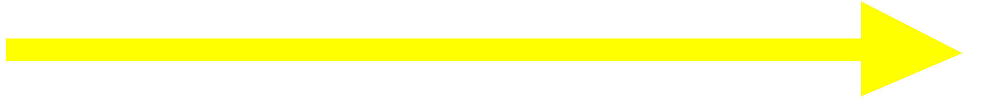
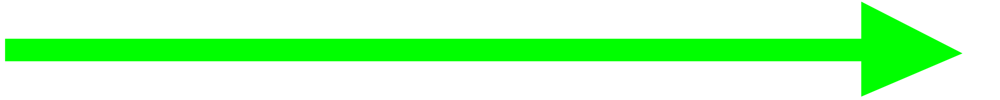

# Medinah Ground [OEMA_GND]

!!! success "Covering"
    This section details all the necessary Standard Operating Procedures for Ground Operations in **Prince Mohammed bin Abdulaziz International Airport (OEMA)**

## 1. General Provisions
The Medinah Ground manages aircraft movements on aerodrome areas, excluding runways and their associated taxiways. Departing aircraft receive pushback and taxi instructions to the runway holding point, while arriving aircraft are assigned a stand and given taxi instructions.

---

## 2. Designated Areas of Responsiblity
**Prince Mohammed bin Abdulaziz International Airport (OEMA)** features one primary Ground Movement Control (SMC) position. The responsibilities and areas of control for each position are outlined as follows:

---

## 3. Procedures
The below procedures are considered as standard and no coordination is required to employ them, except where explicitly required.

!!! caution 
    Should a situation arise that does not match any of the below cases, coordinate an arrangement with the affected agencies.

### 3.1 Push-back Procedures
Aircraft are issued pushback clearances by the SMC controlling the respective apron that the aircraft is parking at.

Pushback direction is based primarily on aircraft location, runway configuration and the apron's flow directiom.

#### 3.1.1 Apron Flow Direction
The apron's flow direction can be determined by examining the taxiway diagrams outlined in the [TWR] Tower section of this aerodrome's SOP.

By looking at the entry and exit taxiways of the apron, it is very obvious what the direction that all traffic should face.

|       **Apron(s)**       |         _35/36_         |      _17/18_    |
|:------------------------:|:-----------------------:|:---------------:|
|     **Apron 103-120**    |        Southbound       |    Northbound   |
|     **Apron 121-126**    |        Northbound       |    Northbound   |
|     **Apron 127-131**    |        Southbound       |    Northbound   |
|     **Apron 132-135**    |        Southbound       |    Northbound   |
|       **GA Apron**       |        Southbound       |    Southbound   |
|      **Royal Apron**     |        Southbound       |    Southbound   |

Table 3.1.1 - Medinah Aprons Flow Direction

#### 3.1.2 Push-Back Types
##### 3.1.2.1 Standard Push-back
This is the default type of push-back which will normally have the aircraft stop abeam the adjacent stand.

***Phrasesolgy:*** 

> **Pilot:** _"SVA123, Stand 112, request pushback"_

> **SMC:** _"SVA123, Push & Start Approved, Face South on L"_

!!! tip "Be helpful!"
    If you wish to be helpful towards the pilots, you may give them the local QNH. This is not mandatory as the pilot acknowledged the latest ATIS which contains the QNH!

##### 3.1.2.2 Short Push-back
A short pushback instruction shall require the aircraft to complete the pushback abeam the current stand such that the adjacent stand will not be blocked.

***Phrasesolgy:*** 

> **Pilot:** _"SVA123, Stand 108, requesting pushback"_

> **SMC:** _"SVA123, Short Pushback Approved, Face South on L"_

##### 3.1.2.3 Long Push-back
A long pushback instruction shall require aircraft to complete the pushback operation more then two stands away from where the pushback was commenced. This manoeuvre may be used when an aircraft is vacating a stand to be used by another aircraft that is taxing in.

***Phrasesolgy:*** 

> **Pilot:** _"SVA123, Stand 109, request pushback"_

> **SMC:** _"SVA123, Long Pushback Approved, Face South on L"_

!!! info "Be Specific!"
    If you desire to provide precise instructions regarding the end point of the pushback, you can use the following phraseology to instruct the aircraft to halt at a specific position:

    > **SMC:** _"SVA123, Long Pushback Approved, Face South on L, Finish Abeam stand XX"_

    *or if you wish the aircraft keeps a taxiway clear*

    > **SMC:** _"SVA123, Long Pushback Approved, Face South on L, Stay Clear of Taxiway XX"_

##### 3.1.2.4 Conditional Push-back

In certain situations, conditional pushback instructions may be given when there is an aircraft taxiing behind another aircraft that is waiting for pushback. This ensures safe coordination and efficient movement on the taxiway. This type of pushback is always prefered to be used when applicable as it saves radio time and eases the controller's job.

An example of such an instruction is as follows:

> **Pilot:** _"SVA123, Stand 112, request pushback"_

> **SMC:** _"SVA123, Behind the Flynas A320 passing from your left to right, push & start approved, face south on L. Behind"_

!!! info "Airline"
    When giving the clearance, the "airline" should be mentioned and not "callsign". 

    For example:

    > **SMC:** _"SVA123, Behind the **Qatar Airways** (~~Qatari~~) B777 passing from your left to right, push & start approved, face south on L. Behind"_

    ---

    In addition, if both aircraft involved in the conditional pushback instruction belong to the same airline, it is common to specify the relationship by saying "Behind the Company B777".

!!! caution "Do note."
    The traffic is only mandated to say "Behind" **once**. The controller is mandated to say it **twice** to ensure the instruction is clear.

##### 3.1.2.5 Simultaneous pushback operations
Simultaneous pushbacks from neighboring stands may be allowed if aircraft are directed using the pushback types described in section 3.1. The aim is to ensure that once both aircraft have completed their pushback procedures, they will be positioned on the taxiway with one stand between them.

---

### 3.2 Taxi Procedures
#### 3.2.1 Departure Taxi Procedures
##### 3.2.1.1 35/36 Departure Taxi Procedures
|       **Apron(s)**       |   **Departure Runway**  | **Holding Point(s)** | **Apron Exit Taxiway(s)** | **Taxi via** | **Handoff to Tower** |
|:------------------------:|:-----------------------:|:--------------------:|:-------------------------:|:------------:|:--------------------:|
|     **Apron 103-120**    |        Runway 35        |         J/J1         |            W/K            |       J      |      Immediate       |
|     **Apron 121-126**    |        Runway 35        |         J/J1         |             N             |       J      |      Immediate       |
|     **Apron 127-131**    |        Runway 35        |         J/J1         |             N             |       J      |      Immediate       |
|     **Apron 132-135**    |        Runway 35        |         J/J1         |             N             |       J      |      Immediate       |
|       **GA Apron**       |        Runway 36        |           D          |             S             |      S,D     |      Immediate       |
|      **Royal Apron**     |        Runway 36        |           D          |             R             |      R,D     |      Immediate       |

##### 3.2.1.2 17/18 Departure Taxi Procedures
|       **Apron(s)**       |   **Departure Runway**  | **Holding Point(s)** | **Apron Exit Taxiway(s)** | **Taxi via** | **Handoff to Tower** |
|:------------------------:|:-----------------------:|:--------------------:|:-------------------------:|:------------:|:--------------------:|
|     **Apron 103-120**    |        Runway 17        |         J7/J8        |           K/W/N           |       J      |      Immediate       |
|     **Apron 121-126**    |        Runway 17        |         J7/J8        |             P             |       J      |      Immediate       |
|     **Apron 127-131**    |        Runway 17        |         J7/J8        |             P             |       J      |      Immediate       |
|     **Apron 132-135**    |        Runway 17        |         J7/J8        |             P             |       J      |      Immediate       |
|       **GA Apron**       |        Runway 18        |         D, D1        |             S             |      S,D     |     Passing by R     |
|      **Royal Apron**     |        Runway 18        |         D, D1        |             R             |      R,D     |      Immediate       |

#### 3.2.2 Stand Allocation Procedure
Stands are assigned by the SAUControllerPack in the Euroscope, but controllers should preferably have a basic idea of stand assignments.

|       **Aprons**       |                         **Airlines**                        |
|:----------------------:|:-----------------------------------------------------------:|
|       East Apron       | Low cost and major international airlines (KNE,FAD,KAC,THY) |
|        GA Apron        |                       General Aviation                      |
|      Royal Apron       |                            Royal                            |

#### 3.2.3  Arrival Taxi Procedures
##### 3.2.3.1 General Arrival Taxi Procedures
SMC should promptly assign a stand to an aircraft as soon as it appears on the arrival list using the stand assigner in the sectorfile. This enables the Tower controller to clear the aircraft to the appropriate vacating point, allowing them to follow the Arrival Taxi Procedures outlined below. It also allows the Tower controller to assign the correct Arrival Taxi Route (ATR) to the aircraft once it has vacated the runway.

Upon vacating the runway, the Tower controller will instruct the aircraft to follow the designated ATR and provide the correct ground frequency for communication. Subsequently, the Ground controller is responsible for providing a taxi route that aligns with the prescribed taxiroutes mentioned below.

##### 3.2.3.2 35/36 Arrival Taxi Procedures
|               **Type**             |    **Taxi to**   | **Vacate via** |             **Taxi via**            |   **Initial Taxi By TWR**  |
|:----------------------------------:|:----------------:|:--------------:|:-----------------------------------:|:--------------------------:|
|     **International Airlines**     |    East Apron    |    J4/J5 [35]  |                 N/W, L              |            **W**           |
|       **Domestic & Lowcost**       |    East Apron    |    J4/J5 [35]  |                 N/W, L              |            **W**           |
|          **Royal Aprons**          |    West Apron    |        H [36]  |                 D, R                |            **D**           |
|        **General Aviation**        |    West Apron    |        H [36]  |                 D, S                |            **D**           |

##### 3.2.3.2 17/18 Arrival Taxi Procedures
|               **Type**             |    **Taxi to**   | **Vacate via** |             **Taxi via**            |   **Initial Taxi By TWR**  |
|:----------------------------------:|:----------------:|:--------------:|:-----------------------------------:|:--------------------------:|
|     **International Airlines**     |    East Apron    |    J2/J3 [17]  |                 K/W, L              |            **W**           |
|       **Domestic & Lowcost**       |    East Apron    |    J2/J3 [17]  |                 K/W, L              |            **W**           |
|          **Royal Aprons**          |    West Apron    |      A/B [18]  |                 D, R                |            **D**           |
|        **General Aviation**        |    West Apron    |      A/B [18]  |                 D, S                |            **D**           |

#### 3.2.4 Taxi Diagrams
##### 3.2.4.1 Legend
###### Departures Flow

###### Arrivals Flow

###### Royal Arrivals Flow

