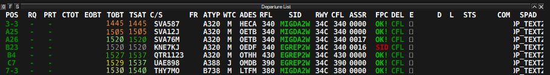

# Virtual Airport Collaborative Decision Making

vACDM is a EuroScope plugin designed to replicate **ACDM (Airport Collaborative Decision Making)**. vACDM aims at improving the efficiency of an airport and improve the predictability of traffic. 

This is achieved through time milestones such as TOBT, TSAT, TTOT and CTOT, which create a well-defined sequence of startups and takeoffs, taking into account the EOBT filed in the flightplan, traffic load of the airport, capacity of the runways, taxi-times and much more.

---

## Abbreviations

> **EOBT Estimated off-block time:** The estimated time that an aircraft will start movement (time filed in flight plan)

> **TOBT Target off-block time:** A more accurate and updated time than EOBT, usually set by the pilot but can be set by the controller as well

> **TSAT Target startup approval time:** The time provided by ATC taking into account TOBT, CTOT and/or the traffic situation that an aircraft can expect start up/push back approval

> **ASRT Actual startup request time:** Time where the outbound is fully ready and requested startup

> **EXOT Estimated taxi-out time:** Taxitime from the position to the assigned runway, including pushback

> **TTOT Target take-off time:** The target take off time taking into account the TOBT/TSAT plus the EXOT

> **CTOT Calculated take-off time:** The time calculated and issued by the appropriate Central Management unit, as a result of tactical slot allocation, at which a flight is expected to become airborne (Used during slotted events)

It is recommended to also click on “TSAT” to have the list ordered by TSAT.

**Below is also a list of the commands of the startup list:**

!!! success "Remember"

    To activate vACDM type .vacdm master in the ES chat

    This command is generally used by the controller managing vACDM (usually the Delivery controller or designated positions like OEJN_P_DEL). All other users should type .vacdm slave

---

## Colors
The times displayed in the Startup list use different color codes to indicate the status of the milestone.

> **ORANGE =** Time invalid or expired

> **LIGHT GREEN =** TOBT valid but not confirmed / TSAT not yet within the start up window (+5 / -5)

> **DARK GREEN =** TOBT valid and confirmed / TSAT within start up time

> **LIGHT YELLOW =** Valid but not Confirmed (More than 5 minutes delay expected)

> **DARK YELLOW =** Valid and Confirmed (More than 5 minutes delay expected)

### Examples

- **SVA587 TSAT is expired**
    - A new TSAT will be calculated after setting a new TOBT, manually by ATC or via the website by the pilot
- **SVA76M has filed his EOBT as 1520**
    - It has not been confirmed
    - He his within +5 / -5 of his TSAT, his startup can be approved
- **KNE7KJ has been approved for pushback and startup**
    - He has requested startup at 1519 (ASRT) and it has been approved, TOBT, TSAT and ASRT are now grey
- **QTR1123 has set and confirmed his TOBT as 1527**
    - He has set his TOBT via the vACDM website
    - He his within +5 / -5 of his TSAT, his startup can be approved
- **UAE898 has set and confirmed his TOBT as 1529**
    - He has set his TOBT via the vACDM website
    - There is more than 5 minute delay between his TOBT and his TSAT
- **THY7MO has filed his EOBT as 1530**
    - It has not been confirmed
    - There is more than 5 minute delay between his TOBT and his TSAT
- **UAE898 has requested startup**
    - ATC has placed the ASRT marker
    - He must wait for his TSAT to be within the startup window

!!! success "Note"
    It is not required to confirm the TOBT before approving pushback

!!! Caution "Be Careful!"
    If you choose to edit the TOBT the TSAT may change and be delayed

---

## Usage

As the controller managing vACDM you may be presented with the following situations when pilots request startup / pushback:

!!! success "Dark green TSAT"
    TSAT is within startup window (+5 / -5), left click on ASRT, set his STS to READY and send him to the ground controller for pushback.
    Green TOBT (dark / light) light green TSAT

    The pilot has called ready before his TSAT window, set the TOBT to "now" by either right clicking the TOBT or left clicking and selecting "TOBT now".

    **This will result in two possibile scenarios:**

    TOBT and TSAT become dark green, traffic can be handed over to ground for startup
    TOBT becomes yellow and TSAT remains light green, delay can be expected

!!! caution "Yellow TOBT and light green TSAT"
    The pilot has called at his TOBT but delay is expected, communicate the TSAT and mark the ASRT

---

## Phraseology

**Aircraft calls for startup and his TSAT is dark green:**

> **Pilot:** SVA2MA, ready for startup

> **GMP:** SVA2MA, For startup contact ground on 121.900

**Aircraft calls for startup and his TSAT is light green:**

> **Pilot:** SVA9KD, ready for startup

> **GMP:** SVA9KD, TSAT 1540

*or*

> **GMP:** SVA9KD, expect startup at 1540

!!! caution "In case the TSAT is green but delay is needed (due to departures not flowing as expected)"
    > **Pilot:** SVA9KD, ready for startup

    > **Pilot:** SVA9KD, expect startup at TSAT + 5