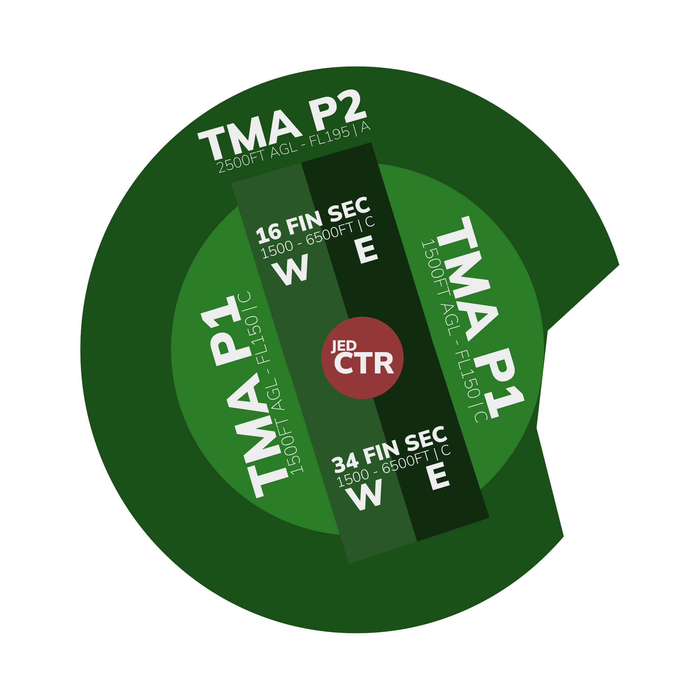
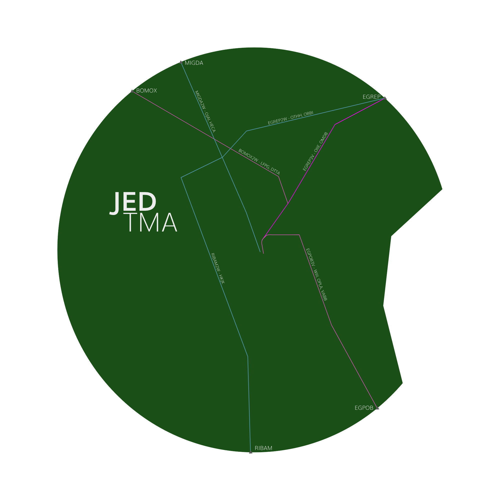

# OEJN_APP [APP 1] Briefing Material | Cross the Land: 2025

!!! success "Covering"
    This section details all the necessary briefing materials for **OEJN_APP [APP 1]** during Cross the Land: 2025

## Designated Area of Responsibility 
"*Jeddah Approach*" (OEJN_APP) is in charge all arrivals and departures in the Jeddah TMA.

---

## Notes
### Arrival
- GND-FL195 = **Class C airspace**
- **RWY34L and 34R** for arrivals.
- There is a large restricted zone in the **East** of Jeddah TMA, the *Kaaba.*
- Arrivals into Jeddah will be handed off to *Jeddah Approach* around **FL180-FL190**. They would have **already been cleared for their STAR** by *Jeddah Terminal*
- In OEJN, there is a **PMS (Point Merge System)** which is utilized for efficient traffic management. 
- Go around traffic must climb **4000ft on RWY heading**, and **vectors** back to the ILS for their runway.
- **Arrival traffic** that are **unable** to follow **STARs** will expect **vectors**.
- Hand arrival traffic to *Jeddah Tower* when **established on the ILS**. 
- OEJN_E_TWR for **RWY34R**, OEJN_W_TWR for **RWY34L**.
- REFER TO JEDDAH APP SOP FOR FURTHER

### Departure
- **RWY34C and 34R** for departures.
- There will be simultaneous independent departures from 34C and 34R.
- There will be simultaneous departures to EGREP from 34R and 34C. Make sure lateral/vertical separation is met before handoff. No sequencing required. They will split to different destinations but still, 8nm or greater should be the goal.
- Aircraft must be handed off to *Jeddah Terminal* (OEJN_1_CTR) at **FL200** or at their **exit point from Jeddah TMA**, whichever is earlier.

---

## Visual Representation

