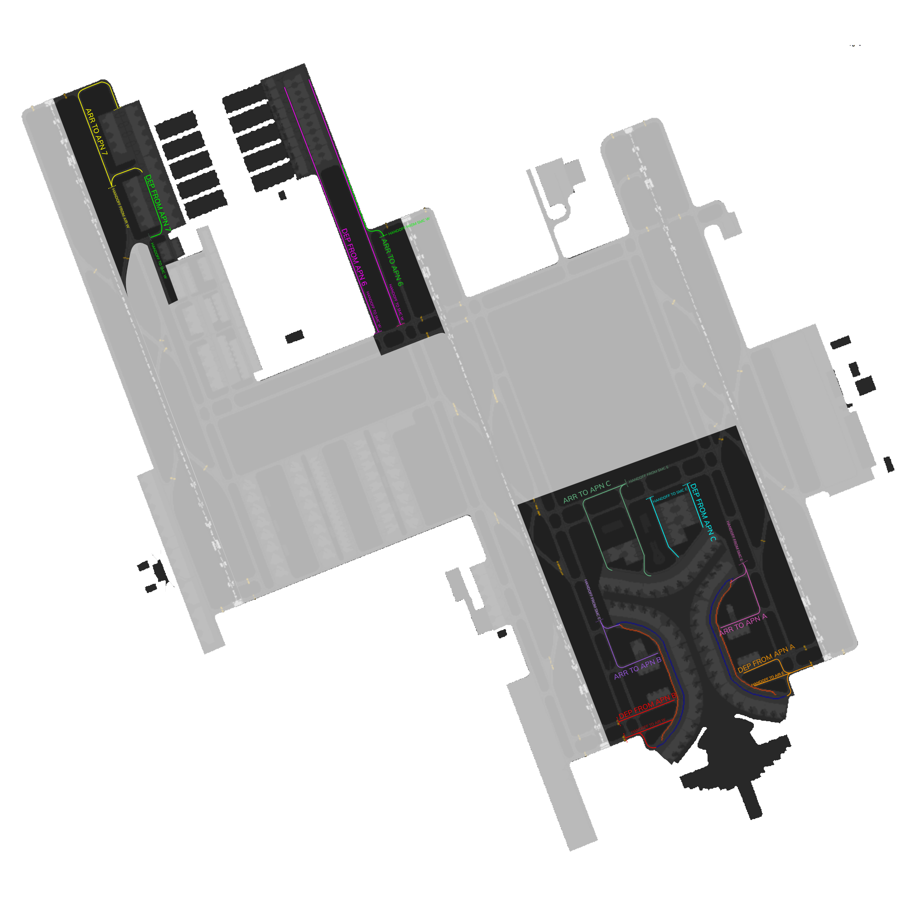

# OEJN_E_RMP [APN E] Briefing Material | Cross the Land: 2025

!!! success "Covering"
    This section details all the necessary briefing materials for **OEJN_E_RMP [APN E]** during Cross the Land: 2025

!!! Caution "Bandbox"
    During the event, only Apron East will be on which is the bandbox of both APN E and APN N. 

## Designated Area of Responsibility 
**"Jeddah Apron" (OEJN_E_RMP)** is in charge of all apron operations. (**Aprons 6, 7, A, B, C**).

---

## Notes
### Arrival
- Expect arrivals to contact "*Jeddah Apron*" **holding short L5** from "*Jeddah Ground*," where "*Jeddah Apron*" must clear the traffic to **enter the apron via L5 or L4**, and taxi via **LC, if it is a medium aircraft**, or **LA, if it is a heavy aircraft**. If traffic permits, **LC** can be used to **push departure traffic** as well.
- **Arrival traffic** will enter **Apron C** through **W1 and W2**.
- **Arrival traffic** will contact "*Jeddah Apron*" on **V holding short of V2** and shall enter via **W, W1 or W2**, once **clear of traffic** pushing at remote stands.
- Expect arrivals to contact "*Jeddah Apron*" **holding short K5** from "*Jeddah Ground*," where "*Jeddah Apron*" must clear the traffic to **enter the apron via K5 or K4**, and **taxi via KC**, if the traffic is a **medium aircraft**, or **KA**, if the traffic is a **heavy aircraft**. If traffic permits, KC can be used to push **departure traffic** as well.
- Arrival traffic will enter via **D6, B7** and will contact you following **B5X arrival taxi route** and will enter Apron via **D6**. When traffic permits, taxi **via D6 D, or B B7 D.**

### Departure
- Traffic at **Apron A** shall be pushed **Southbound** to exit via **L3, L2, or L1**.
- **Apron C** flow direction is **Eastbound** to exit via **W3, W4**.
- **Apron B** flow direction is **Southbound** to exit via **L1, L2, L3**.
- Except for **Apron C**, **Medium** departure traffic shall be pushed on the **blue** line. **Heavy** departure traffic shall be pushed on the **main** taxiway.
- **Remote stands** can be pushed facing **North** if traffic permits.
- **Apron 7** flow direction is **Southbound** to exit via **D5**.
- **Apron 6** traffic must be pushed **facing south**.
- Taxiway **E** is **southbound** only.
---

## Visual Representation

