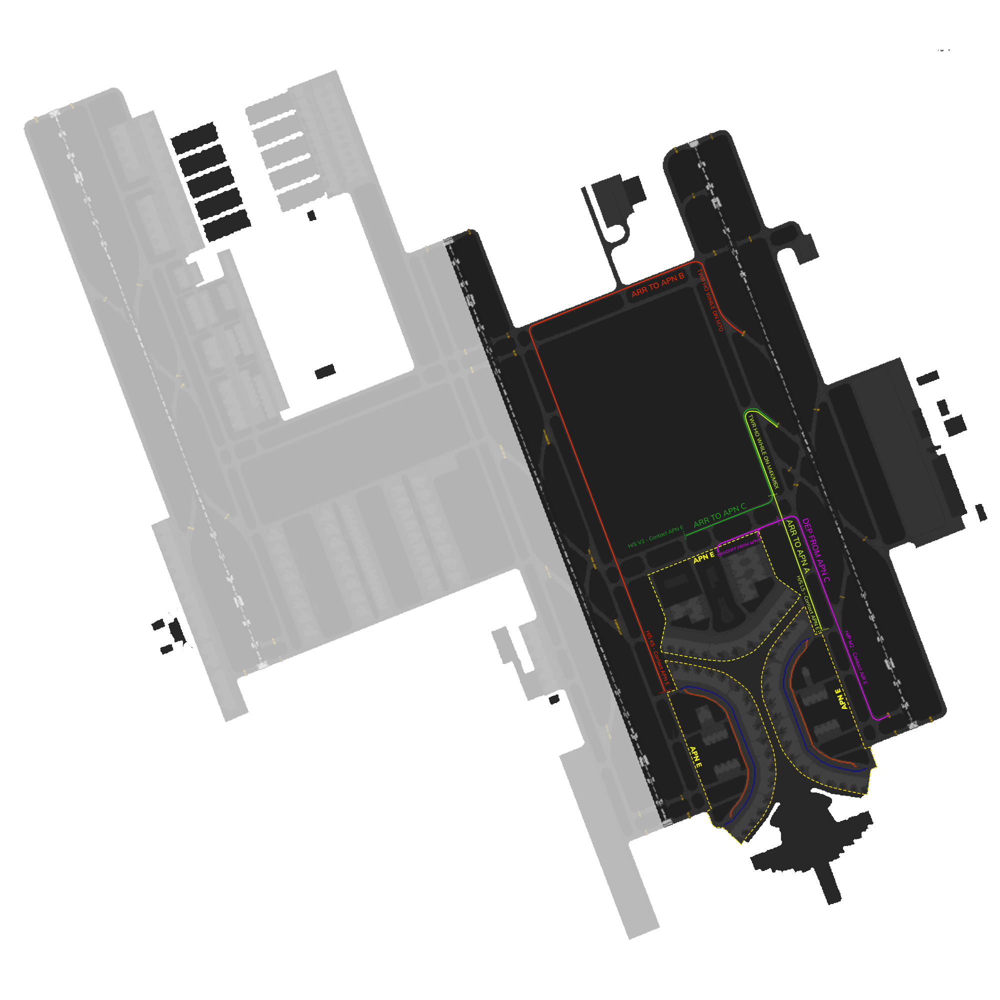

# OEJN_E_GND [SMC E] Briefing Material | Cross the Land: 2025

!!! success "Covering"
    This section details all the necessary briefing materials for **OEJN_E_GND [SMC E]** during Cross the Land: 2025

!!! Caution "Bandbox"
    During the event, only SMC W and SMC E are going to be online, spliting the DOAR on 34C.

## Designated Area of Responsibility 
**"Jeddah Ground" (OEJN_E_GND)**, is in charge of any GMC operations **east of RWY 34C**. Ground east includes the new terminal, military aprons, GA apron, and royal hangar (**Aprons A, B, C, 12, 14, and 15)**.

---

## Notes
### Arrival
- **Arrival** traffic going to **Apron A**, will contact you while taxing via the **M4X or M6X arrival taxi route**, and shall be taxied by "Jeddah Ground" to hold short **L5** and **passing MB** shall contact "Jeddah Apron."

- **Arrival** traffic going to **Apron B,** will contact you while taxing via the **M7O arrival taxi route**, and shall be taxied by "Jeddah Ground" via **R, K to hold short K5** and **passing HB** shall contact "Jeddah Apron."

- **Arrival** traffic going to **Apron C**, will contact you while taxing via the **M4X or M6X** arrival taxi route, and shall be taxied by "Jeddah Ground" via **V to hold short V2**, and contact "Jeddah Apron."

### Departure
- Departures from Apron C will be cleared by "Jeddah Apron" until holding short of **W via W4 or W3**, expect traffic to call you holding short of W via W3 or W4 from "Jeddah Apron." Traffic should be cleared via **W M holding point M2** and shall be transferred to "Jeddah Tower" **passing MB** if clear of conflict.

- Departures from **Apron A** will be cleared by "Jeddah Apron" directly to **hold short of M1 taxiway**. **No contact** will be made between the traffic and "Jeddah Ground." Traffic will be **directly handed off** to "Jeddah Tower."

- Departures from **Apron B** will be cleared by "Jeddah Apron" directly to hold short of **H1 taxiway**. No contact will be made between the traffic and "Jeddah Ground." Traffic will be **directly handed off** to Tower.

- **No** traffic from **Apron C** shall be cleared to **hold short of M1 or H1** to avoid conflicts between Apron B or Apron A traffic.

---

## Visual Representation

