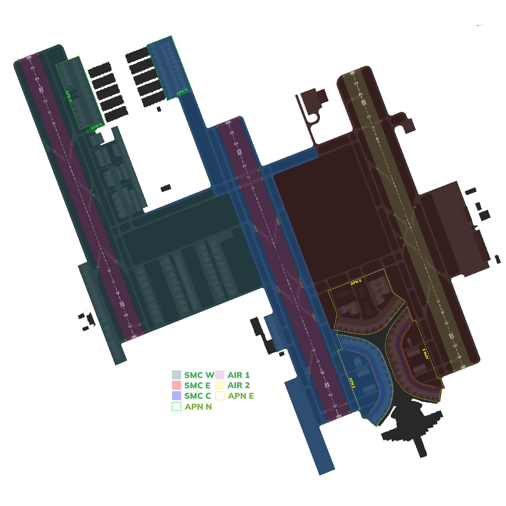
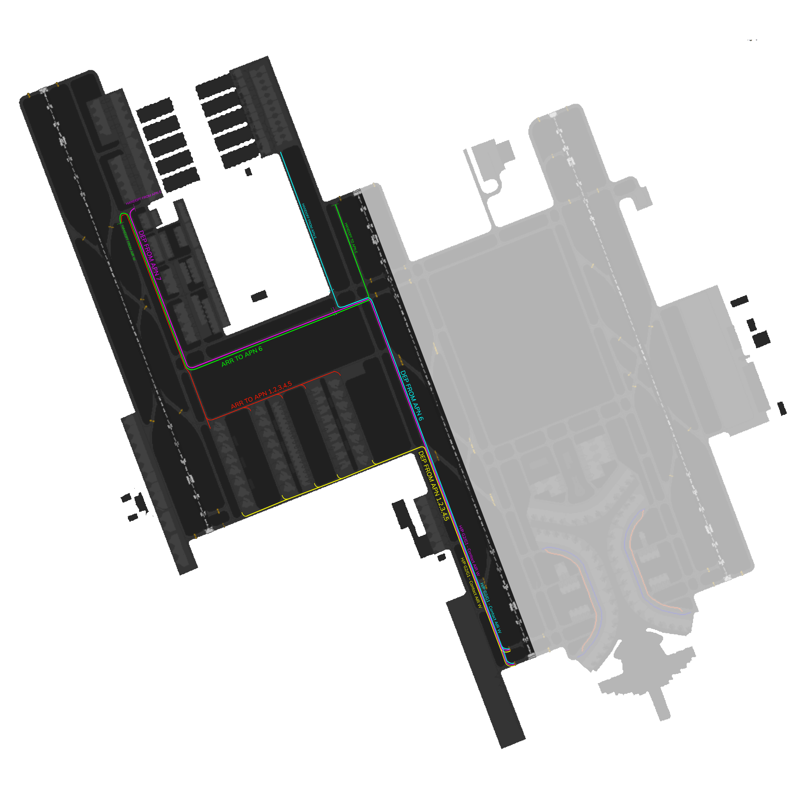

# OEJN_W_GND [SMC E] Briefing Material | Cross the Land: 2025

!!! success "Covering"
    This section details all the necessary briefing materials for **OEJN_W_GND [SMC W]** during Cross the Land: 2025

!!! Caution "Bandbox"
    During the event, only SMC W and SMC E are going to be online, spliting the DOAR on 34C.

## Designated Area of Responsibility 
**"Jeddah Ground" (OEJN_W_GND)** is in charge of all GMC operations west of RWY 34C. Ground west includes the old terminal, Hajj aprons, GA aprons, royal aprons, and cargo aprons **(Aprons 1, 2, 3, 4, 5, 13, 8, 9, G, 6, 7, and 11)**.

---

## Notes
### Arrival
- **Arrival** traffic going to Apron 1, 2, 3, 4, 5, will contact "*Jeddah Ground*" while taxing via the **B3X arrival taxi route**, once clear of departure traffic, further taxi by "*Jeddah Ground*" via **C T** to **Apron 1, 2, 3, 4** or via **C** to **Apron 5**.

- Arrival traffic going to **Apron 6**, will contact "*Jeddah Ground*" while taxing via the **B3X arrival taxi route**. Once **clear** **of departure** traffic, further taxi by "*Jeddah Ground*" via **D5 C S to hold short of E.** Once clear of conflict, **taxi via S G to hold short GA**, and to contact "*Jeddah Apron*."

- **Arrival** traffic going to **Apron 7** will **not** contact "*Jeddah Ground*" and will directly contact "Jeddah Apron."

### Departure
- Departure traffic from **Apron 6** will be cleared by "*Jeddah Apron*" via **E to hold short R**. Expect traffic to call "*Jeddah Ground*" taxing on **E** from "*Jeddah Apron*." Once clear of conflict, traffic shall be taxied by "*Jeddah Ground*" via **E S G to hold short G1 or G2** for **RWY34C**, if clear of conflict, **traffic passing U** shall contact "Jeddah Tower.'

- Departure traffic from **Apron 7** will be cleared by "*Jeddah Apron*" via **D**. Expect traffic to call you holding short of **C on D5** from "*Jeddah Apron*." Traffic shall be taxied by "*Jeddah Ground*" via **C S to hold short E**, and once clear of conflict, further taxi via **S G** to **hold short G1 or G2 for RWY34C**, if clear of conflict, traffic passing U shall contact "*Jeddah Tower*."

- Departure traffic from **Apron 1, 2, 3, 4, 5**, shall contact "*Jeddah Ground*" around **+-5 minutes from TSAT** requesting pushback. All traffic shall be pushed **South** as soon as possible. When traffic request taxi, they shall be taxied via **U hold short G,** and once clear of conflict, further taxi via **G, G1 or G2 for RWY34C**, if clear of conflict, traffic **passing U** shall contact "*Jeddah Tower*."

---

## Visual Representation

