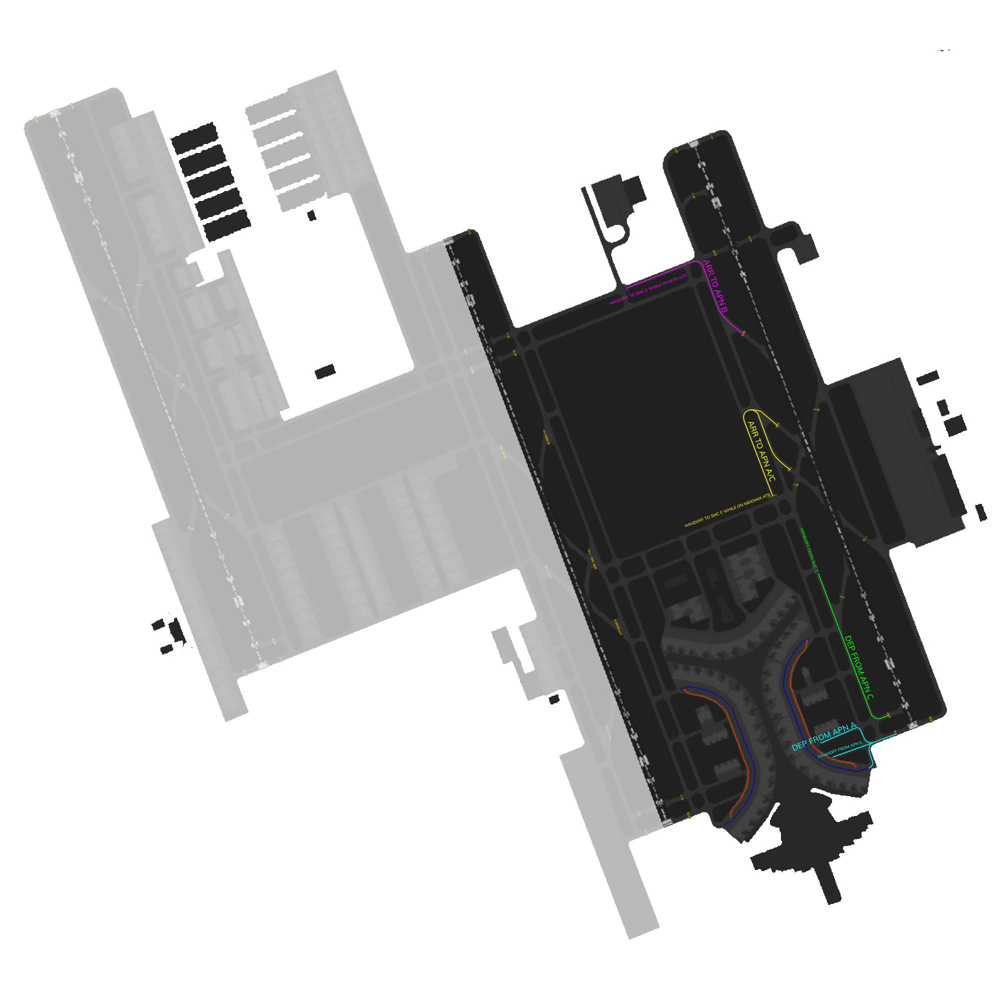

# OEJN_E_TWR [AIR E] Briefing Material | Cross the Land: 2025

!!! success "Covering"
    This section details all the necessary briefing materials for **OEJN_E_TWR [AIR E]** during Cross the Land: 2025

## Designated Area of Responsibility 
"*Jeddah Tower*" (OEJN_E_TWR) is in charge of **runway 34R** operations, whether that be departures or arrivals.

---

## Notes
### Arrival
- **Arrival traffic** shall be told the **expected runway exit point**, depending on their **parking apron**. Apron C, you must give them the **M4X or M6X** arrival taxi route, depending if they vacate **M4 or M6**. After the **arriving traffic vacates the runway**, hand the traffic off to "*Jeddah Ground*" (OEJN_E_GND).
- **Arriving traffic** parking at **Apron B** must be given the **M7O arrival taxi route**, meaning they must vacate the **runway at M7**. After the arriving traffic vacates the runway, hand the traffic off to "*Jeddah Ground*" (OEJN_E_GND).

### Departure
- Departures shall be **immediately** handed off to "*Jeddah Approach*" (OEJN_APP) after **departure**.
- Expect departures from **Apron C** to contact you **while taxing on M** to holding point **M2**.
- Departures from **Apron A** will contact you at **holding point M1**. 

---

## Visual Representation

