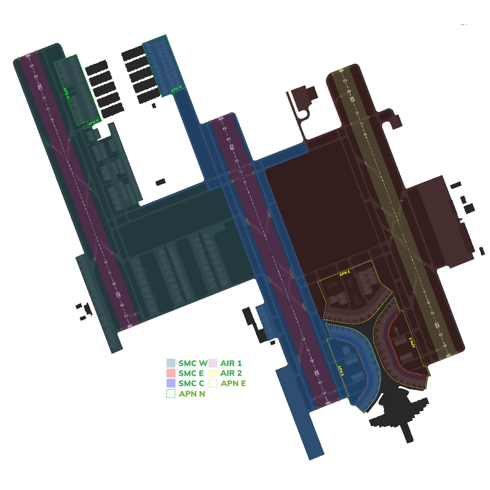

# OEJN_W_TWR [AIR W] Briefing Material | Cross the Land: 2025

!!! success "Covering"
    This section details all the necessary briefing materials for **OEJN_W_TWR [AIR W]** during Cross the Land: 2025

## Designated Area of Responsibility 
"*Jeddah Tower*" (OEJN_W_TWR) is in charge of **runway 34R and runway 34C** operations, whether that be departures or arrivals.

---

## Notes
### Arrival
- Arrival traffic shall be told the expected runway exit point. They should **vacate B5** if they are going to **Apron 7**, and you must **immediately** hand them off to "*Jeddah Apron*" (OEJN_E_RMP). 
- They should vacate **B3** to follow **B3X arrival taxi route** for **Apron 1, 2, 3, 4, 5, 6,** and you must **immediately** hand them off to "*Jeddah Ground*" (OEJN_W_GND).

### Departure
- Departures shall be **immediately** handed off to "*Jeddah Approach*" (OEJN_APP) after **departure**.
- Departures from **Apron B** will contact you at holding point H1.
- Departures from **Aprons 1, 2, 3, 4, 5, 6, 7** will contact you **while taxing on G**, or at holding point **G1 or G2**.