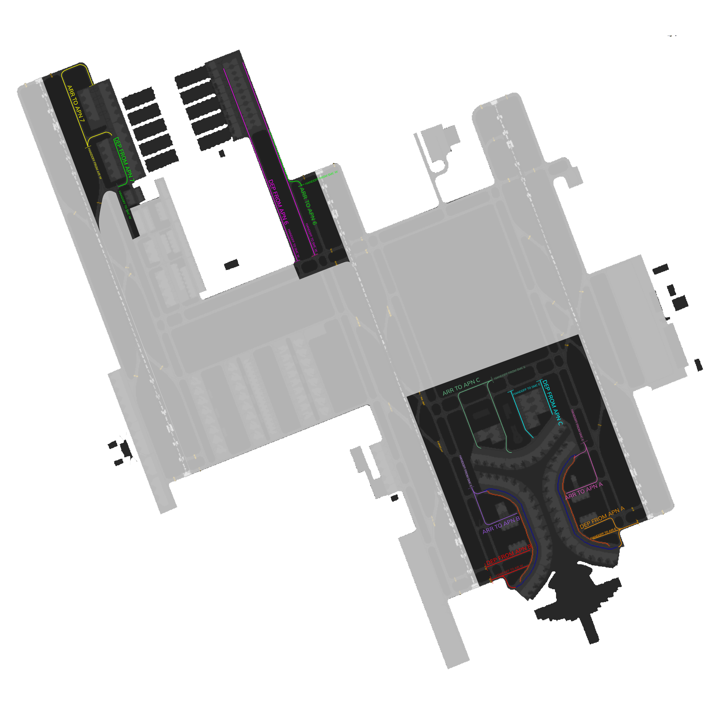

# OEJN_E_RMP [APN E] Briefing Material | Hajj OPS: 2025

!!! success "Covering"
    This section details all the necessary briefing materials for **OEJN_E_RMP [APN E]** during Hajj OPS: 2025

!!! Caution "Bandbox"
    During the event, only Apron East will be on which is the bandbox of both APN E and APN N. 

## Designated Area of Responsibility 
**"Jeddah Apron" (OEJN_E_RMP)** is in charge of all apron operations. (**Aprons 6, 7, A, B, C**).

---

## Notes
- **All** departure traffic will contact you **+-5 minutes** from TSAT **requesting pushback**. If there is a sequence for pushback, traffic shall be **prioritized by their TSAT**.
- Traffic at **Apron A** shall be pushed **Southbound** to exit via **L3, L2, or L1**.
- **Medium** departure traffic shall be pushed on the **blue** line. **Heavy** departure traffic shall be pushed on the **main** taxiway.
- Traffic exiting the **Apron via L3** shall be instructed to taxi via **L3, L, hold short of MF,** when clear of conflict, **taxi via MF to hold short M1 for RWY34R** and to contact "*Jeddah Tower*."
- Traffic exiting the **Apron via L2** shall be instructed to taxi via **L2, MF, to hold short M1 for RWY34R** and to contact "*Jeddah Tower*." Traffic shall be handed off to "*Jeddah Tower*" **after passing L.**
- Traffic **exiting the Apron via L1** shall be instructed to taxi via **L1, L, hold short of MF**, when **clear of conflict**, taxi via **MF to hold short M1 for RWY34R** and to contact "*Jeddah Tower*."
- Expect arrivals to contact "*Jeddah Apron*" **holding short L5** from "*Jeddah Ground*," where "*Jeddah Apron*" must clear the traffic to **enter the apron via L5 or L4**, and taxi via **LC, if it is a medium aircraft**, or **LA, if it is a heavy aircraft**. If traffic permits, **LC** can be used to **push departure traffic** as well.
- **Apron C** flow direction is **Eastbound** to exit via **W3, W4**.
- **Arrival traffic** will enter **Apron C** through **W1 and W2**.
- **Departure traffic** shall exit **Apron C** through **W3, and W4**.
- **Departure traffic** shall be handed off to "*Jeddah Ground*" holding short of **W, at W3 or W4**, - once **clear of traffic** pushing at remote stands.
- **Arrival traffic** will contact "*Jeddah Apron*" on **V holding short of V2** and shall enter via **W, W1 or W2**, once **clear of traffic** pushing at remote stands.
- **Remote stands** can be pushed facing **North** if traffic permits.
- **Apron B** flow direction is **Southbound** to exit via **L1, L2, L3**
- **Medium departure traffic** shall be pushed on the **blue line**. **Heavy departure traffic** shall be pushed on the **main taxiway**.
- Traffic exiting the **Apron via K3** shall be instructed to taxi via K3, K, hold short of HF, when clear of conflict, **taxi via HF** to **hold short H1** for RWY34C and to contact "*Jeddah Tower*."
- Traffic exiting the **Apron via K2** shall be instructed to taxi via **K2, HF**, to **hold short H1 for RWY34C** and to contact "*Jeddah Tower*." Traffic shall be handed off to "*Jeddah Tower*" **after passing L.**
- Traffic exiting the Apron via K1 shall be instructed to taxi via K1, K, hold short of HF, when clear of conflict, **taxi via HF** to **hold short H1** for **RWY34C** and to contact "*Jeddah Tower*."
- Expect arrivals to contact "*Jeddah Apron*" **holding short K5** from "*Jeddah Ground*," where "*Jeddah Apron*" must clear the traffic to **enter the apron via K5 or K4**, and **taxi via KC**, if the traffic is a **medium aircraft**, or **KA**, if the traffic is a **heavy aircraft**. If traffic permits, KC can be used to push **departure traffic** as well.
- Apron 7 flow direction is **Southbound** to exit via **D5**
- Arrival traffic will enter via **D6, B7** and will contact you following **B5X arrival taxi route** and will enter Apron via **D6**. When traffic permits, taxi **via D6 D, or B B7 D.**
- Departures shall be taxied via **D, D5, hold short of C,** and contact "*Jeddah Ground*."
- Apron 6 traffic must be pushed **facing south**.
- Taxiway E is **southbound** only.
- Traffic who pushed on **taxiway E**, shall be taxied **via E to hold short of R,** and shall contact "*Jeddah Ground*" **while taxing on E**.
- Traffic who pushed on **taxiway F,** shall be taxied **via F to hold short of R**, and shall contact "*Jeddah Ground*" while **taxing on F**.
**Arrival** traffic into **Apron 6** will contact "*Jeddah Apron*" holding short of GA on G. When traffic permits, traffic shall be permitted to enter the **Apron via F.**

---

## Visual Representation

