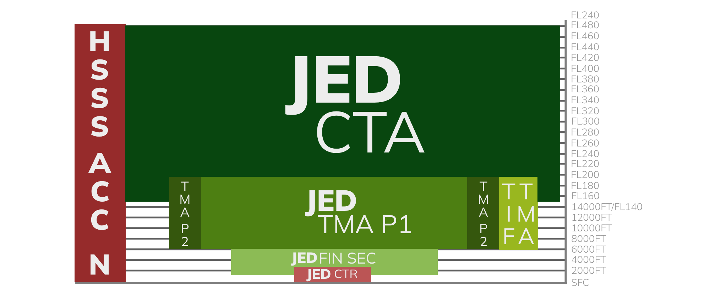

## 2.2.1 Defined Airspace

In air traffic control, **airspace variables** are key parameters that describe the structure and limits of controlled airspace. These variables include lateral and vertical boundaries, traffic patterns, and designated operational zones that determine where and how aircraft can safely operate. Understanding these variables allows controllers to manage traffic appropriately, maintain separation, and ensure that pilots comply with applicable rules while navigating through or near the aerodrome environment.

---

## 2.2.2 Variables
There are four important variables that make up and define an airspace:

### 2.2.2.1 Horizontal Limits
Horizontal limits refer to **the boundaries of a controlled airspace or control zone as measured along the earth’s surface**. These limits define the area in which an aerodrome controller is responsible for managing aircraft movements, ensuring that all operations within this space are coordinated and safe.  

Figure 2.1.2 - Airspace - Top View

!!! info "Do note"
    The limits are typically expressed in terms of radius from a reference point such as the airport or aerodrome

### 2.2.2.2 Vertical Limits
The vertical limits of airspace refer to **the boundaries that define its altitude range, specifying how high or low a particular class or type of airspace extends**. These limits are measured from mean sea level (MSL) or from the surface, depending on the airspace classification, and are established to separate different types of air traffic vertically.

### 2.2.2.3 Type
Airspace around an airport and across a country is organized into different types to ensure safe and efficient aircraft operations. Starting from the lowest level, the **Aerodrome Traffic Zone (ATZ)** surrounds smaller airports to protect local takeoff, landing, and circuit traffic. Above that, the **Control Zone (CTR)** covers larger airports, providing controlled airspace for arriving and departing aircraft. **Terminal Control Areas (TMA)** are higher and larger zones designed to manage the flow of traffic into and out of multiple nearby airports. Beyond the terminal regions, **Control Area (CTA)** manage en-route traffic over wide regions at higher altitudes, coordinating aircraft over long distances. These layers of airspace work together to maintain order and safety from the surface to cruising altitude.

Figure 2.1.3 - Surrounding Airspace - Vertical view

### 2.2.2.4 Class
Airspace is categorized into the following **classes**:

- Class A
- Class B
- Class C
- Class D
- Class E
- Class F
- Class G

Each class, from A to G, specifies the rules for flying, including whether **Instrument Flight Rules (IFR)** or **Visual Flight Rules (VFR)** are permitted and the extent of **air traffic control (ATC)** services available. Higher classes, such as A and B, involve stricter control, requiring ATC clearance and separation for all aircraft, while lower classes like E, F, and G offer more flexibility, particularly for VFR flights.
